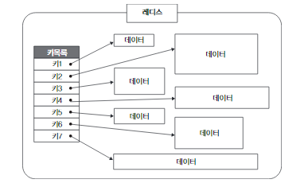
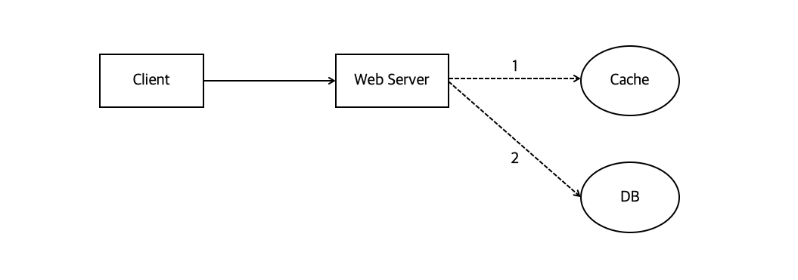
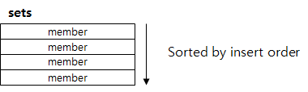
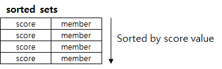
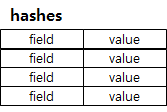
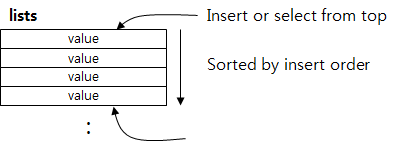

     
    <h1>
        Redis란?
    </h1>
     

## 목차

1. [**Redis란?**](#1)
2. [**Redis의 특징**](#2)
3. [**Redis 사용 시 주의점**](#3)

 

## 1. Redis란?

- `REmote DIctionary Server`의 약자

 

- Remote에 위치한

- 프로세스로 존재하는

- In-Memory 기반의

  - 보통 메모리에 상주하면서 RDBMS의 캐시 솔루션으로 사용됨(RBMS의 read 부하를 줄임)

- "키-값" 구조 데이터 관리 시스템

  - 비관계형 데이터베이스(NoSQL) 중 하나로, 별도 쿼리 없이도 데이터를 간단히 가져올 수 있으며 Key-Value 저장 구조를 가지고 있음

  

> Redis : 메모리를 이용하여 고속으로 <key, value> 스타일의 데이터를 저장하고 불러올 수 있는 시스템

 

 

## 2. Redis의 특징

 

#### 1. Cache 또는 Persistence Data Storage로 사용 가능

 

**1.  cache로 사용할 때**

서비스 사용자가 증가했을 때, 모든 유저의 요청을 DB접근으로만 처리하게 된다면 DB 서버에 무리가 가고, 성능이 떨어지게 됨

👉 요청된 결과를 미리 저장해 두었다가 빨리 제공하기 위해 **캐시** 사용

​	  Redis Cache는 메모리 단에 위치하기 때문에 디스크보다 용량은 작지만 접근 속도가 빠름

 

**캐시 사용 방법**

- `Look aside cache` - 일반적인 패턴
  1. 웹 서버는 클라이언트 요청을 받아서, 데이터가 존재하는지 캐시를 **먼저** 확인
  2. Cache에 데이터가 있으면 그걸 읽어가고, 없으면
  3. DB에서 읽어서 → 먼저 캐시에 저장한 다음 클라이언트에게 데이터를 돌려줌

- `Write back`

  데이터를 캐시에 전부 먼저 저장해 놓았다가 특정 시점마다 한번씩 캐시 내 데이터를 DB에 insert하는 방식.

  -  insert를 1개씩 500번 수행하는 것 보다 500개를 한번에 insert하는 동작이 훨씬 빠름

  - 데이터를 일정 기간 동안 유지하고 있어야 하는 storage는 **메모리 공간**이므로 서버 장애 상황에서 데이터가 손실될 수 있다는 단점 有

    👉 재생 가능한 데이터나, 극단적으로 heavy한 데이터인 경우에 많이 사용되는 방식

 

**2. Persistence data storage로 사용할 때**

Redis는 데이터를 디스크에 저장할 수 있어서, 서버가 shutdown된 후에 재시작 되더라도 디스크에 저장해 놓은 데이터를 다시 읽어서 데이터가 유실되지 않음.

데이터를 디스크에 저장하는 방식은 Snapshot, AOF 방식이 있음.

- Snapshot
  - 순간적으로 메모리에 있는 내용을 디스크에 옮기는 방식
  - SAVE : 순간적으로 Redis의 동작을 정지시키고 그 snapshot을 디스크에 저장(blocking 방식)
  - BGSAVE : 별도의 프로세스를 띄운 후, 명령어 수행 당시의 snapshot을 disk에 저장하고 redis는 동작을 멈추지 않음(non-blocking 방식)
- AOF
  - redis의 write/update 연산을 log 파일에 기록하고, 서버가 재시작되면 log에 기록된 연산을 재실행하여 데이터를 복구하는 방식

 

✒레디스 공식문서에서의 권장사항 : RDBMS의 rollback 시스템같이 두 방식을 혼용해서 사용할 것을 권장

​	주기적으로 snapshot으로 백업하고 그 다음 snapshot까지의 저장을 AOF 방식으로 수행.

 

 

#### 2. Collection 제공

Redis Collection에서 지원하는 대표적인 자료구조

1. `String` 

   - 가장 일반적인 형태로, key - value 형태로 저장됨
   - text 문자열 뿐만 아니라 Integer같은 숫자나 JPEG같은 Binary file까지 저장 가능

    

   

2. `set`

   - String의 집합 👉 블로그 포스트의 Tag 등에 사용 가능
   - 데이터의 중복 허용 X
   - 집합 관련 연산 지원(교집합, 합집합, 차집합...)

    

   

3. `Sorted set`

   - set에 "score" 필드가 추가된 데이터 형. score는 일종의 '가중치' 

   - 데이터는 score를 기준으로 오름차순으로 내부 정렬

     👉 score값 범위에 따른 쿼리, 랭킹 서버 쉽게 구축 가능

 

4. `hash`

   - field, string value 쌍으로 이루어진 테이블을 저장하는 데이터 구조체
   - 즉, RDBMS에서 PK 1개와 string 필드 하나로 이루어진 테이블인 셈

    

   

5. `list`

   - push/pop 연산을 이용하거나 지정된 index값을 이용하여 원하는 위치에서 데이터를 넣거나 뺄 수 있음.

+) 주의점

	- 하나의 컬렉션에 너무 많은 아이템을 담으면 좋지 않다. 가능하면 10000개 이하의 데이터 셋 유지 추천
	- `expire` (삭제 키워드)는 Collection의 아이템 개별로 걸리지 않고, '전체 컬렉션에 대해서만' 걸린다.

 

 

#### 3. Atomic 하다.

** atomic : 수행 도중, 끼어들거나 중단될 수 없는 하나의 동작 단위

- 한번에 딱 하나의 명령만 수행 가능

  👉 Race condition을 피할 수 있음 

  (race condition 참고 자료 : https://github.com/ssafy-tech-concert/ssafy-tech-concert/blob/master/Computer-Science/Process_Synchronization.md)

- single threaded 특성이 있음
- redis는 `remote data storage`로서 여러 서버에서 같은 데이터를 공유하고 싶을 때 많이 사용됨
  - 인증 토큰 저장, 유저 API limit을 두는 상황 등에서 redis가 많이 사용됨

 

 

## 3. Redis 사용 시 주의점

 

1. 서버에 장애가 발생했을 경우, 그에 대한 운영 플랜이 반드시 필요

   : 인메모리 데이터 저장소의 특성 상, 데이터 유실이 발생할 수 있기 때문

   

2. 메모리 관리를 잘 해야 함

   - `jemalloc`은 **메모리를 페이지 단위로 반환** → 내부 단편화 발생 가능

     (내부 단편화 참고 자료 : https://github.com/ssafy-tech-concert/ssafy-tech-concert/blob/master/Computer-Science/Memory_Allocation.md)

   - 다양한 사이즈를 가지는 데이터보다는 유사한 크기의 데이터를 가지는 경우가 유리함.

     따라서, 메모리를 유사한 크기로 두고 관리해주어야 함.

   - 큰 메모리를 사용하는 instance 하나보다는 적은 메모리를 사용하는 instance 여러개가 안전함

   

3. 싱글 스레드의 특성 상, 한 번에 하나의 명령만 처리할 수 있으므로 처리하는 데 시간이 오래 걸리는 요청, 명령은 피해야 함.

<질문 1> Redis는 memory 상에 있을까요, disk 상에 있을까요?

<질문 2> Redis collection 중, set에 "score" 필드가 추가된 데이터 형으로 score를 기준으로 오름차순으로 내부 정렬되는 자료구조는?

***

**참고 자료**

https://velog.io/@hyeondev/Redis-%EB%9E%80-%EB%AC%B4%EC%97%87%EC%9D%BC%EA%B9%8C

https://velog.io/@swhan9404/Redis-%EB%9E%80-%EB%AC%B4%EC%97%87%EC%9D%B8%EA%B0%80

https://songsunbi.tistory.com/59