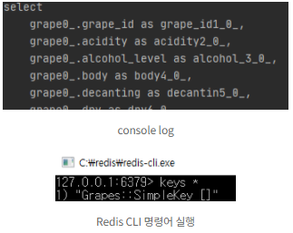

<div align="center">
    <br>
    <h1>
       SpringBoot + Redis
    </h1>
    <br>
</div>


## 목차

1. [**Redis란?**](#1)
2. [**Spring Boot + Redis 연동**](#2)

<br>
<div id="1"></div>

## **Redis?**
<br>


#### Redis는 Cache 또는 Persistence Data Storage로 사용 가능

아무래도 서비스 사용자가 증가하게 되면 모든 유저의 요청을 DB 접근으로만 처리할 때 DB 서버에 무리가 가고, 성능이 떨어지게 됩니다. 

```
👉 요청된 결과를 미리 저장해 두었다가 빨리 제공하기 위해 캐시를 사용하게 됩니다.

```
​1. Redis Cache는 메모리 단에 위치하기 때문에 디스크보다 용량은 작지만 접근 속도가 빠름 

2\. Key-Value 저장 구조로 조회시 빠르다.

[캐시가 궁금하시다면 참고해주세요](https://github.com/ssafy-tech-concert/ssafy-tech-concert/blob/master/web/Cache.md)

[Redis 정리된 자료가 궁금하시다면 참고해주세요](https://github.com/ssafy-tech-concert/ssafy-tech-concert/blob/master/Back-end/Redis.md)

이번 와인추천 프로젝트를 진행하면서 위와 같은 장점 때문에 Spring Boot에 Redis를 적용해보려고 합니다.

Redis의 적용 예시를 말하자면 저는 1순위로 자주 쓰이는 데이터를 적용하려고 합니다.

그 밖의 예시로는 **좋아요 처리하기, 랭킹 서버, 최근 검색어, 일일 방문자** 등등 활용사례가 많습니다.

<br>

### **Redis 처리 순서**

1\. 클라이언트가 데이터를 요청

2\. Redis에 클라이언트가 원하는 데이터가 있는지 검사 -> 있으면 바로 데이터 반환

3\. 없다면 DB에 데이터를 요청

4\. DB에서 조회된 데이터를 레디스에 저장

<br>

<div id="2"></div>

## **Spring Boot + Redis 연동**

**도커를 통해 레디스를 설정하는 방법도 있지만 저는 로컬 환경에서 진행했습니다.**

**[https://oingdaddy.tistory.com/225](https://oingdaddy.tistory.com/225)** 

레디스를 설치 하셨다면 

redis-cli.exe, redis-server.exe를 반드시 실행시켜주세요 안 하면 오류 납니다 ㅎㅎ 

build.gradle

```
implementation 'org.springframework.boot:spring-boot-starter-data-redis'
implementation 'org.springframework.boot:spring-boot-starter-cache'
```

application.yml

```
redis:
  host: localhost
  port: 6379
```

RedisConfig.Java

```
@EnableRedisRepositories
@Configuration
@RequiredArgsConstructor
public class RedisConfig {

    @Value("${spring.redis.host}")
    private String redisHost;

    @Value("${spring.redis.port}")
    private int redisPort;

    @Bean
    public RedisConnectionFactory redisConnectionFactory() {
        RedisStandaloneConfiguration redisStandaloneConfiguration = new RedisStandaloneConfiguration();
        redisStandaloneConfiguration.setHostName(redisHost);
        redisStandaloneConfiguration.setPort(redisPort);
        return new LettuceConnectionFactory(redisStandaloneConfiguration);
    }

    @Bean
    public StringRedisTemplate stringRedisTemplate() {
        StringRedisTemplate stringRedisTemplate = new StringRedisTemplate();
        stringRedisTemplate.setConnectionFactory(redisConnectionFactory());
        stringRedisTemplate.setEnableTransactionSupport(true);
        return stringRedisTemplate;
    }
}
```

**RedisConnectionFactory** : Redis와 connection을 생성해 주는 객체입니다.

**RedisTemplate** 

-   Redis 서버와 통신을 처리 
-   Redis 모듈을 사용하기 쉽도록 기능을 제공해준다.
-   Redis는 기본적으로 key, value를 바이트의 배열(byte\[\])로 저장한다. StringRedisTemplate를 사용하면 key, value를 모두 문자열로 저장할 수 있다.
-   다양한 타입의 자료구조를 사용할 수 있다. 위와 같은 메서드를 사용하면 해당 자료구조의 직렬화 및 역직렬화를 할 수 있어서 유용하다. 

CacheConfig.java

```java
@RequiredArgsConstructor
@EnableCaching
@Configuration
public class CacheConfig extends CachingConfigurerSupport {

    private final RedisConnectionFactory redisConnectionFactory;

    @Bean
    @Override
    public CacheManager cacheManager() {
        return RedisCacheManager.RedisCacheManagerBuilder.fromConnectionFactory(redisConnectionFactory)
                .cacheDefaults(defaultConfiguration())
                .withInitialCacheConfigurations(cacheConfigurations())
                .build();
    }

    private Map<String, RedisCacheConfiguration> cacheConfigurations() {
        Map<String, RedisCacheConfiguration> customConfigurationMap = new HashMap<>();
        customConfigurationMap.put("Grapes", defaultConfiguration().entryTtl(Duration.ofDays(1)));
        customConfigurationMap.put("userFilterWine", defaultConfiguration().entryTtl(Duration.ofDays(1)));
        return customConfigurationMap;
    }

    private RedisCacheConfiguration defaultConfiguration() {
        return RedisCacheConfiguration.defaultCacheConfig()
                .entryTtl(Duration.ofDays(7))
                .disableCachingNullValues()
                .serializeValuesWith(
                        RedisSerializationContext.SerializationPair.fromSerializer(
                                new GenericJackson2JsonRedisSerializer()
                        )
                );
    }
}
```

CacheConfig 클래스는 캐시 설정을 해주는 것입니다. 

이것을 만들어주는 이유는 캐시의 TTL 적용 등록 삭제 등의 기능을 사용 할때 별도의 Configuration 설정이 필요해서입니다. SpringBoot에서 제공하는 CachingConfigureSupport 클래스를 상속받고 별도의 config 클래스 파일을 추가합니다.

저는 프로젝트에서 캐시를 적용하는 부분이 여러개라 키값과 expire시간이 다를 거라서 cacheManager에 필요한 속성 값을 설정했습니다. ex) Grapes 키는 1일로 지정할거야~ 

```java
//Controller
@GetMapping
public ResponseEntity<CommonResponseDto> getGrape() {
      return ResponseEntity.ok().body(CommonResponseDto.of(
            HttpStatus.OK, grapeService.getGrape()));
 }
 
//Service
@Cacheable(value = "Grapes")
public List<GrapeResponse> getGrape() {
    List<Grape> grapeList = grapeRepository.findAll();
    return grapeList.stream().map(GrapeResponse::from).collect(Collectors.toList());
}

// Entity
@Getter
@NoArgsConstructor
@AllArgsConstructor
@Entity(name = "tbl_grape_info")
public class Grape {

    @Id
    @GeneratedValue(strategy = GenerationType.IDENTITY)
    @Column(name = "grape_id")
    private Long id;

    private String grapeVariety;

    private String grapeKor;
 }
// Repository
@Repository
public interface GrapeRepository extends JpaRepository<Grape, Long> {

}
```

제가 이번에 진행하는 프로젝트가 와인프로젝트이기 때문에 도메인을 포도로 잡았어요

👉 Service Layer에 **@Cashable** 과 값을 넣으면 데이터가 Redis에 있다면 Redis에서 꺼내어 반환을 하게 되고 없다면 DB에서 조회를 해서 가져오게 됩니다. 

👉 만약 새로 데이터가 추가된다면 **@CacheEvict**를 등록 API 에사용하면 됩니다. 저는 포도는 등록되거나 변할 일이 없어서 @CacheEvict는 구현하지 않았습니다. 

```
http://localhost:8080/grapes
```

api를 호출해보겠습니다

첫 조회 시 Select log가 찍힙니다.




😯 다시 API를 호출했을 때 data가 만료되어 있지 않다면 Redis에서 꺼내서 바로 Return 됩니다. 직관적인 TEST를 위해서 이처럼 진행했습니다.

[👉 Blog](https://codingjhj.tistory.com/37)
