

     
    <h1>
        연속 / 비연속 메모리 할당
    </h1>

## 목차

1. [**연속 메모리 할당**](#1)
2. [**비연속 메모리 할당 - Paging**](#2)
3. [**비연속 메모리 할당 - Segmentation**](#3)

 

## 1. 연속 메모리 할당

> 메모리에 하나의 프로세스를 적재할 때 연속적으로 적재하는 방법

가정

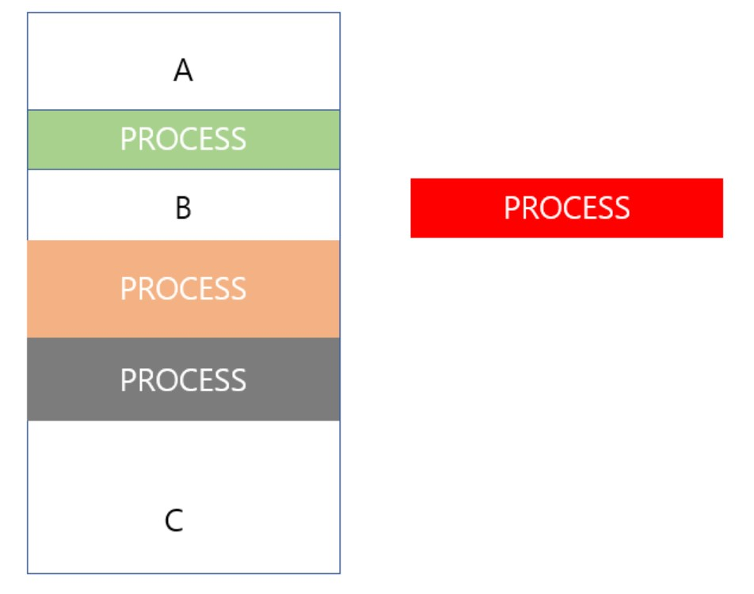

### 가변 분할 방식

**1. first-fit(최초적합)**

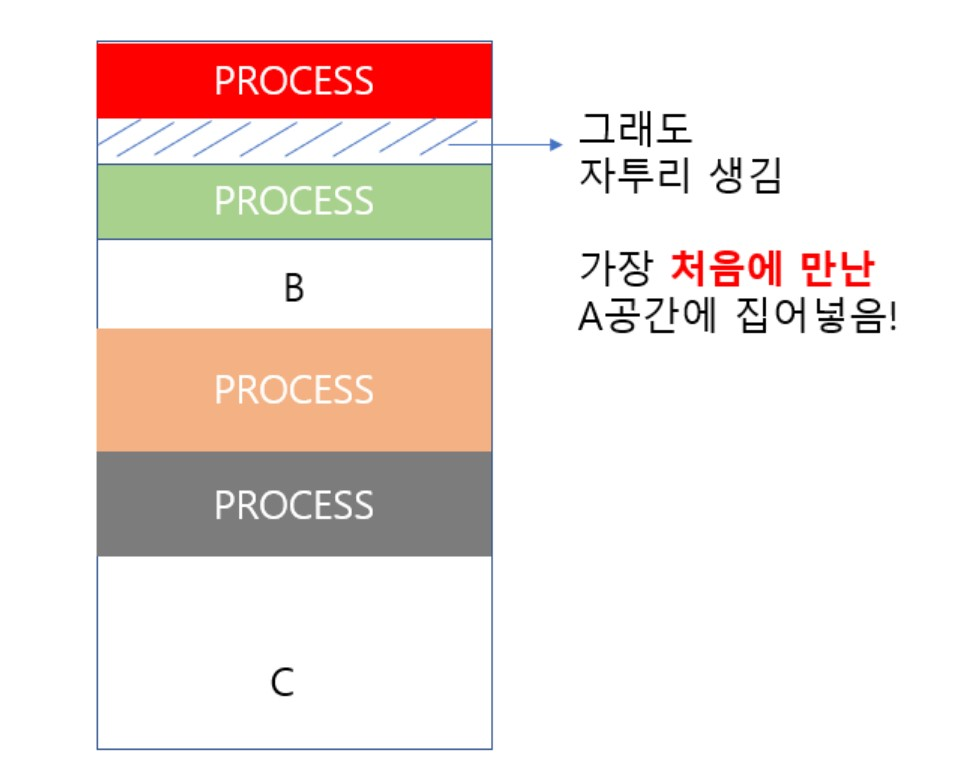

남은 메모리를 순차적으로 앞에서부터 탐색하는데, 프로세스가 들어갈 수 있는 hole들 중 최초에 발견된 hole에다가 적재

**2. best fit(최적적합)**

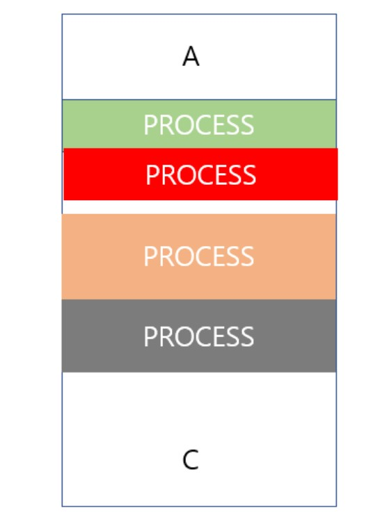

메모리를 탐색하여 메모리 공간 중에서 제일 적절하게 들어갈 수 있는 곳(자투리가 가장 적게 남는 곳)을 찾아 프로세스를 적재

**3. worst fit(최악 적합)**

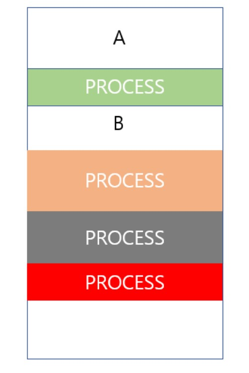

적재할 프로세스의 크기와 제일 안 맞는 공간(자투리가 가장 많이 남는 곳)에 프로세스를 적재

→ 자투리를 크게 만들어야 다른 프로세스가 그 동일한 hole에 들어갈 확률이 높다는 논리

**세 가지 방법의 성능 비교**

- first fit, best fit은 메모리 사용률 측면에서 worst fit보다 우수
- first fit과 best fit은 메모리 효율 상 차이 X, 알고리즘의 복잡도 면에서는 first fit이 우수

**연속 메모리 할당의 단점** : *"외부 단편화"* (external fragmentation)발생

프로세스들은 여러 위치의 메모리에 적재됨 : scattered holes 발생

👉 hole들의 크기를 모두 합치면 프로세스를 충분히 적재할 수 있는데 떨어져 있어서 프로세스가 적재되지 못하는 현상

👉 1/3 정도의 메모리 낭비 발생. 해결방법 : Paging

 

+) compaction

외부 단편화를 해결하기 위한 방법

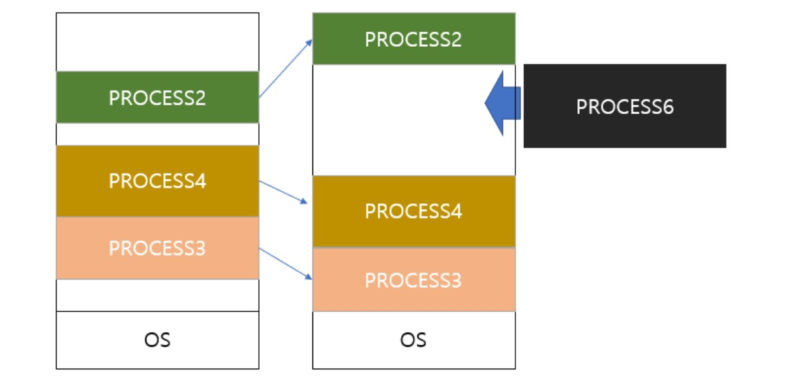

프로세스가 사용중인 파티션을 동적으로 재배치시켜 남는 hole들을 하나로 묶는 방법

But, 메모리 계산의 부담이 커서 오히려 비효율적

 

 

## 2. 비연속 메모리 할당 - Paging

> 프로세스를 일정 크기인 페이지로 잘라서 메모리에 적재하는 방식

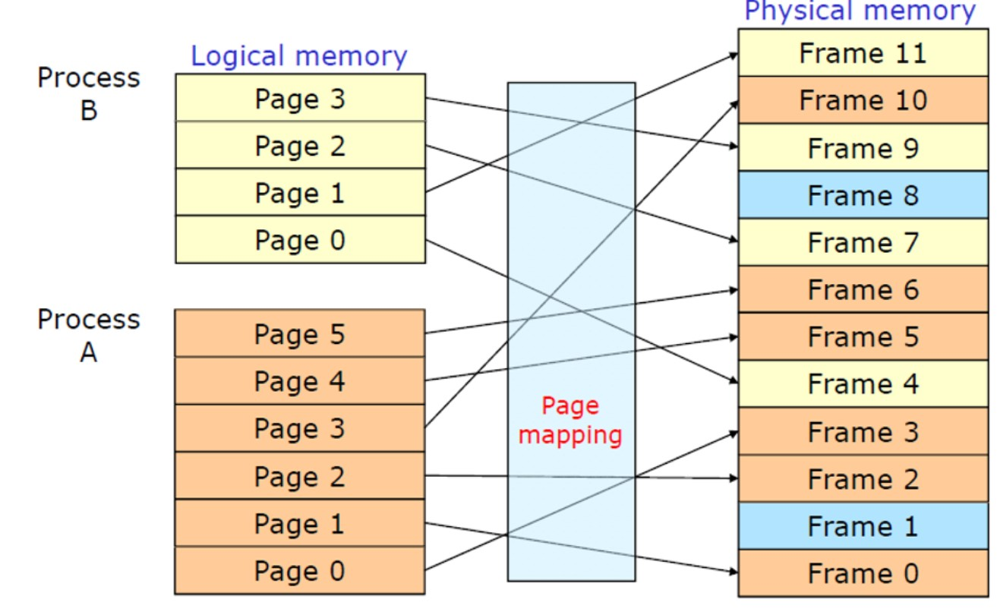

* page : **프로세스**를 나누는 단위
* frame : page와 동일한 크기로 **메모리**를 나누는 단위

### Paging 기법

: 프로세스를 잘라서 적재하더라도 정상적으로 실행될 수 있게 하는 방법

> Point : 비연속적인 물리 주소를 연속적인 방식으로 표현한 논리 주소로 변환시켜서 CPU를 속인 후, MMU를 사용

- MMU : Memory Management Unit. CPU 코어 안에 탑재되어 가상 주소(논리 주소)를 실제 메모리 주소(물리 주소)로 변환해주는 장치. Page table에 해당함

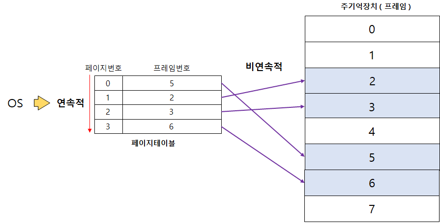

👉OS는 물리적으로 비연속적이게 저장된 데이터를 페이지 테이블을 통해 연속적으로 접근 가능.

 

**논리주소 구조**

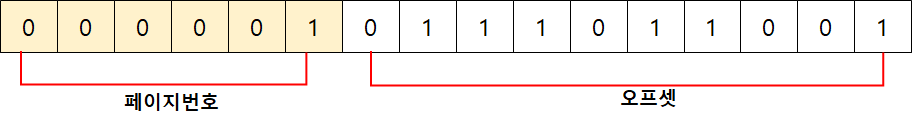

우리가 생각하는 주소의 구조와 유사

ex)

*도로명주소: 서울특별시 서대문구 북아현로22마길*

*상세주소 : 21-8 (북아현동, 경복궁아침)*

- '페이지 번호'는 '도로명 주소'와 유사. 즉, 프레임 번호
- '오프셋'은 '상세 주소'와 유사. 즉, 프레임 안에서의 정확한 위치(위에서부터 얼만큼 떨어져 있는지)

 

**물리주소 구조**

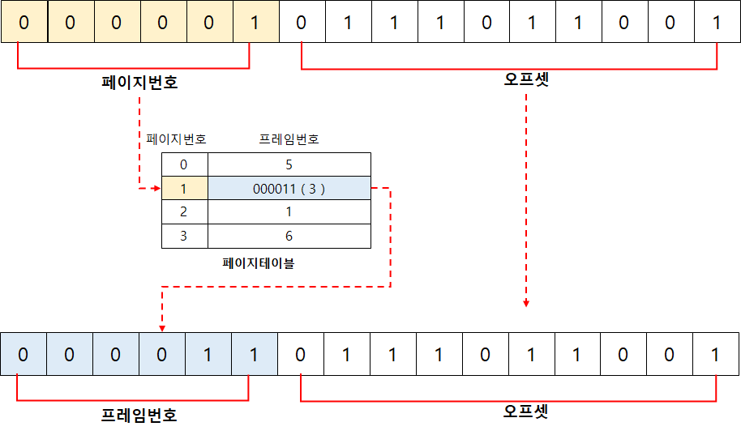

- 프레임 번호 : 논리주소의 페이지번호로 페이지 테이블에 접근하여 프레임 번호를 파악
- 오프셋 : 페이지와 프레임은 동일한 크기이므로 논리주소의 오프셋을 그대로 가져옴

 

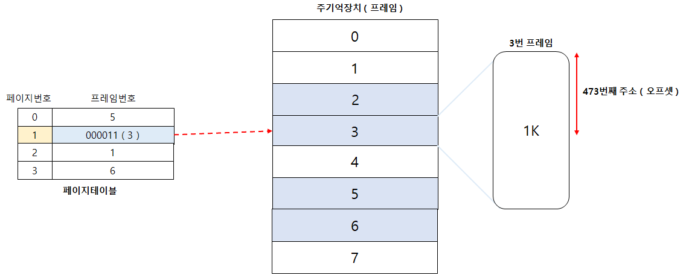

 

**Paging의 단점 :**  *내부 단편화*(internal fragmentation) 발생

프로세스를 페이지 단위로 나누는데 만약 프로세스의 크기가 페이지 크기의 배수가 아니라면, 마지막 프로세스의 페이지는 한 프레임을 다 채울 수 없음 👉 메모리 안에서 빈 공간으로 남아 낭비됨.

BUT, 외부 단편화에 비해 낭비되는 공간이 매우 미비한 정도.

 

 

## 3. 비연속 메모리 할당 - Segmentation

> 프로세스를 물리적인 크기의 단위(page)가 아닌 **논리적 내용의 단위**(의미가 같은)로 자르는 기법

- 기본적으로 코드, 데이터, 스택 세 가지의 세그먼트는 항상 가지고 있음
- Paging과 달리, segment들의 크기는 일반적으로 같지 않음

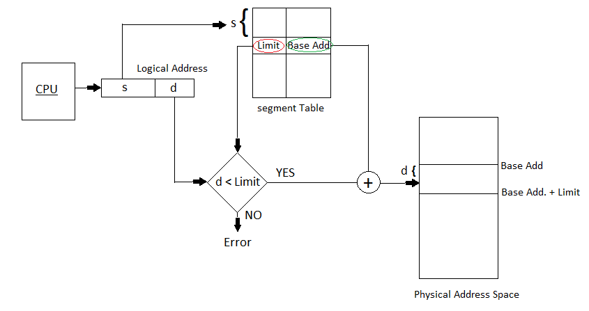

- 메모리 할당은 '연속 메모리 할당의 가변 분할 방식'방법과 유사. (다른 점 : 세그먼트들이 연속적으로 배치되지 않아도 됨.)
- 주소 변환 방법 : 페이징과 동일(page table 대신 segment table이 있고, 상위 비트들이 page 번호가 아닌 segment 번호라는 점 등이 다름)

 

**segmentation의 장점** : 보호나 공유의 면에서 paging보다 뛰어남

내용적인 측면으로 프로세스를 나누므로, 코드 영역은 코드 영역으로 잘리게 되고 중요한 세그먼트, 중요하지 않은 세그먼트를 구별해서 자를 수 있게 되면서 보호 및 공유의 기능을 수행하기 쉬워짐

 

**segmentation의 단점** : *외부 단편화*  발생 가능

BUT, 가변 분할보다는 상대적으로 적게 발생됨

 

 

+) Segmentation + Paging

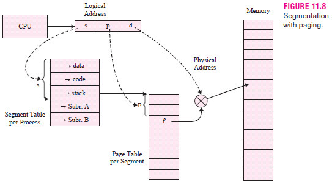

프로세스를 세그먼트 단위로 잘라서 보호/공유 측면의 이점을 취함

잘라진 세그먼트를 다시 페이지 단위로 자름(paging) 👉 외부 단편화 발생 X

✔테이블 두 가지를 모두 거쳐야 하므로 속도 면에서 조금 떨어질 수 있음.

✔이러한 hybrid형태는 현재 **인텔 프로세서에서 쓰이고 있는 방법**

 

 

<질문 1>

segmentation과 연속적 메모리 할당 방식의 단점은 무엇일까요?

<질문 2>

프로세스를 같은 단위의 크기로 잘라서 비연속적으로 메모리에 적재하는 방법은 무엇일까요?

***

### 출처

https://lordofkangs.tistory.com/211?category=885801

https://copycode.tistory.com/108?category=740133

https://jhnyang.tistory.com/247?category=815411

