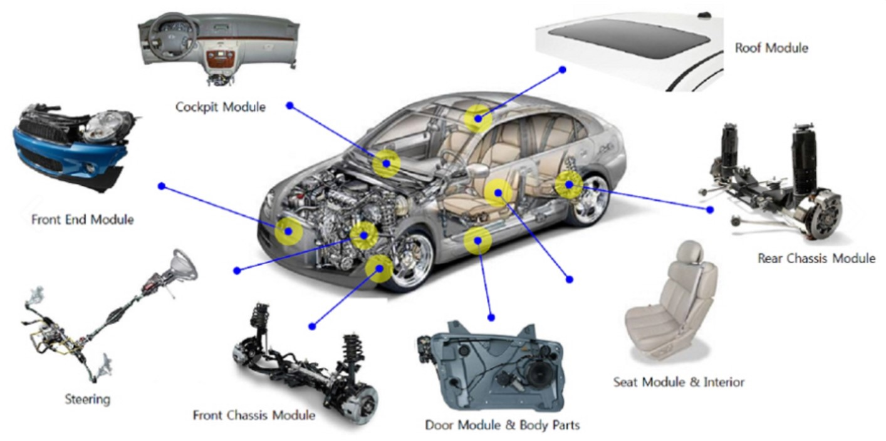
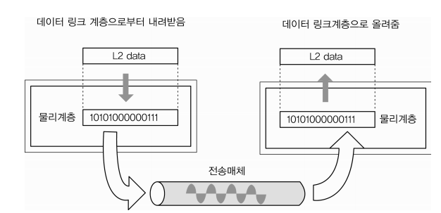
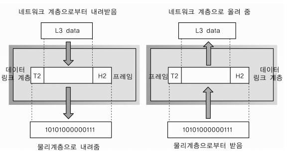
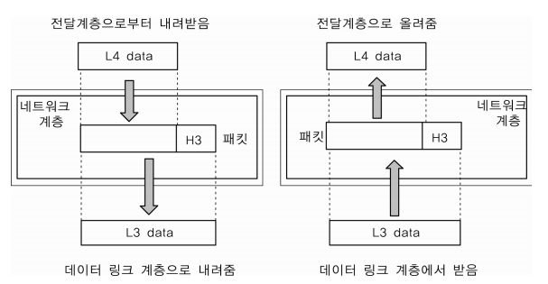
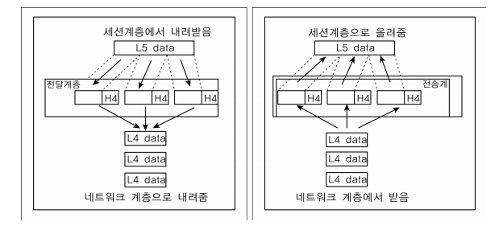
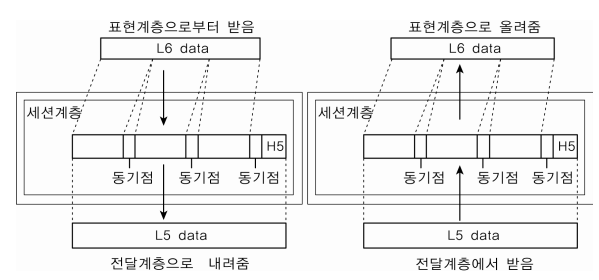
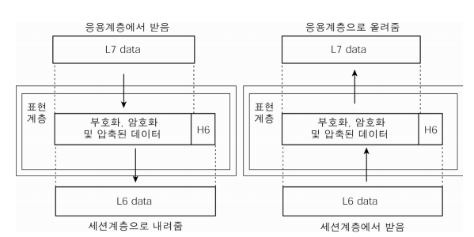
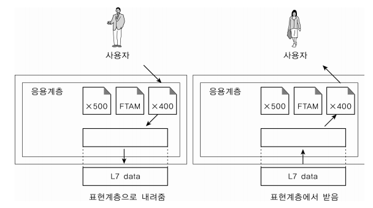

     
    <h1>
        OSI 7 layer
    </h1>

 

## 목차

1. [**OSI 7 layer의 개념과 필요성**](#1)
2. [**계층 별 설명**](#2)
3. [**전체적인 통신 플로우**](#3)

 

## 1. OSI 7 layer의 개념과 필요성

### 1-1. OSI 7 layer의 개념

<blockquote>
    1984년에 국제표준화기구(ISO)에서 개발한 모델로서, 네트워크 프로토콜 디자인과 통신 과정을 일곱 개의 계층으로 구분하여 만든 "표준" 규격
</blockquote>

- 통신이 일어나는 과정을 7단계로 크게 구분하여, 단계별로 파악이 가능

- **OSI 참조 모델** 이라고도 불림 

  - OSI(Open System Interconnection) = 개방형 시스템 👉 누구나 참조 및 부가적인 추가 가능
  - 컴퓨팅 장치나 네트워킹 장치를 만들 때 이 모델을 참조해서 모든 통신 장치를 만듦

   

- 각 계층은 상하 계급 구조를 가지고 있음
  - 상위 계층의 프로토콜이 제대로 동작하기 위해서는 하위의 모든 계층에 문제가 없어야 함
  - 물리계층 : 하드웨어   /   데이터링크 계층 : 하드웨어 + 소프트웨어   /  3계층부터는 소프트웨어로 구성
- 각 계층은 독립적인 모듈로 구성되어 있음

 

### 1-2. OSI 7 layers의 필요성

1. <u>**표준**</u> 규격 👉 *용이성*
   - 네트워크 구성 요소를 표준화함으로써 서로 다른 통신 장치와의 상호 호환 가능

 

2. 계층 별 모듈화된 것이 하나로 조립/융합된 구조 👉 *유지관리의 수월성*

자동차가 하나의 통으로 이루어져 있는 것이 아니라, 일정 계층별로 독립적으로 모듈화 되어있는 것과 같은 원리

- 7단계 중 특정한 곳에 이상이 생기면 다른 단계의 장비 및 소프트웨어를 건들이지 않고도, 이상이 생긴 단계만 고쳐 해결이 가능

3. 설계가 간단해지고, 통신이 일어나는 흐름을 한 눈에 알아보기 쉬움

​		

 

## 2. 계층 별 설명

### 2-1. Layer 1. 물리 계층(Physical Layer) 

- 최하위 계층

- 물리적인 전송 매체를 통하여 상위 계층인 데이터 링크 계층으로부터 전달된 비트 스트림을 상대측 물리 계층으로 전달하는 기능 수행

- 통신 단위 : 비트 (1 - 전기적으로 On, 0 - 전기적으로 Off)

- 단지 데이터를 전달만 할 뿐, 전송/받으려는 데이터가 무엇인지, 어떤 에러가 있는지 등은 전혀 신경 쓰지 않음.

   👉 **데이터를 전기적인 신호로 변환해서 주고받는 기능만 수행**

- 장비 : 통신 케이블, 리피터, 허브 등

 

### 2-2. Layer 2. 데이터 링크 계층(DataLink Layer)

 

- 물리적인 네트워크 사이에 데이터 전송을 담당하는 계층
- Point to Point 간 신뢰성 있는, 안전한 전송을 보장하기 위한 계층
  - 물리계층을 통해 송수신되는 <u>데이터의 전송 오류</u>를 감지하는 기능을 제공하며, 오류 감지 시 재전송

- 전송 단위 : 프레임
- 장비 : 브리지, 스위치 등

- 맥(MAC) 주소를 가지고 통신
  - MAC(Media Access Control) Address : 컴퓨터 간 데이터를 전송하기 위한 컴퓨터의 물리적 주소
  - MAC vs IP
    - IP 주소간의 통신은 각 라우터에서 일어나는 MAC주소와 MAC주소 통신의 연속적인 과정
    - ex) 미국에 있는 주소로 편지를 보낼 때, IP는 시작점과 끝점에 해당하는 주소라면, MAC주소는 편지가 거쳐가는 중간 거점들(즉, 바로 옆에 물리적으로 연결되어 있는 노드와 통신 시 사용되는 주소)

 

### 2-3. Layer 3. 네트워크 계층(Network Layer)

- 목적지 네트워크 주소(IP)를 정하고, 그에 따른 경로(Route)를 선택하고, 경로에 따라 패킷을 전달해 주는 역할
- 데이터를 목적지까지 가장 안전하고 빠른 경로로 전달하는 기능(**라우팅**)이 가장 중요
  - 프로토콜, 라우팅 기술 다양
- 여러 개의 노드를 거칠 때마다 경로를 찾아주는 역할을 하는 계층
- 다양한 길이의 데이터를 네트워크를 통해 전달하고, 그 과정에서 전송 계층이 요구하는 서비스 품질(QoS)를 제공하기 위한 기능적, 절차적 수단 제공
- 장비 : 라우터, Layer3 스위치 등

 

### 2-4. Layer 4. 전송 계층(Transport Layer)

- Endpoint의 사용자들이 신뢰성 있는 데이터를 주고 받게 해주는 역할

  - 오류검출 및 복구, 흐름 제어와 중복 검사 등을 수행

- 패킷 생성 및 전송

  - 패킷들의 전송이 유효한지 확인하고 전송 실패한 패킷들을 다시 전송

- 헤더에 포트번호가 포함되어 있음

  - 포트 번호 : 디바이스에 있는 여러 프로세스 중 자기가 가야 할 프로세스를 구분하기 위해 필요한 번호

- 대표적인 프로토콜 : TCP, UDP

  - TCP

    - 대부분 TCP 사용
    - 신뢰적인 전송 보장(패킷 손실, 중복, 순서 바뀜 등이 없도록 보장) - ACK 사용
    - IP가 처리할 수 있도록 데이터를 여러 개의 패킷으로 나누고, 도착지에서 완전한 데이터로 패킷을 재조립
    - 데이터 전송 단위 : 세그먼트

  - UDP

    - 비연결성, 비신뢰성 서비스

    - TCP와 다르게 패킷을 나누고 재조립하는 과정 없이, 수신지에서 제대로 받던 받지 않던 상관하지 않고 데이터를 보내기만 함

      👉 에러와 그에 따른 재전송, 대체는 어플리케이션에서 처리해야 함

    - 하지만 그만큼 속도가 빠름 - real time 서비스에 사용 ↑
    - 데이터 전송 단위  : 블록 형태의 다이어그램

    

 

### 2-5. Layer 5. 세션 계층(Session Layer)

- 세션 : 클라이언트와 웹서버 간 네트워크 연결이 지속 유지되고 있는 상태

  👉 사용자가 브라우저를 열어 서버에 접속한 뒤 접속을 종료할 시점까지를 뜻함

- 네트워크 상 양쪽 연결을 관리하고 연결을 지속시켜주는 계층
- 세션 생성, 유지, 종료, 전송 중단 시 복구 기능 수행 (OS가 세션 계층으로 이 역할 수행)
- TCP/IP 세션을 만들고 없애는 역할
- 통신하는 사용자들을 동기화하고 오류복구 명령들을 일괄적으로 다룸

 

### 2-6. Layer 6. 표현 계층(Presentation Layer)

- 응용 계층으로부터 전달받거나 전송하는 데이터의 <u>인코딩, 디코딩, 암호화</u> 등이 이루어지는 계층

- 코드 간의 번역을 담당하여 데이터의 형식상 차이를 다루는 부담을 응용 계층으로부터 덜어줌

  ex) 해당 데이터의 포멧 부분 (txt / jpg / gif / mpeg....)

  ​	  EBCDIC로 인코딩 된 문서 파일을 ASCII로 인코딩된 파일로 바꿈

  

 

### 2-7. Layer 7. 응용 계층(Application Layer)

​      

- 응용 프로세스와 직접 관계하여 일반적인 응용 서비스를 네트워크에 연결 및 수행하는 역할
- 사용자와 직접 접하는 유일한 계층
  -  사용자로부터 정보를 입력 받아 하위 계층으로 전달하고, 하위 계층에서 전송한 데이터를 사용자에게 전달
  - UI부분, I/O부분
- 대표적인 프로토콜 : HTTP, DNS, Telnet, FTP...

## 3. 전체적인 통신 플로우

1. 발신 측에서 응용 계층부터 시작해 각 계층마다 헤더를 붙여서 캡슐화를 진행

2. 수신 측에서는 물리 계층부터 차례로 올라가면서 헤더를 떼 내는 디캡슐레이션을 진행하여 데이터 식별

   ex) 데이터가 목적지로 이동할 때, Network Layer에서 IP헤더에 있는 프로토콜 정보를 이용해 데이터가 TCP인지 UDP인지 식별한 후 그에 따른 처리를 Transport Layer에서 수행.

3. 목적지에 원하는 데이터가 전송됨

더 알아보기 : https://better-together.tistory.com/89

### +) OSI 7 layer 암기 팁

---

**참고 사이트**

https://jhnyang.tistory.com/194

https://shlee0882.tistory.com/110#recentComments

https://blog.naver.com/PostView.nhn?blogId=pst8627&logNo=221670903384

https://jhnyang.tistory.com/404

https://itstudyblog.tistory.com/295

**이미지 출처** :  '데이터통신', 오창환 저, 한국학술정보(주)

