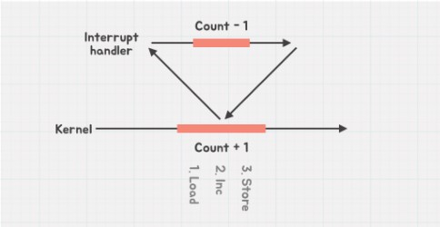
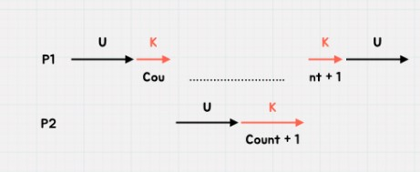
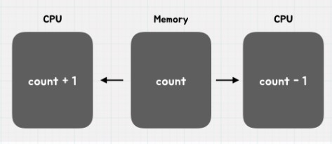
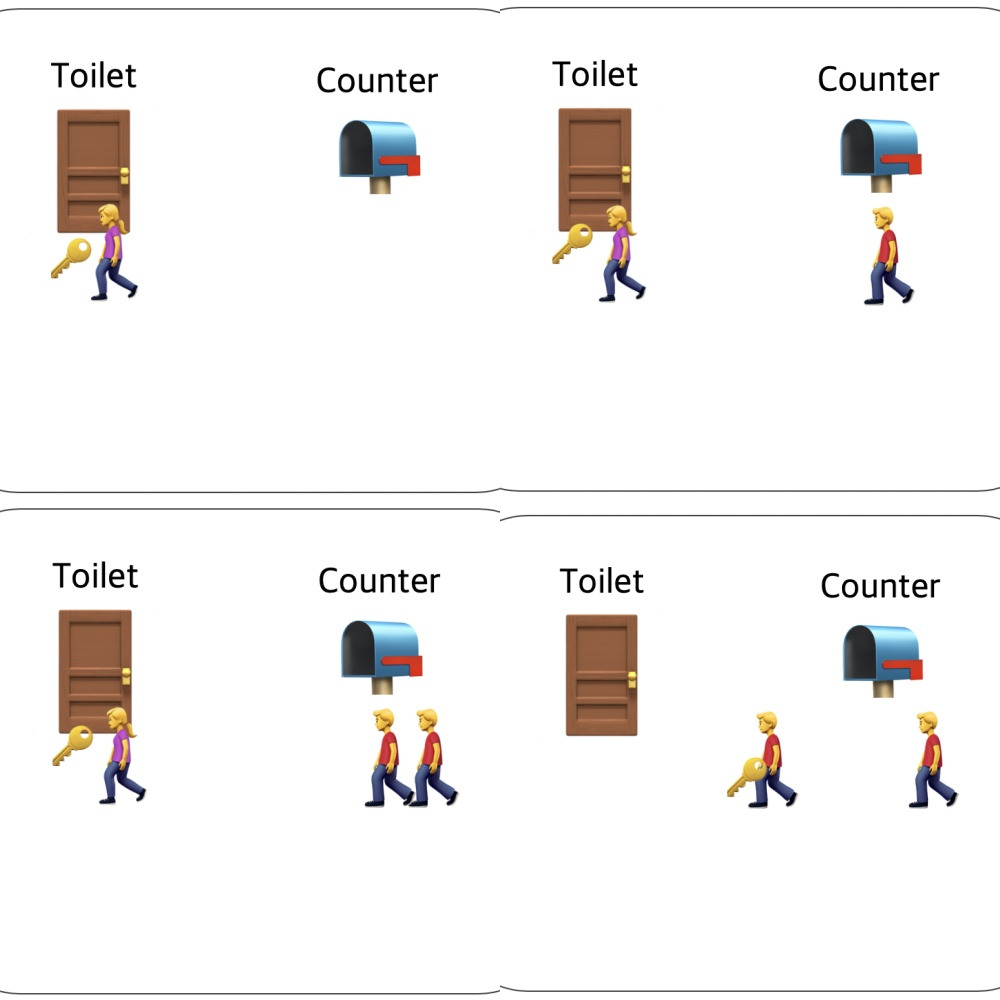
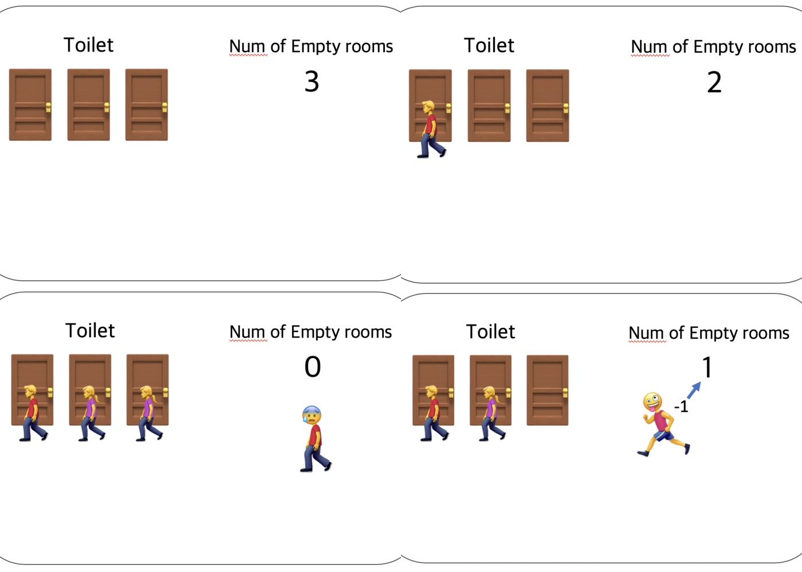
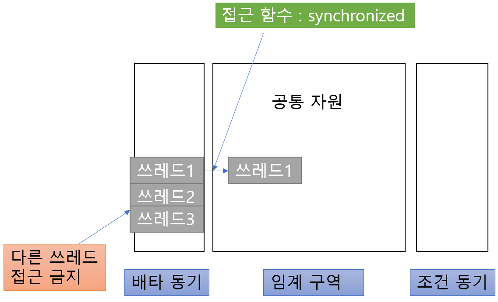
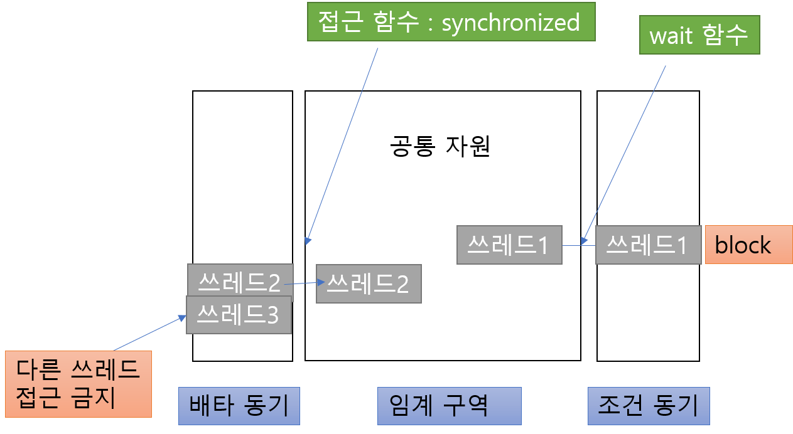
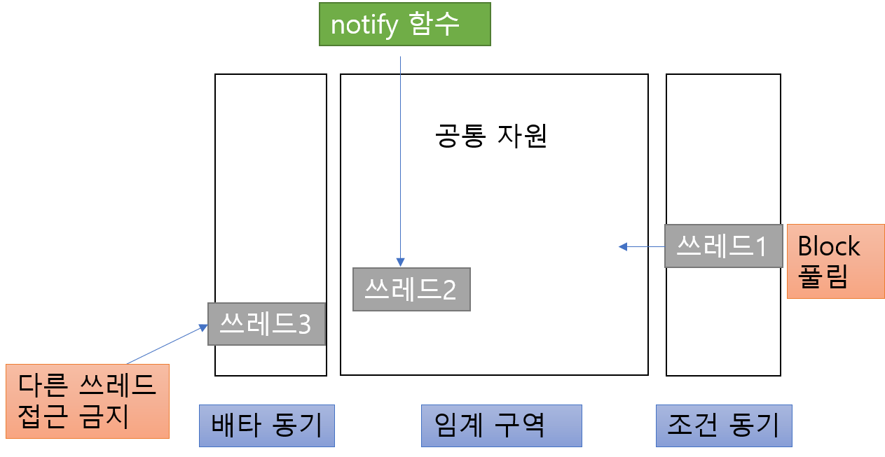

     
    <h1>
        프로세스 동기화
    </h1>
     

## 목차

1. [**경쟁 상태(Race Condition)**](#1)
2. [**임계 구역(Critical Section)**](#2)
3. [**프로세스 동기화 방법**](#3)

 

 

## 1. 경쟁 상태(Race Condition)

> 여러 프로세스가 하나의 공유 자원을 놓고, 동시에 접근하여 서로 사용하려고 경쟁하는 상황

- 접근 타이밍, 순서 등이 결과값에 영향을 줄 수 있음
- 동시에 접근할 때 *자료의 일관성*을 해치는 결과가 나타날 수 있음

 
 
 

### OS에서 Race condition은 언제 발생하는가?

 

**1. kernel 작업 수행 중 interrupt가 발생할 시**

**interrupt : 프로그램을 실행하는 도중에 예상치 않은 상황이 발생한 경우, 현재 실행중인 작업을 중단하고 발생된 상황을 처리한 후 다시 실행중인 작업으로 복귀하는 것

- **문제점** : **kernel mode*에서 데이터를 로드하여 작업을 수행하는 도중 interrupt가 발생하여 같은 데이터를 조작하는 경우 →  interrupt의 작업이 반영되지 않음
- **해결법** : kernel mode에서 작업을 수행하는 동안, interrupt를 disable 시켜 CPU 제어권을 가져가지 못하도록 함 

  

** kernel mode :  운영체제가 CPU의 제어권을 가지고 운영 체제 코드를 실행하는 모드로서, 모든 종류의 명령을 다 실행할 수 있음

** user mode : 일반 사용자 프로그램이 실행되며 제한적인 명령만 수행 가능(즉, 시스템에 중요한 영향을 미치는 연산은 커널 모드에서만 실행 가능하도록 함으로써 하드웨어의 보안을 유지)

  

**2. Process가 system call을 하여 작업을 수행하는 도중 context switch가 일어나는 경우**

** system call : kernel mode 영역의 기능을 user mode가 사용 가능하게, 즉 프로세스가 하드웨어에 직접 겁근해서 필요한 기능을 사용할 수 있게 해 주는 것.

** context switch : CPU가 하나의 프로세스를 실행하고 있는 상태에서 interrupt 요청에 의해 다음 우선 순위의 프로세스가 실행되어야 할 때, 기존 프로세스의 상태값(context)을 저장한 뒤 프로세스의 상태나 값을 교체하는 작업.

- **문제점** : P1이 커널 모드에서 데이터를 조작하는 도중, 시간이 초과되어 CPU 제어권이 P2로 넘어가 같은 데이터를 조작하는 경우 → P2의 작업이 반영되지 않음
- **해결법** : 프로세스가 커널 모드에서 작업을 하는 경우 시간이 초과되어도 CPU 제어권이 넘어가지 않게 함.

  

**3. 멀티 프로세서에서 공유 메모리 내의 커널 데이터에 접근할 때**

- **문제점**  : 2개의 CPU가 동시에 커널 내부의 공유 데이터에 접근하여 조작하는 경우
- **해결법** : 커널 내부에 있는 각 공유 데이터에 접근할 때마다, 그 데이터에 대한 lock/unlock을 하여 동시 접근을 제한

    

## 2. 임계 구역(Critical Section)

> OS에서 여러 프로세스가 데이터를 공유하면서 수행될 때, **각 프로세스에서 공유 데이터를 엑세스하는 프로그램 코드 부분**을 의미함. `공유 자원의 독점을 보장`해주는 역할을 수행

  

**임계구역 문제를 해결하기 위한 3가지 조건**

1. Mutual Exclusion(상호 배제)

   : 하나의 프로세스가 critical section 부분을 수행 중이면 다른 모든 프로세스들은 그 critical section에 접근할 수 없다.

   

2. Progress (진행)

   : 아무도 critical section에 있지 않다면, 들어가고자 하는 프로세스를 들어가게 해줘야 한다.

   

3. Bounded Waiting(유한 대기)

   : 프로세스가 critical section에 들어가기 위해 **무한정으로 기다리는 현상(starvation)**이 있어서는 안되기 때문에, 한 번 진입했다가 나온 프로세스는 다음 진입 때 제한을 준다.

    

## 3. 프로세스 동기화 방법

>  공유 자원에 대한 여러 프로세스의 동시 접근을 막는 방법

 
 

### 3-1. Critical Section

- 공유되는 영역 자체를 Critical Section이라고도 하지만, 이 영역에 대한 동기화를 맞추는 기법 중 하나이기도 함
- User mode 동기화 방법에 속함 → 동기화 과정에서 Kernel mode까지 접근하지 않아도 되기 때문에, 가볍고 빠름
- OS의 객체를 사용하는 것이 아닌, 프로세스의 메모리 공간에 정의되어 있는 변수를 이용하여 동기화를 맞추는 기법
- 하나의 프로세스 내의 Thread들에 대한 동기화를 맞춰줄 수는 있지만, 서로 다른 여러개의 프로세스 간의 동기화를 맞춰줄 수는 없음
- 공유 자원에 대해 '1개의 thread'만이 접근 가능하도록 만들어 줌

 
 

## 3-2. Mutex

&nbsp;&nbsp;&nbsp;&nbsp;&nbsp;&nbsp;&nbsp;순서대로 1, 2, 3, 4

 

- 동작 원리

  뮤텍스는 **화장실이 하나밖에 없는 식당**과 비슷함. 화장실을 가기 위해서는 카운터에서 열쇠를 받아 가야 함

  1. 화장실을 가려고 하는데 카운터에 키가 있으면 화장실에 사람이 없다는 뜻이고, 나는 그 열쇠를 가지고 화장실에 들어갈 수 있다.
  2. 다른 테이블에 있는 남자가 화장실에 가고 싶어졌다. 하지만 이 사람은 열쇠가 없기 때문에 화장실에 들어갈 수 없으므로, 내가 나올 때까지 카운터에서 기다려야만 한다.
  3. 곧이어 또다른 남자도 화장실에 가고 싶어졌고, 그 또한 화장실에 들어가기 위해서는 카운터에서 대기해야만 한다.
  4. 이제 내가 화장실에서 나와 카운터에 키를 돌려놓았다. 이제 기다리던 사람들 중 맨 앞에있던 사람은 키를 받을 수 있고, 이를 이용해서 화장실에 갈 수 있다.

 

  👉 화장실을 이용하는 사람은 **프로세스 혹은 쓰레드** 이며 화장실은 **공유자원**, 화장실 키는 공유자원에 접근하기 위해 필요한 어떤 오브젝트

 
 

- 요약
  - Mutex는 Key에 해당하는 어떤 오브젝트가 있으며, 이 오브젝트를 소유한 하나의 쓰레드/프로세스만이 공유자원에 접근 가능한 Locking 매커니즘.

 
 
 

## 3-3. Semaphore

&nbsp;&nbsp;&nbsp;&nbsp;&nbsp;&nbsp;&nbsp; 순서대로 1, 2, 3, 4

 

- 동작 원리

  1. 세마포어는 **화장실을 여러 개 가지고 있는** 식당과 비슷하다. 그리고 화장실 입구에는 현재 화장실의 빈 칸 개수를 보여주는 전광판이 있다.
  2. 내가 화장실에 가고 싶으면 입구에서 빈 칸의 갯수를 확인하고 1개 이상이라면 빈칸의 개수를 하나 뺀 다음에 화장실로 입장해야 한다.그리고 나올 때는 빈 칸의 개수를 하나 더해준다.
  3. 모든 칸에 사람이 들어갔을 경우 빈 칸의 개수는 0이 되며, 이때 화장실에 들어가고자 하는 사람이 있다면 빈칸의 개수가 1로 바뀔 때까지 기다려야 한다.
  4. 사람들은 나오면서 빈 칸의 수를 1씩 더한다. 그리고 기다리던 사람은 이 숫자에서 다시 1을 뺀 다음 화장실로 간다.

 

  👉 세마포어도 화장실이 공유자원이며 사람들이 쓰레드, 프로세스이다. 그리고 화장실 빈칸의 갯수는 현재 공유자원에 접근할 수 있는 쓰레드, 프로세스의 개수를 나타낸다.

 
 

- 요약
  - 현재 공유자원에 접근할 수 있는 쓰레드/프로세스의 수를 나타내는, 공통으로 관리하는 하나의 값을 두어 상호 배제를 달성하는 Signaling 메커니즘.

   

### Mutex와 Semaphore의 공통점

 

- Kernel Mode에서 사용되는, 상호배제를 달성하는 동기화 기법이다.
- User Mode에 비해 느리고 무겁다
- 하나의 Process 내에 있는 Thread들 간의 동기화를 맞춰주는 것 뿐만 아니라, Process들 간의 동기화 또한 맞춰줄 수 있다.

- 여전히 *데이터 무결성* 을 보장할 수 없으며 *데드락*이 발생할 수 있지만, 상호배제를 위한 기본적인 기법이며 여기에 좀 더 복잡한 매커니즘을 적용한다면 우아하게 동작하는 프로그램을 짤 수 있다.

  

** 데이터 무결성(Data Integrity) : 데이터의 정확성, 일관성이 유지되는 것

** 데드락(DeadLock) : 둘 이상의 프로세스가 다른 프로세스가 점유하고 있는 자원을 서로 기다릴 때 **무한 대기에 빠지는 상황**

   

### Mutex와 Semaphore의 차이점

 

- 가장 큰 차이점은 **동기화 대상의 갯수**
  - Mutex는 동기화 대상이 하나일 때 사용
  - Semaphore는 동기화 대상이 한개 이상일 때 사용

- Semaphore는 자원의 상태를 나타내는 일종의 '변수'로써 소유 개념이 아니지만, Mutex는 자원을 점유한 프로세스나 쓰레드가 잠시 소유하였다가 작업이 끝나면 반환하는 개념
- Mutex는 lock을 걸은 쓰레드만이 임계 영역을 나갈 때 lock을 해제할 수 있지만 Semaphore는 lock을 걸지 않은 쓰레드도 signal을 사용해 락을 해제할 수 있다.
- Semaphore는 Mutex가 될 수 있지만(카운트를 1로 설정하는 Binary Semaphore), Mutex는 Semaphore가 될 수 없다.

    

## 3-4. Monitor

- 세마포는 오래된 동기화 도구이고, 현재 활발히 사용되는 도구 중 하나가 Monitor.
- 특히 자바 프로그램에서는 Monitor에 대한 활용이 높음
  - 자바에서는 모든 객체가 Monitor가 될 수 있다.

  

**자바의 Monitor를 통한 Monitor 원리**

 

- 두 개의 queue가 있는데 각각 **배타 동기**와 **조건 동기** 역할을 한다.

  - 배타 동기 queue : 하나의 쓰레드만 공유자원에 접근할 수 있게 함

    - synchronized 키워드를 사용해서 지정 가능

  - 조건 동기 queue : 진입한 쓰레드가 블록되면서 새 쓰레드가 진입 가능하게 하는 공간

    - 실행 함수

      -  wait() - 진입한 쓰레드를 조건 동기 queue에 block 시킴
      - notify() - 그렇게 블록된 쓰레드를 깨움
      - notifyAll() - 모든 쓰레드를 깨움

      
  
원리 : 
synchronized 키워드를 통해 쓰레드가 공유 자원에 접근 → 다른 쓰레드가 들어오면 사용이 끝난 쓰레드는 wait 함수로 인해 조건 동기로 넘어가며 block됨  → 현재 공통 자원에 있는 쓰레드가 notify함수를 호출하면 조건 동기에서 block되어 있던 쓰레드의 block이 풀리며 깨어남.  → 깨워진 쓰레드는 현재 쓰레드가 나가면 재진입 가능. 

   

**Monitor의 특징**

- Semaphore가 어셈블리 언어에 적합한 도구라면, Monitor는 그보다 high level 언어의 도구
- 라이브러리에서 제공되는 기법이라서 가볍고 빠름
- Thread 간의 동기화만 맞춰줄 수 있음
- Semaphore는 프로그래머가 Counting 변수, lock 설정 및 해제 등을 매번 직접 지정해 줘야 하는 번거로움이 존재하지만, 모니터는 이러한 기능들이 캡슐화 되어 있어서 제공되어지는 키워드, 함수를 통해서 편하게 동기화 작업이 가능하다.

     

***

#### 참고자료

https://hibee.tistory.com/297

https://worthpreading.tistory.com/90

https://chelseashin.tistory.com/40

https://yabmoons.tistory.com/661

https://copycode.tistory.com/83
