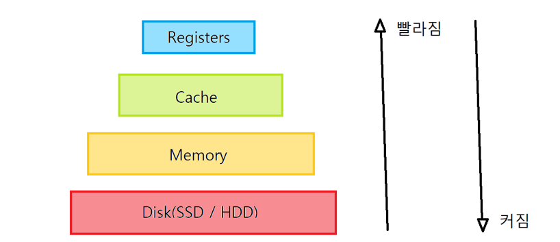

   
  <h1>Auth(인증)방식 : Session과 JWT</h1>
   

## 목차
1. [**세션 왜 써야 하는가?**](#1)
2. [**쿠키(Cookie)**](#2)
3. [**세션(Session)**](#3)
4. [**토큰(Token)**](#4)
5. [**세션의 장, 단점**](#5)
6. [**JWT(JSon Web Token)**](#6)
7. [**세션과 JWT 차이**](#7)

 

## 세션 왜 써야 하는가?

<pre>
HTTP 프로토콜은 stateless라 하며 이는 서버로 가는 모든 요청이 독립적으로 다뤄지기 때문에, 요청끼리 연결이 없고, 메모리가 없기 때문에 요청이 끝나면 서버는 사용자가 누구인지 알 수 없다. 라는 뜻이다. 따라서 이런 정보를 알리기 위해서 세션을 사용한다.

</pre>

 

## 쿠키(Cookie) 란?

<pre>
정보를 전달하는 매개체.

사이트를 방문하면 브라우저는 서버에 요청을 보내고 서버의 응답에 모든 데이터와 사용자가 찾던 페이지 정보가 있고 브라우저에 저장하고자 하는 쿠키가 포함될 수 있다.

브라우저에 쿠키를 저장한 후 다시 방문 할 때마다 브라우저는 해당 쿠키도 요청과 함께 서버로 보낸다.

쿠키는 도메인에 따라 제한되며 서버에서 정한 유효 기간이 있다.

언어 설정 변경 같은 인증 뿐 아닌 여러가지 정보를 저장할 수 있다.

</pre>

 

## 세션(Session)
 
<pre>

필요한 정보를 서버로 보내면 정보를 확인 후 서버는 세션 DB에 유저를 생성하고, 해당 세션에 세션ID는 쿠키를 통해 브라우저로 돌아와 저장된다.

같은 웹 사이트의 다른 페이지로 이동하면 브라우저는 세션ID를 가지고 있는 쿠키를 서버로 보낸다.

서버는 들어오는 쿠키를 보고 세션 ID와 함께오는 쿠키를 확인한다. 이때 서버는 아직 사용자가 누구인지 모른다. 해당 세션 ID를 통해 세션 DB를 확인하고 나서야 서버는 사용자가 누구인지 알게된다. 

**유저의 정보는 모두 서버에 존재한다는 점.
유저가 가지고 있는건 세션 ID뿐이다. 

</pre>

 

## 토큰(Token)

<pre>

쿠키는 그저 세션 ID를 전달하기 위한 매개체로 사용된다.
또한 브라우저에만 존재하기 때문에 세션을 이용해서 안드로이드나 IOS 같은 네이티브 앱을 만들 수 있지만 쿠키는 쓸 수 없다.

이때 사용하는 것이 바로 토큰(Token)이다.

토큰은 그저 하나의 문자열 이다.

토큰을 서버로 보내고 서버는 세션 DB에서 해당 토큰과 일치하는 유저를 찾는다.

서버는 해당 세션DB를 통해 사용자를 알아낸다.

</pre>

 

## 세션의 장, 단점

<pre>

세션은 서버에 세션DB를 통해 모든 것을 관리하기 때문에 유저 관리를 하기 쉽다. 

무슨 뜻인가 하면 유저를 강제탈퇴 시키기 위해서 그저 DB를 삭제하면 되며, 로그인 된 디바이스를 확인해 강제 로그아웃도 가능하고, 계정 공유 숫자를 제한 할 수 있다. 

하지만 단점 역시 명확하다.
서버와 브라우저 사이에 데이터 교환이 페이지 이동 마다 계속 이루어져야 하기 때문에 하는 일이 많아지고, DB를 통해 관리하기 때문에 DB를 구매하여 유지 해야하고, 유저가 늘어나면 그 규모가 기하급수적으로 커질 수 밖에 없다.

</pre>

## JWT

 
<pre>
JSon Web Token이라는 이름을 보면 알듯이 Token형식이다.

JWT는 매우 매우 긴 문자열 형태이다. 공간 제약이 JWT에는 없기 때문이다.

세션 DB를 가질 필요도 없고, 서버는 유저 인증에 많은 일을 하지 않아도 좋다.

사용자가 아이디와 비밀번호를 서버에 보내면, 아이디(꼭 아이디가 아니어도 된다.) 사인 알고리즘을 통해 사인을 한다.

해당 사인 정보를 문자열 형태로 사용자에게 보내게 된다.

이 사인을 사용자가 서버로 보내면 해당 사인이 유효한지만 체크하고 유효하면 서버는 사용자를 유저로 인식하게 된다.

Ex) eyJpc3MiOiJ2ZWxvcGVydC5jb20iLCJleHAiOiIxNDg1MjcwMDAwMDAwIiwiaHR0cHM6Ly92ZWxvcGVydC5jb20vand0X2NsYWltcy9pc19hZG1pbiI6dHJ1ZSwidXNlcklkIjoiMTEwMjgzNzM3MjcxMDIiLCJ1c2VybmFtZSI6InZlbG9wZXJ0In0 

데이터를 사인하고 유저에게 보내고 해당 데이터를 돌려받을 때 유효성을 검증 할 수 있다. 
중요한 점은 DB는 필요 없다는 점이다.

요즘 많이 쓰이는 QR체크인도 JWT를 이용한 거라고 한다.

</pre>

## 세션과 JWT 차이

 
<pre>

세션
모든 정보는 세션 DB에 저장되어 있기 때문에 사용자는 세션 ID만 보내면 된다.

JWT
서버는 유저를 인증하는데 필요한 정보를 토큰으로 저장.
해당 토큰을 사용자에게 주고, 페이지를 요청하면 서버는 해당 토큰이 유효한지만 확인 하면 된다.
단 암호화 되지 않았기 때문에 누구나 열어서 확인 가능.

</pre>