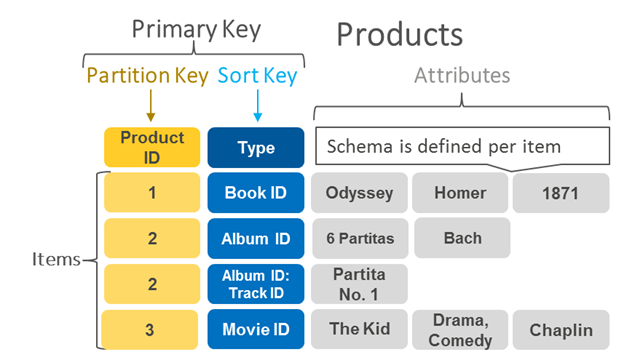
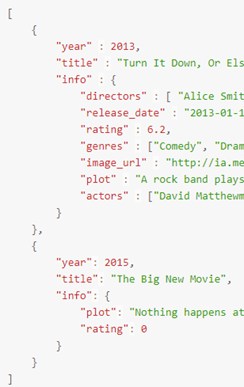
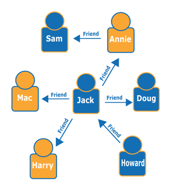

   
  <h1>SQL, NOSQL</h1>
   

## 목차

1. [**SQL**](#1)
2. [**SQL 용어**](#2)
3. [**SQL 장점과 단점**](#3)
4. [**NOSQL**](#4)
5. [**NOSQL 모델**](#5)
6. [**NOSQL 장점과 단점**](#6)
7. [**SQL vs NOSQL**](#7)
8. [**참조**](#8)

 

## SQL

<pre>
관계를 테이블화 시킨 매우 간단한 원칙의 전산정보 데이터베이스

테이블은 열(column)과 행(row)로 이루어져 있고, 하나 이상의 테이블이 필요하다.

각 행(row)은 고유키(Primary key)를 통해 식별하게 된다. 

트랜잭션이 하나의 단위로 기록되며, 실패 시 전체적으로 롤백이 실행 한다는 특징이 있다.

대표적 :  MySQL, Oracle 등등

</pre>

 

## SQL 모델 용어
 
<pre>

키(key)와 값(value) : 키는 각 행을 식별할 수 있는 고유한 식별자이다. 5개의 키가 존재한다. (기본키, 외래키, 슈퍼키, 후보키, 대체키). 값은 해당 키를 통해 식별하는 값을 말한다.

관계(Relation) : 1 : 1, 1 :다, 다 : 다 의 관계가 존재한다. 데이터베이스 들은 각 행과 각 열이 하나의 값만 보유할 수 있게 설계되있다.

트랜잭션 : 하나의 작업을 수행하기 위해 필요한 데이터베이스의 연산들을 모아 놓은 단위.

제약 : 관계형 모델이 갖는 제약 조건. SQL은 이것을 통해 데이터의 무결성을 보장한다.

제약.1)개체 무결성 : 릴레이션에서 기본키를 구성하는 속성은 Null값이나 중복 값을 가질 수 없다.

제약.2)참조 무결성 : 외래키 값은 Null이거나 참조 릴레이션의 기본키 값과 동일해야 한다.

</pre>

 

## SQL의 장점과 단점

<pre>
장점
 - 데이터의 성능이 일반적으로 좋아 정렬, 탐색, 분류가 빠르다.
 - 신뢰성이 높아 데이터의 무결성을 보장한다.
 - 정규화에 따른 갱신 비용을 최소화한다.

단점
 - 기존에 작성된 스키마를 수정하기 어렵다.
 - 데이터베이스의 부하를 분석하기 어렵다.
 - 빅데이터를 처리하는데 매우 비효율적이다.
</pre>

 

## NOSQL

 
<pre>
특정 데이터 모델에 대해 특정 목적에 맞추어 구축되는 데이터베이스

행과 열로 이루어진 테이블 스키마를 사용하지 않고 필요에 따라 모델을 바꾸기 때문에 유연한 스키마를 갖추고 있다.

고유키, 외래키, 조인 등 관계를 정의하지 않고, 스키마 또한 정의 하지 않는다.

대표작 : MongoDB, CouchDB 등

참고로 No SQL이 아니라 Not Only SQL이다.
</pre>

## NOSQL의 모델

 
<pre>
키 - 값 : 간단한 키 - 값 메소드를 사용하여 데이터를 저장하는 모델. 키를 고유한 식별자로 사용하는 키 - 값 쌍의 집합으로 데이터를 저장. 
다른 유형의 데이터베이스로는 불가능한 범위까지 수평 확장이 가능하다.

-세션 스토어, 장바구니등을 만들 때 많이 사용한다.

문서 : JSON 유사 형식의 문서로 데이터를 저장 및 쿼리하도록 설계된 모델. 문서 모델을 사용하면 개발자들이 자신의 애플리케이션 코드에서 사용하는 것과 동일한 문서 모델 형식을 사용하여 데이터베이스에서 보다 쉽게 데이터를 저장하고 쿼리할 수 있다.

-콘텐츠 관리, 카탈로그 등에 자주 쓰인다.

그래프 : 노드를 사용하여 데이터 엔터티를 저장하고, 엣지로 엔터티 간의 관계를 저장하는 모델. 시작 노드, 끝 노드, 유형과 방향을 가지고 있고, 상 - 하위 관계, 동작 소유자 등을 문서화 한다.

-이상 탐지, 추천 엔진 등에 많이 쓰인다. 

</pre>

## NOSQL 장점과 단점

 
<pre>
장점
 - 데이터 모델링이 완료 되기 이전에도 테스트 데이터의 조회가 가능하다.
 - 스키마가 없기 때문에 더 유연하여, 언제든지 저장한 데이터를 조정할 수 있다.
 - 다양한 가변성이 있는 데이터의 저장이 쉽다.
 - 데이터가 애플리케이션이 필요로 하는 형식으로 저장되어 있어 읽어오는 속도가 빠르다.
 - 수직 및 수평적 확장이 모두 가능하여 애플리케이션에서 발생하는 모든 읽기, 쓰기 요청의 처리가 가능하다.
 

단점
 -유연성이 좋아서 데이터 구조 결정이 어려울 때가 있다.
 -익숙하지 않은 방식이므로 추가적인 교육이 필요한 경우가 많다.
 -NOSQL마다 쿼리가 다르게 사용하는 경우가 많아 이식성이 낮다.

</pre>

## 참조

 
<pre>
SQL을 쓰기 좋을 때
 - 관계를 맺고 있는 데이터가 자주 변경되고 수정되는 경우
 - 스키마가 변경될 여지가 없고, 명확한 스키마가 사용자와 데이터에 중요한 경우

 

NOSQL을 쓰기 좋을 때
 -정확한 데이터 구조를 알수 없거나, 변경, 확장이 될 수도 있는 경우.
 -read처리는 자주하지만, update, delete, insert가 거의 없는 경우
  -막대한 양의 데이터를 다뤄야하여 수평적 확장이 필요한 경우

 

이렇게 상황에 맞게 사용하는 것이 좋다.

</pre>

## SQL vs NOSQL

 

https://docs.microsoft.com/ko-kr/azure/architecture/data-guide/big-data/non-relational-data

https://aws.amazon.com/ko/nosql/

https://sunrise-new-world.tistory.com/19

</pre>