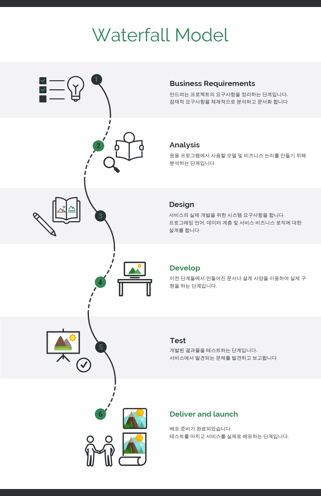
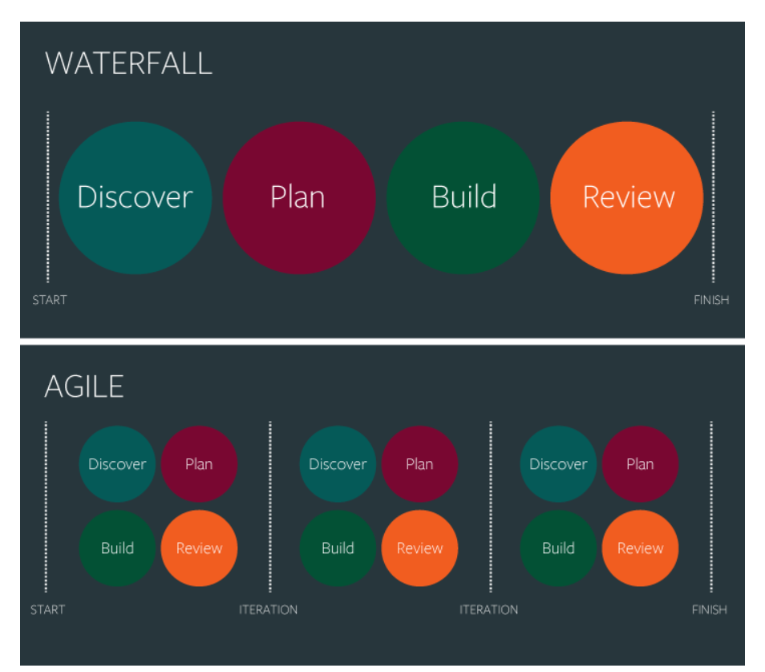
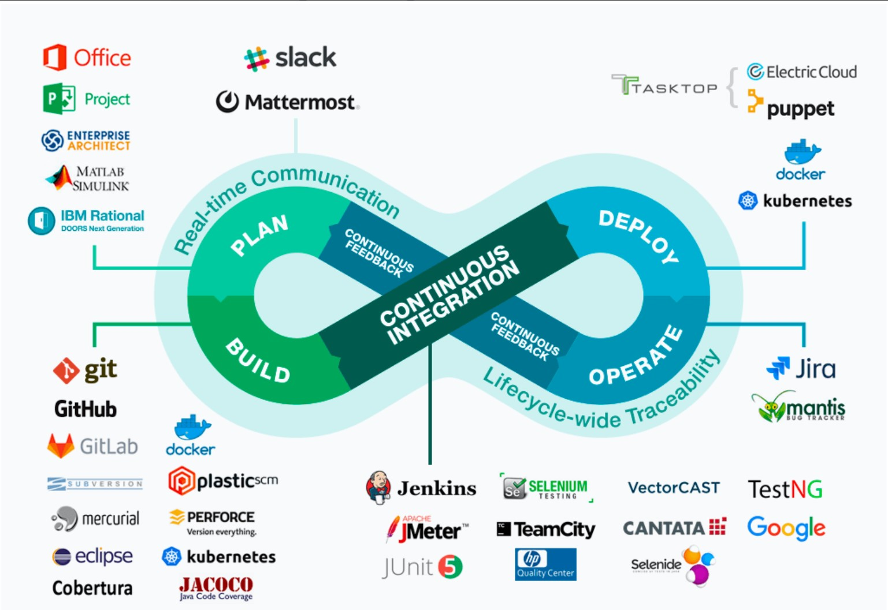

     
    <h1>
        소프트웨어 방법론 - 워터폴, 애자일, 데브옵스
    </h1>
     

## 목차

1. [**폭포수 방법론이란?**](#1)
2. [**애자일 방법론이란?**](#2)
3. [**데브 옵스란?**](#3)
4. [**애자일 방법론 vs 데브 옵스**](#4)

 

## 폭포수 방법론이란?

<blockQuote>1970년대에 창안된 전통적인 소프트웨어 개발 방법으로, 물이 흐르는 듯한 <u>“단계별 순차적인 진행”</u>을 강조합니다.</blockQuote>

- **장점**
  - 프로젝트를 시작하기 전에 프로젝트에 대한 전체적인 요구사항과 디자인들이 이미 완성되어 있기 때문에 각 단계와 전체적인 과정에 대한 이해가 쉽습니다.
  - 단계별로 정형화된 접근방식을 이용하기 때문에 기술적인 위험요소가 적습니다.
  - 고전적인 방법론으로써 적용 사례가 풍부하므로 벤치마킹하기 쉽습니다.
- **단점**
  - 순차적인 진행으로 인해 각 단계 병행이 불가합니다.
  - 실제 동작하는 소프트웨어는 개발 후반부에나 확인할 수 있기 때문에, 고객의 피드백을 즉각적으로 수용하기가 어렵습니다.
  - 개발 도중에 요구사항이 바뀌면 처음 단계부터 다시 돌아가 개발을 진행해야 합니다.

 

## 애자일 방법론이란?

'폭포수 방법론'과는 반대되는 개념입니다.

-등장배경 : 변화가 잦은 소프트웨어 개발 방식에는, 제조업과 건설업의 방식을 가져온 것인 폭포수 방법론이 맞지 않다는 목소리가 점점 커지면서 여러 경량화 방법론이 나오기 시작하였는데, 2001년 발표된 애자일 방법론도 이 중 하나에 해당합니다.

<blockQuote>애자일 방법론이란, 실질적인 코딩을 기반으로 일정한 주기에 따라 계속적으로 프로토타입을 형성하고 필요한 요구사항을 파악하며 이에 따라 즉시 수정사항을 적용하여 결과적으로 하나의 큰 소프트웨어를 개발하는 적응형 개발 방법입니다. </blockQuote>

`'처음부터 완벽한 계획'이 아닌, "간소한 계획과 유연한 대처"를 추구합니다.`

- "계획-설계-개발-피드백"이 하나의 스프린트로 구성되고, 이 스프린트가 주기적으로 반복되는 형태입니다. (한 스프린트 당 1~2주 소요)
- **장점**
  - 제품 초기 버전이 워터폴보다 훨씬 빠르게 출시되어, 고객의 피드백을 그만큼 더 빨리 받아 더 유연하고 즉각적으로 소프트웨어를 개선 가능합니다.
  - 수정과 변경에 유연합니다.
  - 프로젝트를 시작할 때 계획에 버리는 시간을 줄일 수 있습니다.
  - 점진적으로 테스트가 가능하기 때문에, 버그를 더 빠르게 발견할 수 있습니다.

- **단점**
  - 확정되지 않은 계획으로 개발 진행 시 이해하지 못하고 진행하는 부분이 많을 수 있습니다.
  - 반복적인 업무로 속도는 빠를 수 있으나 그만큼 미흡한 기능들에 대해 확실한 대처가 부족할 수 있습니다.

 

## 데브옵스란?

Development와 Operation을 합친 단어입니다.

- 등장 배경 : 개발팀과 운영팀 간의 충돌이 잦아지며 등장하게 되었습니다.

  

  

스프린트가 돌아가며 빠른 소프트웨어 개발이 가능해졌는데, 그런 만큼 소프트웨어 배포가 빨라지고, 빌드도 빈번해지며 개발팀과 운영팀 간의 충돌이 발생하게 됩니다. 2000년대 중반을 넘어오면서 소프트웨어는 시장이 웹 서비스로 넘어가면서 개발만큼이나 안정적인 운영이 중요해졌는데, 안정적인 운영은 개발의 속도를 늦추기 마련이고, 빠른 개발을 선호하는 문화는 안정적인 운영에 방해가 되었기 때문입니다.

<blockQuote>
데브옵스란, 소프트웨어 개발자와 정보기술 전문가 간의 소통, 협업 및 통합을 강조하는 개발 환경이나 문화를 뜻합니다.
    → 즉, 데브옵스는 개발부서와 운영부서 간의 원활한 소통을 기반으로 하며, 운영팀에서 고객의 수요에 맞춰 서버와 데이터베이스를 관리하는 일을 통해 서비스가 제대로 돌아갈 수 있는 환경을 개발팀에게 제공할 수 있게 하는 것입니다. </blockQuote>

- 목적: 소프트웨어 서비스를 빠른 시간에 개발 및 배포
- 데브옵스 시스템은 다양한 툴을 활용하여 구축되는데, 그러한 도구들은 개발팀과 운영팀이 함께 사용 가능하며, 프로세스 자동화 및 모니터링이 가능해서 개발과 운영이 마치 하나의 팀처럼 움직일 수 있게 해줍니다.

- 데브옵스는 에자일 방법론과 함께 쓰이기도 하고, 비교적 최근에 생겨난 개념이지만 아마존, 넷플릭스, 페이스북 등의 유명한 기업부터 해서 점점 많은 기업이 사용하고 있는 방법입니다. 또, 그에 따라 개발 지식뿐만 아니라 네트워크, 인프라 지식까지 갖추고 있는 데브옵스 엔지니어도 최근 많이 채용하고 있는 추세라고 합니다.

 

## 애자일 방법론 vs 데브옵스

