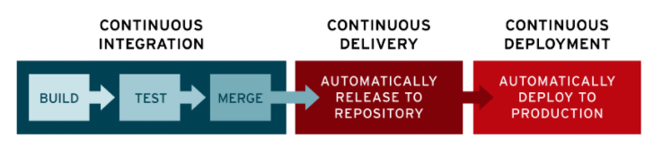

   
  <h1>CI / CD</h1>
   

## 목차

1. [**지속적 통합(CI)**](#1)
2. [**지속적 배포(CD)**](#2)
3. [**정리**](#3)
4. [**참조**](#4)

 

## 지속적 통합(CI)

CI (Continuous Integration)

개발을 진행하면서도 품질을 관리할 수 있도록 하는 것. 
여러 명이 하나의 코드에 대해서 수정을 진해해도 지속적으로 통합하면서 관리할 수 있다.

CI를 통해 개발자들은 코드 변경 사항을 공유 브랜치 또는 `트렁크`로 다시 병합하는 작업을 수월하고 자주 수행 가능하다.

개발자가 애플리케이션에 적용한 변경 사항이 병합되면 이러한 변경 사항이 애플리케이션을 손상시키지 않도록 자동으로 애플리케이션을 구축하고 각기 다른 레벨의 자동화 테스트(ex. 단위 테스트, 통합 테스트)를 통해서 변경 사항이 애플리케이션에 제대로 적용 되었는지 확인한다.

자동화 된 테스트를 통해 기존 코드와 신규 코드 간의 충돌이 발견되면 CI를 통해 이러한 버그를 더욱 빠르게 자주 수정 가능하다.

 

## 지속적 배포(CD)

CD (Continuous Deployment)

소프트웨어가 항상 신뢰 가능한 수준에서 배포될 수 있도록 관리하는 개념으로 지속적 제공(CD == Continuous Delivery)로 사용되기도 한다.

지속적 제공(Continuous Delivery)는 CI를 통해서 새로운 소스코드의 빌드와 테스트 병합까지 성공적으로 진행 되었다면, 빌드와 테스트를 거쳐 저장소(ex. github)에 업로드 하는 것을 의미한다.

지속적 배포(Continous Deployment)는 성공적으로 병합된 내역을 저장소뿐 아니라 사용자가 사용 할 수 있는 배포 환경까지 릴리즈 하는 것을 의미한다.

지속적 배포에서는 지속적 통합을 통해 빌드한 소스 코드를 테스트 가능한 알파나 베타 버전으로 나누고, 이 버전에서 오류가 발생하면 수정한 뒤 정식 버전으로 배포를 진행한다.

 

## 정리

CI / CD 는 애플리케이션 개발 단계를 자동화하여 애플리케이션을 보다 짧은 주기로 고객에게 제공하는 방법이다. 지속적인 통합, 서비스 제공, 배포를 기본적인 개념으로 하며, 새로운 코드 통합으로 인해 개발 및 운영팀에 발생하는 문제를 해결하기 위한 솔루션이다.

CI/CD는 애플리케이션의 통합 및 테스트 단계에서부터 제공 및 배포에 이르는 애플리케이션의 라이프사이클 전체에 걸쳐 지속적인 자동화와 지속적인 모니터링을 제공한다.

이러한 구축을 CI/CD 파이프라인 이라 부르며 DevOps을 통해 지원된다.

 

 

대표적인 CI / CD 방법으로는 Travis와 Jenkins가 있다.

## 참조

 

["CI/CD 이론편"](https://tecoble.techcourse.co.kr/post/2021-08-14-ci-cd/)

["CI/CD 실전편"](https://tecoble.techcourse.co.kr/post/2021-10-10-jenkins/)

["RedHat"](https://www.redhat.com/ko/topics/devops/what-is-ci-cd)
