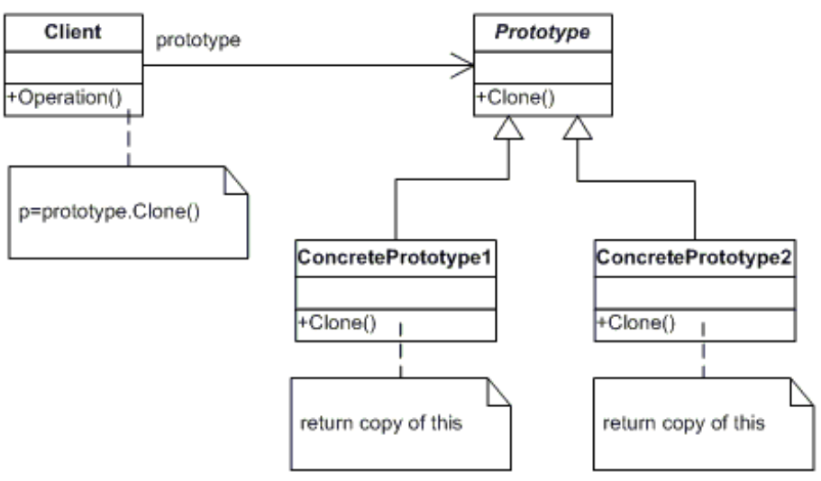
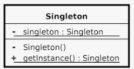
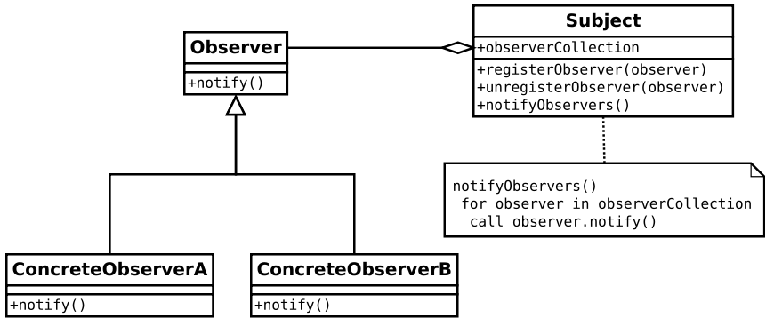

   
  <h1>Design Pattern</h1>
   

## 목차

1. [**디자인 패턴이란?**](#1)
2. [**디자인 패턴의 구조**](#2)
3. [**디자인 패턴의 종류**](#3)
4. [**디자인 패턴 요약**](#4)
5. [**많이 쓰이는 디자인 패턴(3가지)**](#5)
6. [**참조**](#6)

 

## 디자인 패턴이란?

소프트웨어를 설계할 때 특정 맬가에서 자주 발생하는 고질적인 문제들이 또 발생했을 때 재사용할 수 있는 해결책.

이미 만들어져서 잘 되고 있는 부분이 있는데 굳이 처음부터 다시 만들 필요 없이, 그 부분을 패턴화 시켜서 그대로 사용하는 것을 말한다.

패턴은 각기 다른 소프트웨어 모듈이나 기능을 가진 다양한 응용 소프트웨어 시스템들을 개발할 때도 서로 간에 공통되는 설계 문제가 존재하며 이를 처리하는 해결책 사이에도 공통점이 있는데 이것을 패턴이라고 한다.

 

## 디자인 패턴의 구조

- 콘텍스트(context)
  - 문제가 발생하는 상황을 기술하여 패턴이 적용될 수 있는 상황을 나타낸다.
  - 경우에 따라서는 패턴이 유용하지 못한 상황을 나타낼 수도 있다.
- 문제(problem)
  - 패턴이 적용되어 해결될 필요가 있는 여러 디자인 이슈들을 기술
  - 여러 제약 사항과 영향력도 문제 해결을 위해 고려해야한다.
- 해결(solution)
  - 문제를 해결하도록 설계를 구성하는 요소들과 그 요소들 사이의 관계, 책임, 헙력 관계를 기술한다.
  - 반드시 구체적인 구현 방법이나 언어에 의존적이지 않으며 다양한 상황에 적용할 수 있는 일종의 템플릿임을 기억하자.
 

## 디자인 패턴의 종류

GoF 디자인 패턴
- GoF(Gang of Fout)라고 불리는 사람들
  - 에리히 감마
  - 리차드 헬름
  - 랄프 존슨
  - 존 블리시디스
- 소프트웨어 개발 영역에서 디자인 패턴을 구체화하고 체계화한 사람들로 23가지의 디자인 패턴을 정리하고 각각의 디자인 패턴을 생성(Creational), 구조(Structural), 행위(Behavioral) 3가지로 분류된다.

1. 생성(Creational) 패턴
  - 객체 생성에 관련된 패턴
  - 객체의 생성과 조합을 캡슐화해 특정 객체가 생성되거나 변경되어도 프로그램 구조에 영향을 크게 받지 않도록 유연선을 제공

2. 구조(Structural) 패턴
  - 클래스나 객체를 조합해 더 큰 구조를 만드는 패턴
  - 서로 다른 인터페이스를 지닌 2개의 객체를 묶어 단일 인터페이스를 제공하거나 객체들을 서로 묶어 새로운 기능을 제공하는 패턴

3. 행위(Behavioral)
  - 객체나 클래스 사이의 알고리즘이나 책임 분배에 관련된 패턴
  - 한 객체가 혼자 수행할 수 없는 작업을 여러 개의 객체로 어떻게 분배하는지, 또 그렇게 하면서도 객체 사이의 결합도를 최소화 하는 것에 중점을 둔다.

 

## 디자인 패턴 요약

 

- 생성
  - 추상 팩토리 : 생성군들을 하나에 모아놓고 팩토리 중에서 선택하게 하는 패턴
  - 빌더 : 생산 단계를 캡슐화 하여 구축 공정을 동일하게 이용하도록 하는 패턴
  - 팩토리 메소드 : 객체를 생성하기 위한 인터페이스를 정의하여 어떤 클래스가 인스턴스화 될 것인지는 서브 클래스가 결정하도록 하는 패턴
  - 프로토 타입 : 복사하여 새 개체를 생성할 수 있도록 하는 패턴
  - 싱글톤 : 유일한 하나의 인스턴스를 보장하도록 하는 패턴

- 구조
  - 어댑터 : 인터페이스로 인해 함께 사용하지 못하는 클래스를 함꼐 사용하도록 하는 패턴
  - 브리지 : 추상과 구현을 분리하여 결합도를 낮춘 패턴
  - 컴퍼지트 : 개별 객체와 복합 객체를 클라이언트에서 동일하게 사용하도록 하는 패턴
  - 데커레이터 : 소스를 변경하지 않고 기능을 확장하도록 하는 패턴
  - 퍼사드 : 하나의 인터페이스를 통해 느슨한 결합을 제공하는 패턴
  - 플라이웨이트 : 대량의 작은 객체들을 공유하는 패턴
  - 프록시 : 대리인이 대신 그 일을 처리하는 패턴

- 행위
  - 책임 연쇄(Chain of Responsibility) : 객체들끼리 연결 고리를 만들어 내부적으로 전달하는 패턴
  - 커맨드 : 요청 자체를 캡슐화하여 파라미터로 넘기는 패턴
  - 인터프리터 : 언어 규칙 클래스를 이용하는 패턴
  - 이터레이터 : 내부 표현은 보여주지 않고 순회하는 패턴
  - 미디에이터 : 객체 간 상호작용을 캡슐화한 패턴
  - 메멘토 : 상태 값을 미리 저장해 두었다가 복구하는 패턴
  - 옵저버 : 상태가 변할 때 의존자들에게 알리고, 자동 업데이트하는 패턴
  - 스테이트 : 객체 내부 상태에 따라서 행위를 변경하는 패턴
  - 스트래티지 : 다양한 알고리즘 캡슐화하여 알고리즘 대체가 가능하도록 한 패턴
  - 템프릿 메서드 : 알고리즘 골격의 구조를 정의한 패턴
  - 비지터 : 오퍼레이션을 별도의 클래스에 새롭게 정의한 패턴

 
 
 

## 많이 쓰이는 디자인 패턴(3가지)

 

프로토 타입(Prototype) : 처음 시작할때는 일반적은 원형을 만들어 놓고, 복사한 후 필요에 따라 부분 수정을 사용하는 패턴. 생성할 객체의 원형을 제공하는 인스턴스에서 생성할 객체들의 타입이 결정되도록 설정하며 객체를 생성할 때 갖추어야 할 기본 형태가 있을 때 사용되는 패턴.

-기존 객체를 복제함으로써 객체를 생성

하나의 원형을 변형하는 작업이 필요할 때 또 가져오는 것이 아닌 이미 가져온 정보를 복사하여 가공하기 때문에 시간 및 자원의 이득을 취할 수 있다.

다만 복제를 할 때 필요에 따라 얕은 복사와 깊은 복사에 대한 고민이 필요.

 
 

싱글톤(Singleton) : 전역 변수를 사용하지 않고 객체를 하나만 생성하도록 하며, 생성된 객체를 어디에서든지 참조할 수 있도록 하는 디자인 패턴, 한 클래스에 한 객체만 존재하도록 제한 하는 것.

최초 한번의 new 연산자를 통해서 고정된 메모리 영역을 사용하기 때문에 해당 객체에 다시 접근할 때 메모리 낭비를 방지하고, 속도 측면에서도 이점이 있다.

또한 클래스간의 데이터 공유가 쉽다. 싱글톤 인스턴스가 전역으로 사용되는 인스턴스이기 때문에 다른 클래스의 인스턴스들이 접근하여 사용이 가능.

다만 구현할 때 구현하는 코드가 많이 필요하고(syncronized 키워드 등), 테스트 하기가 어렵다는 단점이 있다. 자원을 공유하고 있기 때문에 격리된 환경에서 사용한다면 인스턴스의 상태 초기화가 필수 이기 때문이다.

이 외에도 자식클래스를 만들 수 없는 점 등 여러 문제가 존재하기 때문에 유연성은 많이 떨어지는 패턴이다.

 
 

옵저버(Observer) : 한 객체의 상태가 바뀌면 그 객체에 의존하는 다른 객체들에 연락이 가고 자동으로 내용이 갱신되는 패턴, 일대 다의 의존성을 가지며 상호작용하는 객체 사이에서는 가능하면 느슨하게 결합하는 디자인 패턴

가장 쉬운 예시로는 내가 구독한 유튜브가 업로드 되면 알람이 오는 것을 생각하면 좋다.

 
 
 

## 참조

[**디자인 패턴 종류**](https://gmlwjd9405.github.io/2018/07/06/design-pattern.html)

[**싱글톤**](https://tecoble.techcourse.co.kr/post/2020-11-07-singleton/)

[**프로토타입패턴**](https://lee1535.tistory.com/76)

[**옵저버패턴**](https://pjh3749.tistory.com/266)