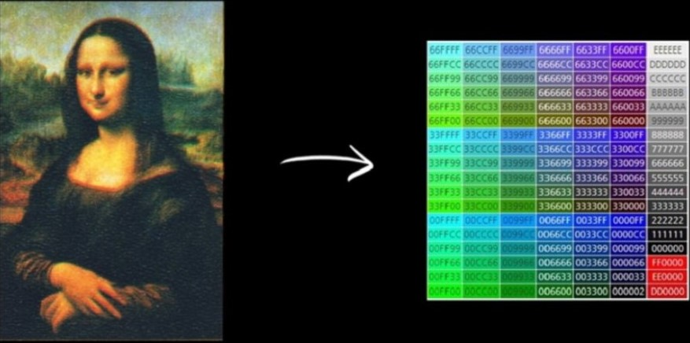

   
  <h1>디지털 트랜스포메이션(Digital Transformation)</h1>
   

## 목차

1. [**DT 란?**](#1)
2. [**DT의 목적**](#2)
3. [**성공 사례**](#3)
4. [**DT와 산업혁명**](#4)
5. [**DT와 코로나**](#5)
6. [**DT와 ESG**](#6)

 

## DT 란?

변화하는 비즈니스 및 시장 요구사항을 충족하기 위해 디지털 기술을 사용하여 새로운 비즈니스 프로세스, 문화 및 고객 경험을 창출하거나 수정해 나가는 과정이다.

물질의 영역을 정보의 영역으로 바꾸는 것이다.

가장 쉽게 디지털로 전환이 가능한 것이 음악과 그림이다. 도, 레, 미 음계 자체가 바로 디지털로 전환이 가능하다.

지금은 과거 천재 작곡가들의 음악을 디지털화해서 인공지능이 학습하게 한 후 작곡까지 기계가 하고 있다.

그림도 유사하다. 그림의 기본 구성 요소는 색깔이 있는 점이다. 그리고 그 색깔의 점은 RGB(red, green, blue)라는 형태로 정보화할 수 있다.

 

## DT의 목적

아날로그 시대에는 누가 더 많은 에너지를 발전시키고, 누가 더 많은 철도나 고속도로를 건설하는지가 중요했지만 디지털 시대에는 누가 더 많은 정보를 만들고 저장하고 전송할 수 있는지가 더 중요하다.

세계적인 기술 기업들이 정보를 더 빠르게 처리할 수 있는 칩을 만들고, 더 빠르고 안전하게 저장하고 분산할 수 있는 클라우드 시스템을 구축하여 인공지능이 정보를 처리하는 세상을 건설하기 위해 사활을 거는 이유도 바로 이 때문이다.

디지털 선도기업들은 디지털 후발기업들에 비해 수익성장률이 1.8배 더 높고, 총 기업가치 성장률은 2배 이상이다.

하지만 디지털 전환(DT) 시도 중 30%만이 목표한 바를 성공적으로 달성, 70%는 실패.

 

## 성공 사례

**넷플릭스**

넷플릭스는 원래 비디오 대여점에서 시작, 두 번의 변화 끝에 지금의 넷플릭스가 탄생했다.

첫 번째 변화는 오프라인 서비스를 온라인으로 전환한 것.  집에서 온라인으로 비디오를 빌려 볼 수 있게 했다.

두 번째는 빅데이터와 인공지능 기술의 도입이다. 이 기술 덕분에 전 세계 수많은 구독자가 취향 저격 알고리즘의 늪에 빠지게 됐다.

**스타벅스**

유통산업의 디지털 트랜스포메이션 선구자.

모바일 앱을 통해 주문부터 결제, 적립, 음료 완료 알림까지, 판매 방식 전체를 디지털화하여 변화를 주도하고 있다.

## DT와 산업혁명

디지털 혁명이라고도 불리는 4차 산업혁명이 시작되면서 디지털 트랜스포메이션의 중요성이 더욱 커졌다. 전통 사회 구조 전반에 디지털 트랜스포메이션을 적용해 기존 비즈니스 모델을 바꾸는 작업이 시작된 것.

 

## DT와 코로나

누구도 예측할 수 없었던 2020년의 코로나 19 사태가 디지털 트랜스포메이션을 앞당겼다.

바이러스 전파를 막기 위해 사회적 거리두기가 일상화, 장기화되고 있기 때문이다. 사람들 간의, 비즈니스 간의, 개인과 정부 간의 새로운 거리 개념이 제시되고 있다.

4차 산업혁명이 진행될수록 수많은 데이터를 처리할 수 있기 때문에 사고나 전염병 같은 재해도 예측하고 대비할 수 있다고 한다.

 

## DT와 ESG

ESG : 환경과 사회에 대한 책임 & 지배구조의 투명성을 평가하는 것

기업의 이윤 추구는 환경과 사회, 사람을 중시하는 가치 창출을 위한 ‘ESG 경영’으로 빠르게 변화하고 있다.

‘기업 경영을 보다 안정적으로 지속시키기 위해서는 환경(Environment)과 사회(Social)를 헤치는 의사결정(Governance)을 해서는 안 된다’

디지털 트랜스포메이션은 ESG 경영(목적)에 기여하는 수단이다.
 
