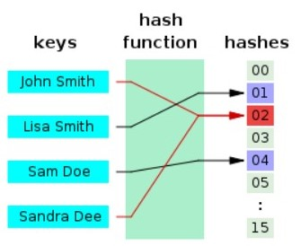
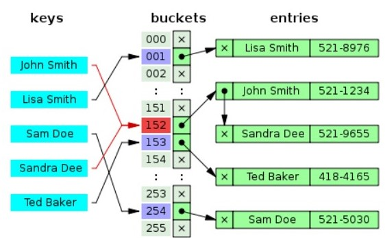
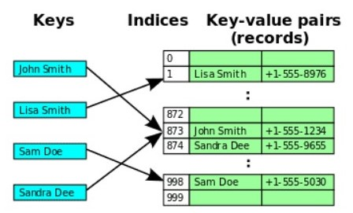

   
  <h1>Hash Function, Hash Table</h1>
   

## 목차

1. [**Hash Function**](#1)
2. [**Hash Table**](#2)
3. [**Hash Collision**](#3)
4. [**Collision 처리 방법**](#4)
5. [**Resizing**](#5)

 

## Hash Function

- 해시함수(hash function)란 데이터의 효율적 관리를 목적으로 임의의 길이의 데이터를 고정된 길이의 데이터로 매핑하는 함수이다.
- 이때 매핑 전 원래 데이터의 값을 키(key), 매핑 후 데이터의 값을 해시값(hash value), 매핑하는 과정 자체를 해싱(hashing)라고 한다.

 

## Hash Table

- 해시함수를 사용하여 키를 해시값으로 매핑하고, 이 해시값을 색인(index) 혹은 주소 삼아 데이터의 값(value)을 키와 함께 저장하는 자료구조를 해시 테이블(hash table)이라고 한다.
- 이때 데이터가 저장되는 곳을 버킷(bucket) 또는 슬롯(slot)이라고 한다.
- 이런 형식으로 데이터를 저장하면 Key에 해당하는 Value를 찾기 위해 해시 함수를 1번만 수행하면 되기 때문에 데이터의 저장과 삭제가 매우 빠르다.
- 해시테이블의 기본 연산은 삽입, 삭제, 탐색.

 

## Hash Collision

- 해시함수는 해쉬값의 개수보다 대개 많은 키값을 해쉬값으로 변환(many-to-one 대응) 하기 때문에 해시함수가 서로 다른 두 개의 키에 대해 동일한 해시값을 내는 해시 충돌(collision)이 발생하게 된다.
- 아래 그림은 이름-전화번호부를 매핑하기 위한 해시함수. John Smith와 Sandra Dee를 모두 02로 매핑해 해시충돌을 일으키고 있다.

 

## Collision 처리 방법

### 1. Separate chaining 

- 각 Index에 데이터를 저장하는 LinkedList에 대한 포인터를 가지는 방식이다.
- 해시 충돌이 발생하면 LinkedList에 노드를 추가한다.
- 데이터를 저장하는 구조는 LinkedList만 사용하진 않는다.
- Java 8 Hashmap의 경우에는 LinkedList와 Tree를 사용한다.

### 2. Open addressing

- Open addressing 방식은 Index에 대한 충돌 처리에 대해서 Linked List와 같은 추가적인 메모리 공간을 사용하지 않는다.
- 대신 Hash table array의 빈 공간을 사용한다.
- 그렇기 때문에 Separate chaining 방식에 비해서 메모리를 덜 사용한다.

#### 2.1 Linear probing

- 해시 충돌시 다음 버킷, 혹은 몇 개를 건너뛰어 데이터를 삽입한다.

- 장점 : 구조가 간단하고 캐시의 효율이 높다.
- 단점 : 최악의 경우 해시 테이블 전체를 검색해야 하는 상황이 발생, 특정 해시값 주변 버킷이 모두 채워져 있는 primary clustring 문제에 취약하다.

#### 2.2 Quadratic probing

- 고정 폭으로 이동하는 선형 탐사와 달리 그 폭이 제곱수로 늘어난다.
- 임의의 키값에 해당하는 데이터에 액세스 할 때 충돌이 일어나면 12칸을 옮긴다.
- 여기에서도 충돌이 일어나면 이번엔 22칸, 그 다음엔 32칸 옮기는 방식.
- 하지만 제곱탐사는 여러 개의 서로 다른 키들이 동일한 초기 해시값을 갖는 secondary clustering에 취약하다.
- 초기 해시값이 같으면 다음 탐사 위치 또한 동일하기 때문에 효율성이 떨어진다.

#### 2.3 Double hashing

- 탐사할 해시값의 규칙성을 없애버려서 clustering을 방지하는 기법이다.
- 2개의 해시함수를 준비해서 하나는 최초의 해시값을 얻을 때, 또 다른 하나는 해시 충돌이 일어났을 때 탐사 이동폭을 얻기 위해 사용한다.
- 이렇게 되면 최초 해시값이 같더라도 탐사 이동폭이 달라지고, 탐사 이동폭이 같더라도 최초 해시값이 달라져 primary, secondary clustering을 모두 완화할 수 있다.
- 해시값을 반환해주는 h1을 ‘3으로 나눈 나머지’, 탐사 이동폭을 결정해주는 h2를 ‘5로 나눈 나머지’라고 한다.
- 키가 3, 6인 데이터의 최초 해시값은 모두 0이 된다. 하지만 키가 3인 데이터의 탐사이동폭은 3, 6인 데이터의 이동폭은 1로 달라진다.
- 키가 6, 11인 데이터의 탐사이동폭은 모두 1이 된다. 하지만 키가 6인 데이터의 최초 해시값은 0, 11은 2로 달라진다.
- 단 제수(위 예시에서 3, 5)는 서로소(relatively prime, 공약수가 1뿐)이어야 원하는 효과를 볼 수 있다.

### 3. Hash Function

- 해시테이블의 크기가 m이라면, 좋은 해시함수는 임의의 키값을 임의의 해시값에 매핑할 확률이 1/m이 된다.
- 특정 값에 치우치지 않고 해시값을 고르게 만들어내는 해시함수가 좋은 해시함수다.
- division method, multiplication method, universal hasing, ...

 

## Resizing

- Open addressing의 경우 고정 크기 배열을 사용하기 때문에 데이터를 더 넣기 위해서는 배열을 확장해야 한다.
- 또한 Separate changing에 경우에도 버킷이 일정 수준으로 차 버리면 각 버킷에 연결되어 있는 List의 길이가 늘어나기 때문에 검색 성능이 떨어지기 때문에 버킷의 개수를 늘려줘야 한다.
- 이를 Resizing이라 부른다.
- Resizing은 별다른 기법이 없다.
- 더 큰 버킷을 가지는 Array를 만든 다음 새로운 Array에 Hash를 다시 계산해서 복사해줘야 한다.

