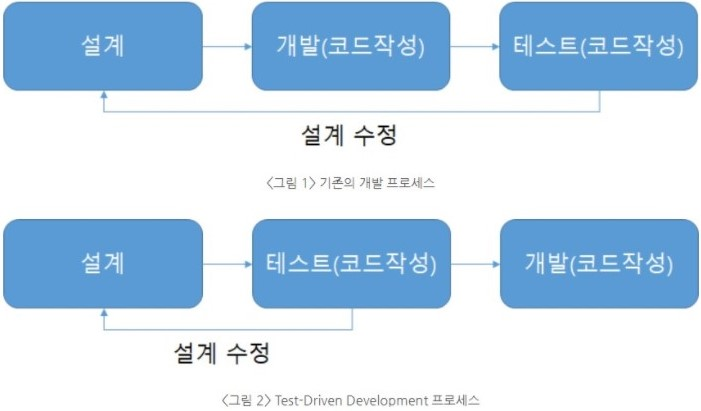

<div align="center">
  <br />
  <h1>TDD & Unit test</h1>
  <br />
</div>


<br />

## 목차

1. [**Unit test**](#Unit-test)
2. [**TDD**](#TDD)
3. [**결론**](#결론)
4. [**TDD와 Unit Test**](#TDD와-Unit-Test)
5. [**느낀점**](#느낀점)

<br />

### Unit test
'단위 테스트'

> 단위 테스트(Unit Test)는 하나의 모듈을 기준으로 독립적으로 진행되는 가장 작은 단위의 테스트이다. 여기서 모듈은 애플리케이션에서 작동하는 하나의 기능 또는 메소드로 이해할 수 있다.

- 예를 들어 웹 애플리케이션에서 로그인 메소드에 대한 독립적인 테스트가 1개의 단위테스트가 될 수 있다.
- 즉, 단위 테스트는 애플리케이션을 구성하는 하나의 기능이 올바르게 동작하는지를 독립적으로 테스트하는 것으로, "어떤 기능이 실행되면 어떤 결과가 나온다" 정도로 테스트를 진행한다.

### TDD

(Test Driven Development) **'테스트 주도 개발'**

> TDD는 매우 짧은 개발 사이클의 반복에 의존하는 소프트웨어 개발 프로세스이다. 우선 개발자는 요구되는 새로운 기능에 대한 자동화된 테스트케이스를 작성하고 해당 테스트를 통과하는 가장 간단한 코드를 작성하고 상황에 맞게 리팩토링하는 과정을 거치는 것이다. 말 그대로 테스트를 우선시하는 개발방식인 것이다.



#### 🤷‍♀️ 예시

- 예를 들어, 덧셈 프로그램

    add 함수를 만들기 전에 반드시 실패하는 testAdd 함수를 먼저 작성한 뒤, 테스트가 성공하게 만드는 add 함수를 작성하도록 한다.

    ```java
    int testAdd(){
      assert 5+4 == add(5,4)
      assert -4+9 == add(-4,9)
    }
    ```

- 테스트에 요구사항이 제대로 동작함을 입증할 수 있는 코드를 작성하고 이 테스트를 만족하는 실제 프로그램을 써나가는 것이 TDD이다.

#### 🍩 얻을수 있는것

- **보다 튼튼한 객체 지향적인 코드 생산**

    테스트 코드를 먼저 작성한다는 것은 하나하나의 기능들에 대해서 철저히 구조화 시켜 코드를 작성한다는 것을 뜻한다. 이는 종속성과 의존성이 낮은 모듈로 조합된 소프트웨어 개발을 가능하게 하며 필요에 따라 모듈을 추가하거나 제거해도 소프트웨어 전체 구조에 영향을 미치지 않게 된다.

- **재설계 시간의 단축**

    테스트 코드를 먼저 작성하기 때문에 개발자가 지금 무엇을 해야하는지 분명히 정의하고 개발을 시작하게 된다. 또한 테스트 시나리오를 작성하면서 다양한 예외사항에 대해 생각해볼 수 있다. 이는 개발 진행 중 소프트웨어의 전반적인 설계가 변경되는 일을 방지할 수 있다.

- **디버깅 시간의 단축**

    이는 유닛 테스팅을 하는 이점이기도 하다. 예를 들면 사용자의 데이터가 잘못 나온다면 DB의 문제인지, 비즈니스 레이어의 문제인지, UI의 문제인지 실제 모든 레이어들을 전부 디버깅 해야하지만, TDD의 경우 자동화 된 유닛 테스팅을 전재하므로 특정 버그를 손 쉽게 찾아낼 수 있다.

- **테스트 문서의 대체 가능**

    개발자가 기대하는 어플리케이션의 동작에 관한 문서를 테스트가 제공해준다. 이 테스트 케이스는 코드와 함께 업데이트 되므로 문서 작성과 거리가 먼 개발자에게 매우 좋다.

- **추가 구현의 용이함**

    개발이 완료된 소프트웨어에 어떤 기능을 추가할 때 가장 우려되는 점은 해당 기능이 기존 코드에 어떤 영향을 미칠지 알지 못한다는 것이다. 하지만 TDD의 경우 자동화된 유닛 테스팅을 전제하므로 테스트 기간을 획기적으로 단축시킬 수 있다.

    ( 겪어본 상황 : 새로운 기능을 구현하여 main branch에 merge까지 했는데, 기존에 개발 완료된 기능이 제대로 작동하지 않았다. PR 전에 Test를 수행하여 작동을 확인했다면 이런 일이 일어나지않았을 것이다...

#### 🤔 좋기만할까?

- **코드 생산성**

    두 배는 아니더라도 분명 코드량이 늘어난다. 비즈니스 로직, 각종 코드 디자인에도 시간이 많이 소요되는데, 거기에다가 테스트 코드까지 작성하기란 여간 벅찬 일이 아닐 것이다. 코드 퀄리티보다는 빠른 생산성이 요구되는 시점에서 TDD 는 큰 걸림돌이 될 수 있다.

- **테스트 코드를 작성하기가 쉬운가?**

    진입 장벽이 존재한다. 어떠한 부분을 테스트해야할 지, 어떻게 테스트해야할 지, 여러 테스트 프레임워크 중 어떤 것이 우리의 서비스와 맞는지 등 여러 부분들에 대한 학습이 필요하고 익숙해지는데에도 시간이 걸린다. 팀에서 한 명만 익숙해진다고 해결될 일이 아니다. 개발은 팀 단위로 수행되기 때문에 팀원 전체의 동의가 필요하고 팀원 전체가 익숙해져야 비로소 테스트 코드가 빛을 발하게 되는 것이다.

#### 📝결론

- TDD를 활용하면 테스트케이스를 설계하기 위한 초기 비용이 확실히 더 들게 된다. 하지만 개발 과정에 있어서 '초기 비용'보다 '유지보수 비용'이 더 클 수 있다는 것을 명심하자.
- 만약 어떤 부분에 대한 결과가 뻔하다면 TDD를 하지 않아도 된다. 또한 TDD를 했을 때 얻는 것이 적다면 TDD를 하지 않아도 된다.

**그럼 언제해**

1. 나에 대한(내부적인) 불확실성이 높은 경우

    👉 처음해보는 프로그램 주제 

2. 외부적인 불확실성이 높은 경우

    👉 고객의 요구조건이 바뀔 수 있는 프로젝트 

    👉 개발하는 중에 코드를 많이 바꿔야 된다고 생각하는 경우

    👉 내가 개발하고 나서 이 코드를 누가 유지보수할지 모르는 경우

즉, 불확실성이 높을 때 TDD를 하면 된다.

### TDD와 Unit Test

> TDD는 테스트 보다는 코드 설계에 더 집중되어있다. TDD와 단위 테스트의 차이는 테스트 코드를 작성하는 시점의 차이.

> TDD와 달리 단위 테스트 코드는 보통 개발 코드를 작성하고, 기능 테스트를 위해 테스트 코드를 작성 하여 테스트를 수행.

`TDD의 결과물은 단위테스트이다.`

### 느낀점
✔ **TDD전에 단위 테스트부터, 테스트 작성법을 익힌 후 TDD 하는게 좋을것같다.**

✔ **TDD 까지는 아니더라도 테스트 코드를 작성하는것은 필요하다고 생각.**

<br>

Unit test : [https://sabarada.tistory.com/68](https://sabarada.tistory.com/68)
