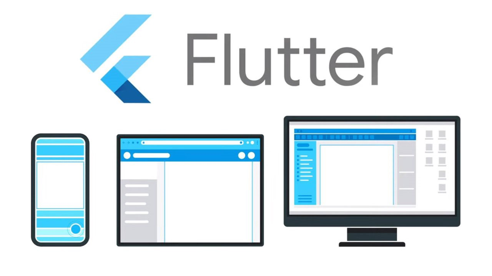
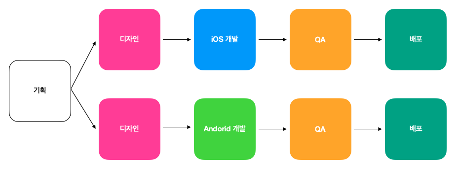
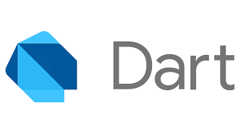

   
  <h1>플러터(Flutter)</h1>
   

1. [**플러터(Flutter)란 무엇인가?**](#1)
2. [**플러터의 장점**](#2)
3. [**플러터의 단점**](#3)

 

## 플러터(Flutter)란 무엇인가?

플러터(Flutter)는 구글이 출시한 오픈 소스 크로스 플랫폼 애플리케이션 프레임워크입니다.

모바일(iOS, Android), 데스크탑(MacOS, Linux, Windows), 웹 브라우저 애플리케이션을 개발할 수 있습니다.

 

## 플러터의 장점

### 1. 개발 비용 절감

당연한 소리이지만 Flutter는 크로스 플랫폼이기 때문에 개발 비용을 상당히 줄일 수 있습니다. 기존에 네이티브로 개발 시 iOS, Android 개발자를 따로 두고 두 개의 앱을 개발했다면 Flutter는 하나의 앱으로 iOS, Android 앱을 개발 동시에 진행할 수 있습니다. 또한 앱 개발 이후 유지보수 시에도 더 큰 효율성을 갖고 옵니다. 그렇기에 새 서비스를 출시하는 스타트업들에 추천됩니다.

### 2. Hot Reload

Flutter로 개발을 할 때 코드를 변경하면 이전에 동작하던 상태를 유지하며 변경된 코드 동작이 바로 적용됩니다. 이는 앱 전체를 다시 로드하는 시간도 굉장히 빨라서 개발 시 매우 편리한 요소입니다.

### 3. 선언형 UI 방식

Flutter는 선언형 UI 방식으로 UI를 구현합니다. 선언형 UI 방식이 이해하기 더 직관적이기 때문에 복잡한 UI를 구현할 때 더 편리합니다.

### 4. 학습 비용이 낮은 Dart 언어

기존에 이미 Java나 Kotlin, JavaScript를 주언어로 사용한 개발자 입장에서 Dart 언어 자체는 기존에 사용하는 언어와 큰 차이가 없어 학습 비용이 낮은 편에 속합니다.

 

## 플러터의 단점

### 1. 관련 라이브러리가 적다.

Flutter는 아직 만들어진지 오랜 시간이 흐르지 않았습니다. 그래서 아직 커뮤니티도 규모도 작고, 관련 라이브러리도 다른 프레임워크에 비해 많지 않습니다. 또한 불안정한 라이브러리도 꽤 있으니 사용 시 주의가 필요합니다.

### 2. 아키텍처와 같은 레퍼런스가 적다.

기존의 iOS, Android에서는 대세를 이루는 아키텍처들이 존재했습니다. Android와 같은 경우에는 MVVM, Clear Architecture 등이 존재했고, iOS와 같은 경우에는 MVC, MVVM, Viper 등이 존재했습니다. 하지막 아직 Flutter에는 베스트로 선택될 아키텍처가 없고 그 외에도 개발 컨밴션적인 부분이나 규칙들(디렉터리 구조와 같은) 또한 아직 많이 미약합니다.

 

## 참고 자료

> https://d2.naver.com/helloworld/3384599

> https://ko.wikipedia.org/wiki/%ED%94%8C%EB%9F%AC%ED%84%B0

> https://joooosan.tistory.com/entry/Flutter-2%ED%83%84-Flutter-%ED%8A%B9%EC%A7%95%EA%B3%BC-%EC%9E%A5%EB%8B%A8%EC%A0%90
