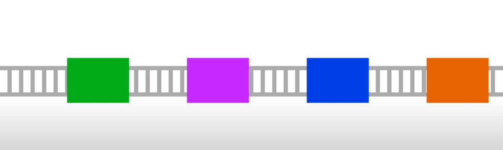
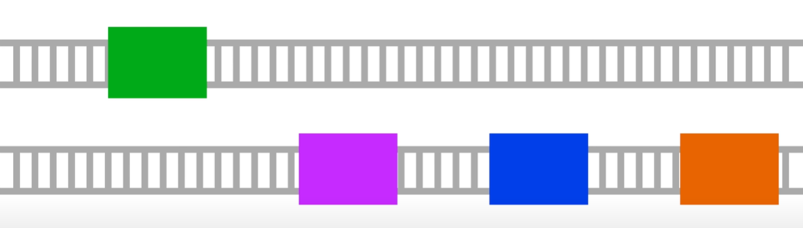
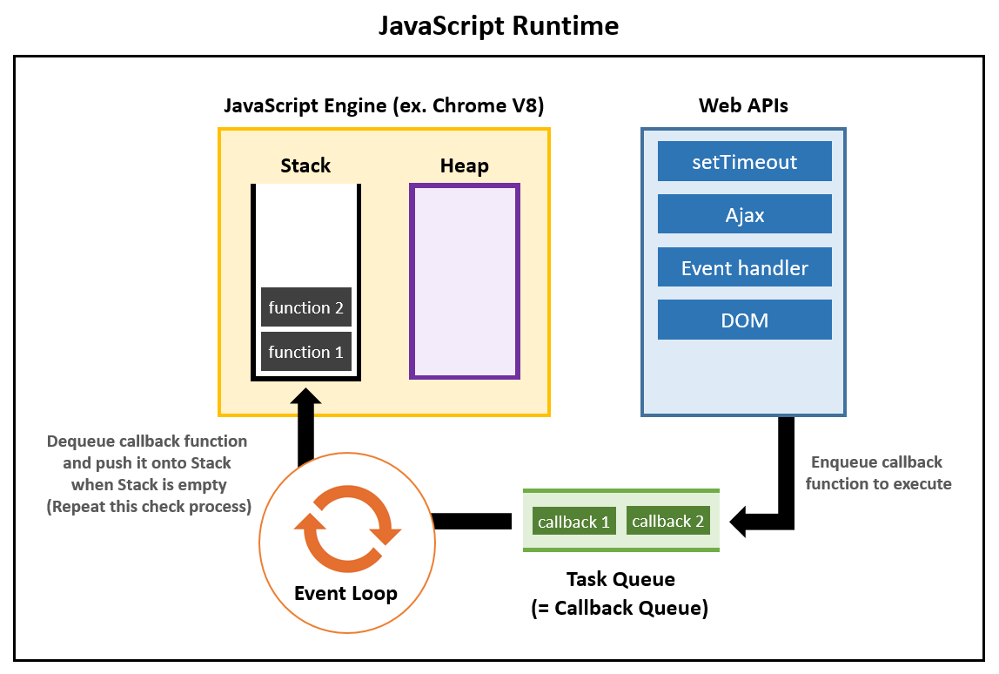

<div align="center">
  <br />
  <h1>동기, 비동기 & 자바스크립트의 실행 모델</h1>
  <br />
</div>

## 목차

1. [**동기 vs 비동기**](#1)
2. [**자바스크립트의 비동기 처리**](#2)
3. [**자바스크립트의 실행 모델**](#3)

<br />

<div id="1"></div>

## 동기 vs 비동기

### 동기(Synchronous)

동기 방식으로 작성된 코드는 코드가 반드시 작성된 순서 그대로 실행됩니다.

동기 방식은 설계가 매우 간단하고 직관적이지만 결과가 주어질 때까지 아무것도 못하고 대기해야 하는 단점이 있습니다.



> 예를 들면 동기는 동일한 기찻길에 놓인 열차들입니다. 때문에 앞의 열차가 꾸물거리거나 멈춰 있으면 뒤에 열차가 나아갈 수 없습니다.

<br />

### 비동기(Asynchronous)

비동기 방식으로 작성된 코드는 한 줄 한 줄 순서대로 실행되지 않습니다.

비동기 방식은 동기보다 복잡하지만 결과가 주어지는데 시간이 걸리더라도 그 시간 동안 다른 작업을 할 수 있으므로 자원을 효율적으로 사용할 수 있는 장점이 있습니다.



> 예를 들면 비동기 방식은 필요에 따라서 이동이 느리거나 자주 서는 열차를 다른 선로에 배치하는 것입니다. 이렇게 하면 뒤의 열차가 막히지 않을 것입니다.

<br />

<div id="2"></div>

## 자바스크립트의 비동기 처리

자바스크립트는 싱글 스레드로 동작하는 언어이기 때문에 비동기 프로그래밍 기법이 없었다면 통신에서 처리하는 과정들이 모두 쌓이다가 병목현상이 나타나게 되었을 것입니다.

자바스크립트에서 비동기로 처리하기 위해서는 Callback 함수, Promise(), async/await 와 같은 다양한 방식이 존재합니다.

<br />

<div id="3"></div>

## 자바스크립트의 실행 모델

자바스크립트의 실행 모델은 Event Loop, Call Stack, Task Queue 개념으로 이루어집니다.

이벤트 루프 모델은 여러 스레드를 사용합니다. 그 중에서 우리가 작성한 자바스크립트 코드가 실행되는 스레드를 메인 스레드라 부릅니다. 한 Node.js 프로세스에서 메인 스레드는 하나이며, 한 순간에 한 줄씩만 실행합니다. 그러나 그 외의 일(file I/O, network...)을 하는 워커 스레드는 여럿이 있을 수 있습니다.



### Call Stack

Call Stack(콜 스택)이란, 지금 시점까지 불린 함수들의 스택입니다.

```javascript
function f3() {}

function f2() {
  f3();
}

function f1() {
  f2();
}

f1();
```

| 빈 상태 | 호출 | 호출 | 호출 | 처리 중 | 처리 중 | 빈 상태 |
| :-----: | :--: | :--: | :--: | :-----: | :-----: | :-----: |
|    -    |  -   |  -   | f3() |    -    |    -    |    -    |
|    -    |  -   | f2() | f2() |  f2()   |    -    |    -    |
|    -    | f1() | f1() | f1() |  f1()   |  f1()   |    -    |

<br />

### Web API

**Web API**는 setTimeout, Ajax 요청, 이벤트 핸들러의 등록과 같이 웹 브라우저에서 제공하는 기능들을 말합니다.

여기서 중요한 것은 이러한 요청들의 처리가 JavaScript 엔진의 스레드와는 다른 스레드에서 이뤄진다는 점입니다.

JavaScript 엔진의 스택에서 실행된 비동기 함수가 요청하는 비동기 작업에 대한 정보와 콜백 함수를 웹 API를 통해 브라우저에게 넘기면, 브라우저는 이러한 요청들을 별도의 스레드에 위임하게 되는 것입니다. 그러면 그 스레드는 해당 요청이 완료되는 순간 전달받았던 콜백 함수를 JavaScript 엔진의 Task Queue에 집어 넣습니다.

<br />

### Task queue

Task Queue는 Web API를 처리하고 있던 스레드로부터 전달받은 콜백 함수들을 FIFO 구조로 저장하고 있는 일종의 큐(Queue)로, JavaScript 엔진 자체에 포함되어 있는 부분입니다.

여기서 말하고 있는 Task란 곧 Callback 함수를 의미하기 때문에 Callback Queue라고 부르기도 합니다.

여기에 저장된 Callback 함수들은 Call Stack이 비는 순간 스택에 순서대로 푸시됩니다.

이러한 원리로 비동기 작업이 완료된 이후 콜백 함수가 실행되는 것입니다. 그런데 비동기 작업이 완료되어 Task Queue에 Callback 함수가 들어가 있더라도 Call Stack이 비어있지 않다면 해당 Callback 함수는 바로 실행 되지 못한다는 특징이 있습니다.

> 그래서 setTimeout() 함수도 인자로 명시한 시간은 '잠드는 최소 시간'일 뿐, 그것보다 더 오래 잠들 수 있는 것입니다.

<br />

### Event Loop

위와 같은 동작이 가능하려면 매 순간 Call Stack이 비어있는지 여부와 Task Queue에 Callback 함수가 기다리고 있는지 여부를 확인해야 합니다. 이러한 역할을 수행하는 것이 바로 **Event Loop**입니다.

Event Loop도 JavaScript 엔진 자체에 포함되어 있는 부분입니다. Event Loop는 이름 그대로 같은 작업을 무한히 반복하는 무한 루프라고 생각하면 됩니다.

> 매순간 Task Queue와 Call Stack을 확인하는 작업을 Tick이라고 부릅니다.

<br />

## 참고 자료

> https://2ssue.github.io/base/async_programming/

> https://it-eldorado.tistory.com/86

> https://www.youtube.com/watch?v=m0icCqHY39U

> https://fastcampus.co.kr/dev_online_node
