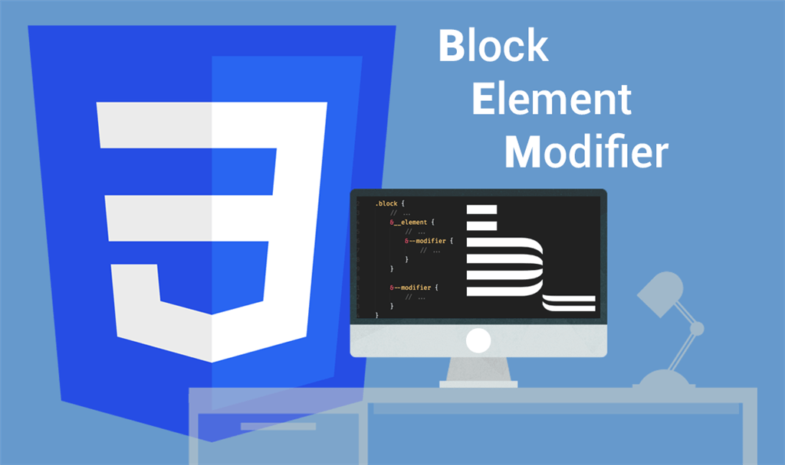
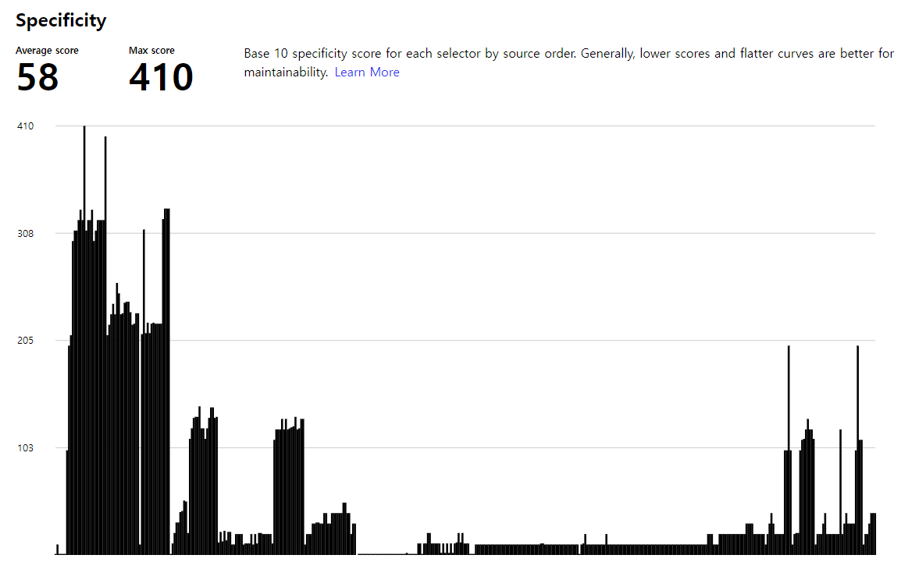
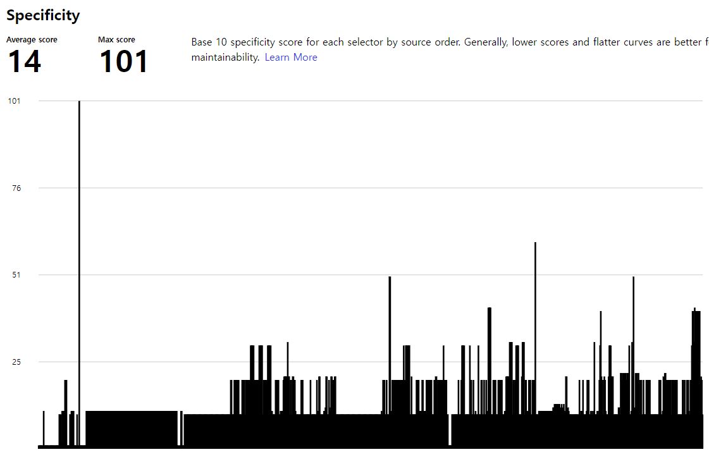
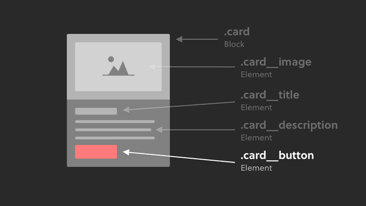

<div align="center">
  <br />
  <h1>BEM (Block Element Modifier)</h1>
  <br />
</div>

## 목차

1. [**BEM 의미**](#1)
2. [**BEM 특징**](#2)
3. [**작명 규칙을 잘못 관리한 사례**](#3)
4. [**CSS 선택자 우선순위 규칙 (CSS selector specificiy)**](#4)
5. [**스타일시트 분석**](#5)
6. [**BEM 명명 규칙**](#6)
7. [**BEM 안티패턴**](#7)
8. [**키워드 연결 방법**](#8)
9. [**접두어 사용**](#9)
10. [**BEM 정리**](#10)

<br />

<div id="1"></div>

## BEM 의미

**BEM**은 Block, Element, Modifer로 구성된 클래스 이름을 짓는 **CSS 방법론**입니다.

> BEM 방법론은 id에는 사용할 수 없고 오직 class명에만 활용할 수 있습니다.



|              Block              |                Element                 |                     Modifier                      |
| :-----------------------------: | :------------------------------------: | :-----------------------------------------------: |
| 재사용 가능한 독립적인 **블록** | 블록을 구성하는 종속적인 하위 **요소** | 블록 또는 요소의 **변형**<br />(모양, 상태, 동작) |


<br />

<div id="2"></div>

## BEM 특징

1. **의미론적 클래스 선택자** 작명 규칙

   > 약어 사용 피하기

2. 다른 형식의 선택자 사용을 **제한**

   > `--`, `__` 형식 이외에 다른 형식의 기호 사용 제한

3. 전역에서 **유일한** 이름 권장
4. 낮은 선택자 **특이성** 유지
5. HTML/CSS 연결이 느슨, **병렬 개발** 가능

<br />

<div id="3"></div>

## 작명 규칙을 잘못 관리한 사례

- 의미를 파악할 수 없는 작명

  ```CSS
  .cnt {...}
  .uw {...}
  .sa {...}
  ```

<br />

- 전역 공간을 선점한 흔한 이름

  ```CSS
  .top {...}
  .content {...}
  .button {...}
  ```

<br />

<div id="4"></div>

## CSS 선택자 우선순위 규칙 (CSS selector specificiy)

| id  | class, \[attr], :class | type, ::element |
| :-: | :--------------------: | :-------------: |
|  0  |           0            |        0        |

<br />

### 예시

|     CSS 선택자      |    우선순위    |
| :-----------------: | :------------: |
|          a          | 0, 0, 1 ➜ 001  |
|         .a          | 0, 1, 0 ➜ 010  |
|         #a          | 1, 0, 0 ➜ 100  |
|        #a a         | 1, 0, 1, ➜ 101 |
|       #a.a a        | 1, 1, 1 ➜ 111  |
| #a#b\[href]::before | 2, 1, 1 ➜ 211  |

<br />

<div id="5"></div>

## 스타일시트 분석

아래의 그래프는 `cssstats.com`에서 제공하는 웹 사이트 선택자 사용 현황 분석 기능을 사용하여 두 웹 사이트를 분석한 것입니다.

- 예시 A 사이트

  

> **평균 선택자 점수**: 58점  
> **최대 점수**: 410점

<br />

- 예시 B 사이트

  

> **평균 선택자 점수**: 14점  
> **최대 점수**: 101점

<br />

선택자 점수는 **낮게 유지**하고 **020 수준**으로 유지하는 것이 좋습니다.

예시 사이트들을 비교해보면 B 사이트가 A 사이트보다 더 관리가 잘 되고 있는 사이트로 볼 수 있습니다.

> CSS 선택자 분석 그래프는 낮고 평탄한게 좋습니다.

|     -      |       A 사이트       |  B 사이트  |
| :--------: | :------------------: | :--------: |
| Max score  |         410          |    101     |
| CSS 선택자 | #a #b #c #d .f {...} | #a p {...} |

<br />

[**🔗 cssstats 바로가기 Click !**](https://cssstats.com/) 👈

> 스타일시트에 대한 분석 및 시각화를 제공하는 웹 사이트

> 새 창 열기 방법 : CTRL+click (on Windows and Linux) | CMD+click (on MacOS)

<br />

<div id="6"></div>

## BEM 명명 규칙

| 기호 |         의미         |
| :--: | :------------------: |
| `__` | 하위 **요소**를 의미 |
| `--` | 상태 **변형**을 의미 |

> 하나의 이름에 요소, 변형은 각 한 번만 허용합니다.

<br />

### 예시

```CSS
.block {...}
.block__element {...}
.block__element--modifier {...}
.block--modifier {...}
```

> 이 형식 이외에 다른 형식은 허용하지 않습니다.

<br />

```HTML
// 단순 블록
<button class="btn" />

// 요소 및 변형 추가
<em class="info__label info__label--warning" />
```

```HTML
// 잘못된 사용
<button class="btn--submit" />

// 올바른 사용
<button class="btn btn--submit" />
```

> '변형' 클래스 단독 사용 불가, 항상 블록 또는 요소와 함께 사용

<br />

### 실사용 예시

```HTML
<div class=“card”>
  
  <h2 class=“card__title”>I am a card</h2>
  <p class=“card__description”>I am the card paragraph</p>
  <!-- The button is an element inside the block -->
  <a class=“card__button”>Learn more</a>
</div>
```



<br />

<div id="7"></div>

## BEM 안티패턴

**안티패턴(anti-pattern)** 은 비효율적이거나 비생산적인 패턴을 의미합니다.

- 잘못된 사용

  ```CSS
  .photo {...}              // 특이성 10
  .photo img {...}          // 특이성 11
  .photo figcaption {...}   // 특이성 11
  ```

  > '선택자 특이성'이 높아지는 중첩 구조, 타입 선택자는 'BEM'에서 안티 패턴으로 간주합니다.

  > 그러므로 타입 선택자는 가급적 피하는게 좋습니다.

<br />

- 올바른 사용

  ```CSS
  .photo {...}              // 특이성 10
  .photo__img {...}         // 특이성 10
  .photo__figcaption {...}  // 특이성 10
  ```

  > 제어하려는 모든 요소에 클래스 이름을 부여하여 특이성을 관리합니다.

<br />

- 잘못된 사용

  ```CSS
  .__elem {...}
  .--modi {...}
  .block__elem1__elem2 {...}
  .block--modi1--modi2 {...}
  ```

  > 블록/요소 이름 생략, 요소/변형 이름 중복을 금지합니다.

<br />

<div id="8"></div>

## 키워드 연결 방법

|   표기법   |
| :--------: |
| PascalCase |
| camelCase  |
| kebab-case |
| snake_case |

<br />

<div id="9"></div>

## 접두어 사용

이름 공간을 위한 접두어 사용을 추천합니다.

```CSS
.lzModal {...}
.lzModal__title {...}
.lzBtn {...}
.lzBtn--small {...}
```

> 접두어를 사용하여야 다른 라이브러리와 공존이 가능하다.

> 예를 들어 접두어 없이 .btn을 사용하게 될경우 bootstrap 라이브러리와 중첩될 수 있다.

<br />

<div id="10"></div>

## BEM 정리

1. 의미론 작명법으로 읽고 이해하기 쉽다.
2. 생소한 이름에 약어를 사용하지 않는다.
3. 특이성을 '020' 보다 작게 유지한다.
4. 선택자 이름은 전역 공간에서 유일하다.
5. HTML/CSS 병렬 개발이 가능하다.

<br />

## 참고 자료

> https://cssstats.com/

> https://www.emrerothzerg.com.au/what-is-bem-methodology/

> https://scalablecss.com/bem-blocks-within-blocks/

> https://fastcampus.co.kr/dev_red_jcm

> 새 창 열기 방법 : CTRL+click (on Windows and Linux) | CMD+click (on MacOS)
