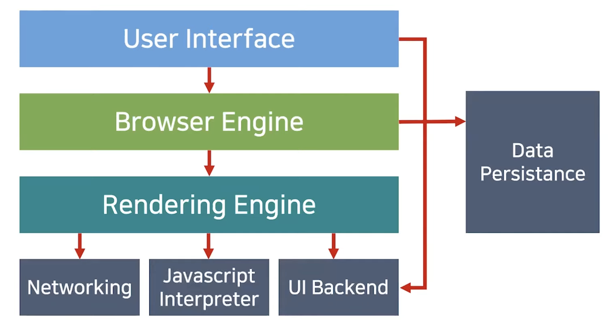
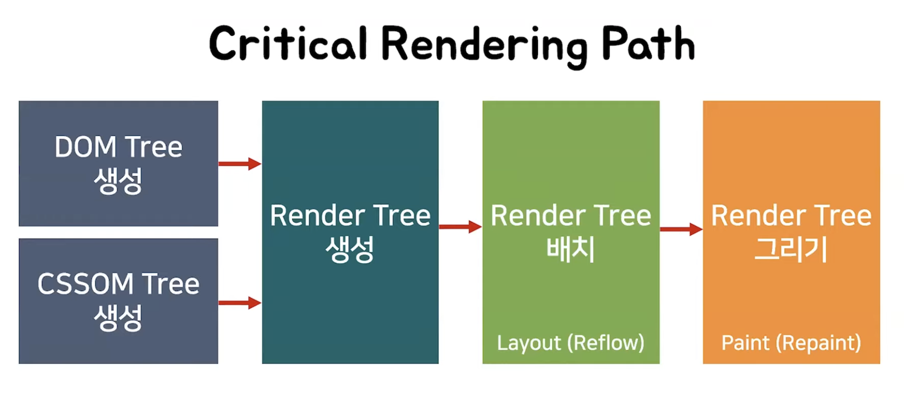

   
  <h1>브라우저 렌더링 과정</h1>
   

## 목차

1. [**브라우저 구조**](#1)
2. [**브라우저 렌더링 과정**](#2)

 

## 브라우저 구조

### 브라우저 구조

- User Interface : 주소 표시줄, 이전/다음/새로고침 버튼 등 웹페이지 제외하고 사용자와 상호작용
- Browser Engine : 유저 인터페이스와 렌더링 엔진을 연결
- **`Rendering Engine` : HTML과 CSS를 파싱하여 요청한 웹 페이지를 표시**
- Networking : 각종 네트워크 요청을 수행
- **Javascript Interpreter : 자바스크립트 코드 실행 (Chrome의 V8)**
- UI Backend : 체크박스나 버튼 같은 기본적인 위젯 그림
- Data Persistance : localStorage나 쿠키처럼 보조기억장치에 데이터 저장

### 렌더링 엔진

- 사파리는 Webkit, Chorme은 Blink, 파이어폭스는 Gecko
- HTML, CSS, JS, 이미지 등 웹페이지에 포함된 모든 요소를 화면에 그려준다
- 업데이트가 필요할 때 효율적으로 렌더링할 수 있도록 자료 구조를 생성

### 렌더링 관련 용어

- Parsing(파싱)
  - 프로그래밍 언어의 문법에 맞게 작성된 텍스트 문서를 읽어 들여 실행하기 위함
  - 텍스트 문서의 문자열을 토큰으로 분해하고, 토큰의 문법적 의미와 구조를 반영하여 트리 구조의 자료구조인 파스 트리를 생성하는 과정
  - 파싱이 완료된 후에는 파스 트리를 기반으로 중간 언어(intermediate code)인 바이트코드를 생성하고 실행
- Rendering(렌더링)
  - HTML, CSS, JS로 작성된 문서를 파싱하여 브라우저에 시각적으로 출력하는 것

 

## 브라우저 렌더링 과정

### 1. 브라우저는 HTML, CSS, JS, 이미지, 폰트 파일 등 렌더링에 필요한 리소스를 요청하고 서버로부터 응답을 받는다

- 일반적으로 서버는 루트 요청에 대해 정적 파일 index.html을 응답하도록 기본 설정 (`www.naver.com/index.html`)
- 서버가 응답한 HTML 문서는 문자열로 이루어진 순수한 텍스트

### 2. 브라우저의 렌더링 엔진은 서버로부터 응답된 HTML, CSS를 한 줄씩 파싱하여 각각 DOM, CSSOM을 생성한다

- **브라우저의 렌더링 엔진이 HTML(index.html)을 파싱하는 도중, 외부 리소스를 로드하는 태그(CSS 파일을 로드하는 link 태그, 이미지 파일을 로드하는 img 태그, JS를 로드하는 script 태그 등)를 만나면 HTML 파싱을 중단하고 해당 리소스 파일을 서버로 요청** ⇒ `동기적`
- **DOM(Document Object Model) Tree** : 렌더 엔진이 HTML을 파싱하여 DOM 노드로 이루어진 DOM Tree 생성
  - 바이트 → 문자 → 토큰 → 노드 → DOM
  1. 서버는 브라우저가 요청한 HTML 파일을 읽어 메모리에 바이트(2진수)로 저장하고 인터넷을 경유하여 응답한다
  2. 브라우저는 HTML 파일을 바이트 형태로 응답받고, meta 태그의 charset 속성에 의해 문자열로 변환한다
  3. 문자열로 변환된 HTML 문서를 읽어 토큰(문법적 의미를 갖는 코드의 최소 단위)으로 분해한다
  4. 각 토큰을 객체로 변환하여 노드들(문서 노드, 요소 노드, 어트리뷰트 노드, 텍스트 노드)을 생성하고, 이 노드들은 이후 DOM을 구성하는 기본 요소가 된다
  5. HTML 문서는 HTML 요소들의 집합으로 구성되며 HTML 요소는 중첩 관계를 이루고, 모든 노드들은 트리 자료구조로 구성된다. 이 노드들로 구성된 트리 자료구조가 DOM이다
- **CSSOM(CSS Object Model) Tree** : CSS 파일과 inline 스타일을 파싱
  - 렌더링 엔진은 DOM을 생성하다가 link 태그나 style 태그를 만나면 중지하고, link 태그의 href 어트리뷰트에 지정된 CSS 파일을 서버에 요청하여 로드한 CSS 파일이나 style 태그 내의 CSS를 파싱하여 CSSOM을 생성한다. 파싱이 끝나면 HTML 파싱이 중단된 지점부터 다시 HTML을 파싱한다.
  - 바이트 → 문자 → 토큰 → 노드 → CSSOM

### 3. 생성된 DOM Tree와 CSSOM Tree는 결합되어 렌더 트리를 생성한다

- **렌더 트리** : 렌더링을 위한 트리 구조의 자료구조 ⇒ HTML 요소의 레이아웃(위치와 크기)을 계산하는데 사용되고 브라우저 화면에 픽셀을 렌더링하는 페인팅 처리에 입력된다
- 브라우저 화면에 렌더링되지 않는 노드(`meta 태그`, `script 태그` 등), CSS 에 의해 비표시(`display: none`)되는 노드는 포함하지 않는다 ⇒ **렌더 트리는 브라우저 화면에 렌더링되는 노드만으로 구성**
- 렌더레이어는 렌더 객체의 최적화를 거쳐 완성되는데 렌더 객체와 렌더레이어는 1:1 대응이 아닌 경우도 있다. 대신 DOM 트리와 렌더 트리는 1:1 대응이 된다. 렌더트리가 생성된 후 렌더레이어에 올려지게 된다

### 4. 브라우저의 자바스크립트 엔진은 서버로부터 응답된 자바스크립트를 파싱하여 AST(Abstract Syntax Tree)를 생성하고 바이트코드로 변환하여 실행한다

- DOM은 HTML 문서의 구조 및 정보와 함께 HTML 요소와 스타일 등을 변경할 수 있는 프로그래밍 인터페이스로 DOM API(`getElementById` 등)를 제공한다
- 렌더링 엔진은 CSS 파싱과 동일하게 HTML 파싱하다가 자바스크립트 파일을 로드하는 script 태그나 자바스크립트 코드를 콘텐츠로 담은 script 태그를 만나면 DOM 생성을 중단한다. 그리고 script 태그의 src 어트리뷰트에 정의된 자바스크립트 파일을 서버에 요청하여 로드한 자바스크립트 파일이나 script 태그 내의 자바스크립트 코드를 파싱하기 위해 자바스크립트 엔진에 제어권을 넘긴다. JS 파싱과 실행이 종료되면 다시 HTML 파싱이 종료된 지점부터 다시 HTML 파싱을 시작한다.
- 자바스크립트 파싱과 실행은 자바스크립트 엔진이 처리한다 ⇒ 자바스크립트 엔진은 자바스크립트 코드를 파싱하여 CPU가 이해할 수 있는 저수준 언어로 변환하고 실행한다
  - 자바스크립트 엔진은 구글 크롬과 Node.js의 V8, 파이어폭스의 SpiderMonkey, 사파리의 JavaScriptCore 등이 있으며, 모두 ECMAScript 사양을 준수한다
- 자바스크립트 엔진은 자바스크립트를 해석하여 AST(Abstract Syntax Tree, 추상적 구문 트리)를 생성하고, 이를 기반으로 인터프리터가 실행할 수 있는 중간 코드인 바이트코드를 생성하여 실행한다
  - AST를 통해 TypeScript, Babel, Prettier 같은 트랜스파일러 구현 가능
- 자바스크립트는 DOM API를 통해 DOM, CSSOM 변경 가능하며, 변경된 DOM, CSSOM은 다시 렌더 트리로 결합된다

### 5. 렌더 트리를 기반으로 HTML 요소의 레이아웃(위치와 크기)을 계산하고 브라우저 화면에 HTML 요소를 페인팅한다

- Render Tree 배치 (Layout / Reflow) : 각 노드들의 스크린에서의 좌표(주로 부모 기준)에 따라 위치 결정 (렌더레이어를 대상으로 layout 설정)
  - %, em 등 상대적 단위는 뷰포트에 맞춰 픽셀 단위로 바뀐다
  - Reflow : 레이아웃 계산을 다시 한다. 노드 추가/삭제, 요소의 크기/위치 변경, 윈도우 사이즈 변경 등 레이아웃에 영향을 주는 변경이 발생한 경우에만 실행
- Render Tree 그리기 (Paint / Repaint) : 실제 화면 그리기
  - Repaint : 재결합된 렌더 트리를 기반으로 다시 페인트
  - 레이아웃에 영향이 없는 변경은 Reflow 없이 Repaint만 실행
    - 색상 변경, `visibility: hidden` 등
- 리렌더링(레이아웃 계산 + 페인팅 재실행) 조건
  - 자바스크립트에 의한 노드 추가/삭제
  - 브라우저 창의 리사이징에 의한 뷰포트(viewport) 크기 변경
  - HTML 요소의 레이아웃에 변경을 발생시키는 width/height, margin, padding 등의 스타일 변경
- **레이어 합치기(composite layer) 및 표기**

 
 

###### 출처: 모던 자바스크립트 Deep Dive, [[10분 테코톡] ☕️ 체프의 브라우저 렌더링](https://www.youtube.com/watch?v=sJ14cWjrNis), [[10분 테코톡] 🥁 지그의 Virtual DOM](https://www.youtube.com/watch?v=PN_WmsgbQCo)

 
 
