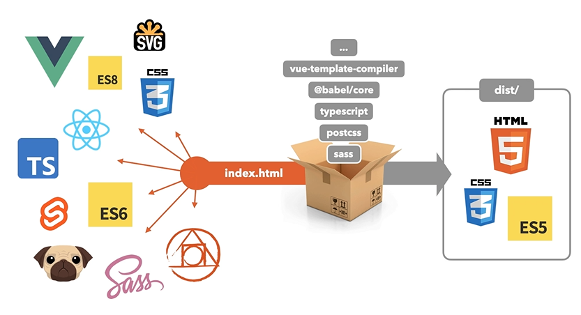
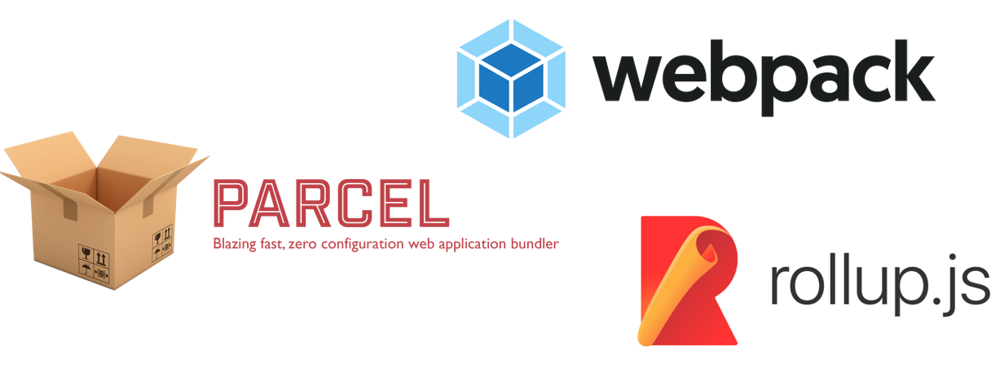
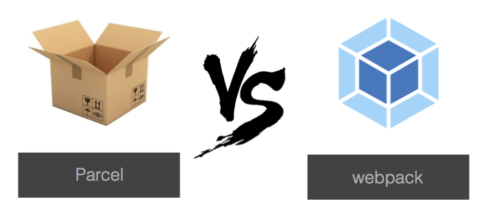

   
  <h1>왜 Bundler를 사용해야 하는가?</h1>
   

## 목차

1. [**Bundler 탄생 배경**](#1)
2. [**Bundler 기능**](#2)
3. [**Bundler 종류**](#3)
4. [**Parcel vs webpack**](#4)

 

## Bundler 탄생 배경

인터넷이 등장하고 처음에는 웹 페이지와 서비스들의 규모가 그렇게 크지 않았지만, 점점 대규모 웹 서비스들이 생겨나고 웹 개발에 여러 모듈들을 사용하면서 여러 문제들이 발생하였습니다. 이를 해결하기 위해 탄생한 것이 바로 **Bundler** 입니다.

> 즉, 프론트엔드 코드의 근본적인 종속성(dependencies) 문제를 핸들링하기 위함입니다.

 

## Bundler 기능

**Bundler**는 의존성이 있는 모듈 코드를 하나 혹은 여러 개의 파일로 만들어주는 **도구**입니다.

> \* 모듈 : 프로그램 내부를 기능별 단위로 분할한 부분

즉 단순히 자바스크립트 파일들뿐만 아니라, 애플리케이션에 필요한 모든 종류의 파일들을 모듈 단위로 나누어 최소한의 **파일 묶음(번들)** 으로 만들어 내는 것입니다.

 

이외에도 코드 축소, 코드 분할, 핫 리로딩 등 여러 기능들을 제공합니다.

- **코드 축소**

  여러 개의 파일들을 묶을 때 애플리케이션 실행에 사용하지 않은 파일은 포함하지 않습니다. 그에 따라 파일의 크기를 줄여 페이지 로딩을 빠르게 하는 효과를 가져옵니다.

- **코드 분할**

  번들링은 훌륭하지만 애플리케이션 규모가 커지면 번들도 커집니다. 특히 큰 규모의 서드 파티 라이브러리를 추가되어 애플리케이션의 로드 시간이 길어지는 것을 방지해야 합니다.

  번들이 거대해지는 것을 방지하기 위한 좋은 해결 방법은 나누는 것입니다. **코드 분할**은 런타임에 여러 번들을 동적으로 만들고 불러오는 것입니다.

  코드를 분할한다면 애플리케이션의 코드 양을 줄이지 않고도 사용자가 필요하지 않은 코드를 불러오지 않게 하여 애플리케이션의 초기화 로딩에 필요한 비용을 줄여 줄 수 있는 것입니다.

- **핫 리로딩(Hot reloading)**

  애플리케이션을 개발할 때는 일반적으로 코드를 조금씩 수정해가면서 만들게 됩니다.
  예시로 To do list 기능을 만든다고 가정해 봅시다. **핫 리로딩**이 없다면 To do list 코드를 수정했을 때 다시 브라우저의 페이지를 새로고침 하고 데이터를 재입력해야 합니다. 이때 **핫 리로딩**이 있다면 코드 수정 뒤에도 데이터 상태가 사라지지 않고 그대로 유지된 상태로 개발할 수 있습니다.

  > Webpack과 Rollup에서 이 기능을 지원합니다.  
  > 

 

## Bundler 종류

 

## Parcel vs webpack

|   Bundler   |                                        장점                                        |                                                           단점                                                           |
| :---------: | :--------------------------------------------------------------------------------: | :----------------------------------------------------------------------------------------------------------------------: |
| **Parcel**  |   별도의 구성 옵션 없는 단순한 자동 번들링 (소/중형 프로젝트에 적합)     |                   webpack에 비해 구성이 꼼꼼하지 않아 프로젝트의 규모가 커지면 Parcel로는 한계가 있음                    |
| **webpack** | 여러가지 구성 옵션들을 제공하여 매우 꼼꼼한 구성 가능 (중/대형 프로젝트 적합) | 규모가 크지 않은 프로젝트에서는 너무 꼼꼼하게 구성 처리를 해서 번들 작업을 하는 것이 배보다 배꼽이 더 큰 작업일 수 있다. |

 

## 참고 자료

> https://ko.reactjs.org/docs/code-splitting.html

> https://velog.io/@eastshine94/Bundler-%EC%99%9C-Bundler%EC%9D%84-%EC%82%AC%EC%9A%A9%ED%95%B4%EC%95%BC%ED%95%98%EB%8A%94%EA%B0%80

> https://bestalign.github.io/translation/redux-hot-reloading-and-time-travel-debugging/

> https://gist.github.com/jeffminsungkim/9cd5c592dfe39a5eaae93ffcc1818cef

> https://fastcampus.co.kr/dev_online_frontend
