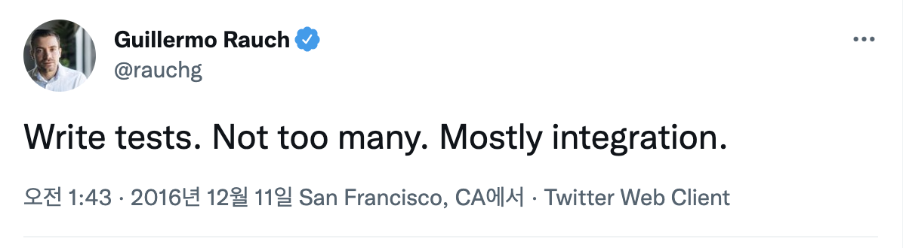
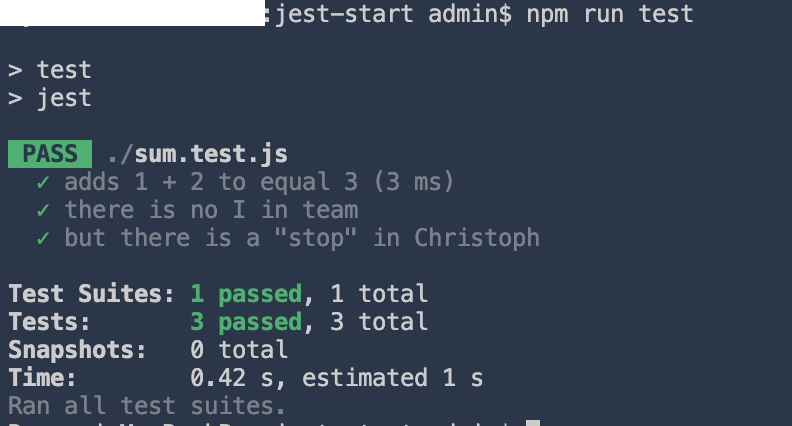
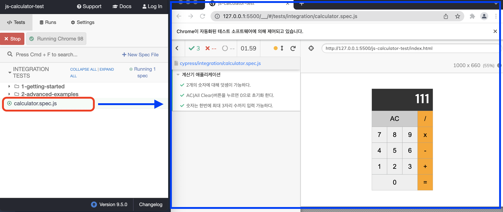
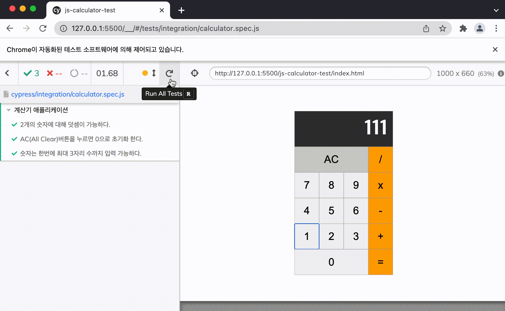

<div align="center">
  <br />
  <h1>프론트엔드의 테스트 종류와 예시</h1>
  <br />
</div>

## 목차

1. [**프론트엔드 테스트 종류**](#1)
2. [**프론트엔드 테스팅 대상**](#2)
3. [**프론트엔드 테스팅 환경**](#3)
4. [**Jest의 간단한 예제**](#4)
5. [**Cypress의 간단한 예제**](#5)

<br />

<div id="1"></div>

## 프론트엔드 테스트 종류

### 정적(Static) 테스트

- 구문 오류, 나쁜 코드
- 예) `ESLint`, `TypeScript`

### 단위(Unit) 테스트

> - 단위 테스트와 TDD에 대한 더 자세한 설명은 [이곳](https://github.com/ssafy-tech-concert/ssafy-tech-concert/blob/master/Etc/TDD%26Unit_Test.md#Unit-test)을 참고
> - 단위 테스트와 통합 테스트, JUnit과 Mockito의 예시는 [이곳](https://github.com/ssafy-tech-concert/ssafy-tech-concert/blob/master/Back-end/Unit%20Test%20-%20JUnit%2C%20Mockito.md#1)을 참고

- 모듈(함수/클래스) 단위의 테스트
- 작성 비용이 적게 들고 실행 속도가 빠르다
- Mocking 필요
- 예) `Jest`

### 통합(Integration) 테스트

- **테스트 속도, 비용이 가장 균형적**
- 단위 테스트보다는 큰 범위의 테스트
- 개별 모듈(함수/클래스)들이 연결되어 제대로 상호작용하는지 테스트 (예: 페이지)
- 앱의 모든 기능이 제대로 동작한다는 확신을 줄 수 있다
- 단위 테스트에 비해 실패 시 어디서 문제 발생했는지 파악하기 어렵다
- 예) `Jest`, `RTL`

### E2E 테스트

- **API 서버, 인프라, DB 등의 외부 서비스들을 모두 사용하여 통합된 시스템을 테스트**
- 실제 사용자가 사용하는 것과 동일한 조건에서 전체 시스템을 테스트
- 단위/통합 테스트에 비해 작성이 어렵고 실행 속도가 상대적으로 느리며 비용도 많이 든다
  - 고려할 범위가 크고, 테스트 시나리오가 다양하며, 예외가 일어날 수 있는 요인이 많기 때문
- 환경적 요인이 많아 실제로 테스트해도 100% 신뢰성을 줄 수 없다
- 예) `Cypress`, `Selenium`

### 테스트 코드

- 테스트 커버리지가 70% 이상이 되면 불필요한 것을 테스트하느라 낭비할 수 있다
  - 테스트코드가 항상 필요한 것은 아니다 (버튼이 1개만 있는 경우나, 메인페이지 등은 불필요)
- Guillermo Rauch (Socket.io 개발)
  - 테스트를 작성하되 필요 이상으로 하지는 말고 주로 통합 테스트로 진행하는 것이 좋다
  - 
- Martin Fowler (리팩토링 저자)
  - 테스트 단위가 커질수록 속도는 느려지고 가격은 비싸진다
  - 

<br />

<div id="2"></div>

## 프론트엔드 테스팅 대상

### 사용자 이벤트 처리

- 방법
  - 자바스크립트 API, 테스트 유틸리티 사용하여 이벤트 시뮬레이션
  - E2E 테스트를 통해 실제 이벤트 발생
- 브라우저 환경 → cypress 사용

### API 서버 통신

- 방법
  - 실제 API - 통합테스트, E2E 테스트
  - mock API - 테스트 API 서버 구축, API Client 모킹
- Jest, testing-library 사용

### 시각적 요소

- 백엔드는 HTTP요청 보내면 HTTP응답으로 검증 가능
- 프론트엔드는 입력값이 사용자의 액션, 출력값은 사용자의 액션에 따른 화면 변화 → 시각적 요소를 코드로 검증
- 방법
  - 스냅샷 테스트 : HTML 구조가 의도한대로 나타내는지 테스트 (Jest, StoryBook)
  - 시각적 회귀 테스트 : HTML에 CSS 더해서 컴포넌트가 실제로 브라우저에서 랜더링되는 모습이 의도한대로 나타나는지 테스트 (StoryBook)

<br />

<div id="3"></div>

## 프론트엔드 테스팅 환경

### 브라우저

- **크로스 브라우징 테스트 가능**
- **브라우저 실제 동작(렌더링, 네트워크 IO, 네비게이션 등)에 대한 테스트 가능**
- 테스트 코드를 다양한 운영체제, 브라우저 사용 가능 → 호환성 체크 가능
- Node.js에 비해 무거워서 초기 구동 속도가 늦다
- 예) Karma, Selenium, Cypress

### Node.js

- 설치 및 실행이 간단하고 속도 빠르다
- 모듈 단위로 테스트 가능
- DOM API가 없다 → DOM을 가상으로 구현하는 라이브러리 jsdom을 사용하지만 브라우저 동작을 100% 구현하지는 못한다
- 예) Jest, Mocha

<br />

<div id="4"></div>

## Jest의 간단한 예제

### Jest 시작하기

- 설치하기

```bash
npm install --save-dev jest
```

- package.json에 추가하기

```js
{
  "scripts": {
    "test": "jest"
  }
}
```

- 실행하기

```bash
npm run test
```

### Jest 코드 예시와 실행 결과

- 파일명 예시 : `sum.test.js`

```js
test("adds 1 + 2 to equal 3", () => {
  expect(sum(1, 2)).toBe(3); // 구현한 sum 함수를 사용하여 1 + 2를 진행했을 때 결과가 3인지 확인
});

test("there is no I in team", () => {
  expect("team").not.toMatch(/I/); // "team"에 "I"가 들어있지 않은지 확인
});

test('but there is a "stop" in Christoph', () => {
  expect("Christoph").toMatch(/stop/); // "Christoph"에 "stop"가 들어있는지 확인
});
```



<br />

<div id="5"></div>

## Cypress의 간단한 예제

### Cypress 시작하기

- 설치하기

```bash
npm install cypress --save-dev
```

- 실행하기

```bash
# Open With Live Server 하기
./node_modules/.bin/cypress open
```

### Cypress 코드 예시와 실행 결과

- 파일명 예시 : `calculator.spec.js`

```js
describe("계산기 애플리케이션", () => {
  beforeEach(() => {
    // 우선 http://127.0.0.1:5500/js-calculator-test/index.html 사이트로 이동
    cy.visit("http://127.0.0.1:5500/js-calculator-test/index.html");
  });

  it("2개의 숫자에 대해 덧셈이 가능하다.", () => {
    cy.get(".digit").contains("2").click(); // 버튼 2를 클릭
    cy.get(".operation").contains("+").click(); // 버튼 +를 클릭
    cy.get(".digit").contains("3").click(); // 버튼 3를 클릭
    cy.get(".operation").contains("=").click(); // 버튼 =를 클릭
    cy.get("#total").should("have.text", "5"); // 그 결과가 5와 같은지 확인
  });

  it("AC(All Clear)버튼을 누르면 0으로 초기화 한다.", () => {
    cy.get(".digit").contains("2").click(); // 버튼 2를 클릭
    cy.get(".modifier").contains("AC").click(); // 버튼 AC를 클릭
    cy.get("#total").should("have.text", "0"); // 그 결과가 0과 같은지 확인
  });

  it("숫자는 한번에 최대 3자리 수까지 입력 가능하다.", () => {
    for (let i = 0; i < 4; i++) {
      // 총 4번 반복
      cy.get(".digit").contains("1").click(); // 버튼 1을 클릭
    }
    cy.get("#total").should("have.text", "111"); // 그 결과가 111과 같은지 확인
  });
});
```

          


### Cypress 구조와 문법

- `integration` 폴더 : 테스트 코드 위치
- 파일명의 `.spec` : 제품의 사양이 어떻게 되는지 알려주는 것
- `describe()` : 어떤 테스트에 대한 건지 설명
- `beforeEach()` : 하나의 테스트코드를 실행시키기 전에 매번 실행하는 것
- `it()` : 하나의 테스트코드

<br />
<br />

###### 출처: [인프런 하루만에 Cypress로 작성하는 자바스크립트 E2E 테스트 코드](https://www.inflearn.com/course/%EC%8B%B8%EC%9D%B4%ED%94%84%EB%A0%88%EC%8A%A4-%ED%85%8C%EC%8A%A4%ED%8A%B8), [[10분 테코톡] 🎪 도비의 프론트엔드에서의 테스트 종류](https://www.youtube.com/watch?v=pkYUcKWOqPs), [Jest - Getting Started](https://jestjs.io/docs/getting-started), [Cypress - Getting Started](https://docs.cypress.io/guides/getting-started/installing-cypress#System-requirements), [Martin Fowler - TestPyramid](https://martinfowler.com/bliki/TestPyramid.html), [Guillermo Rauch - Twitter](https://twitter.com/rauchg/status/807626710350839808)

<br />
<br />
