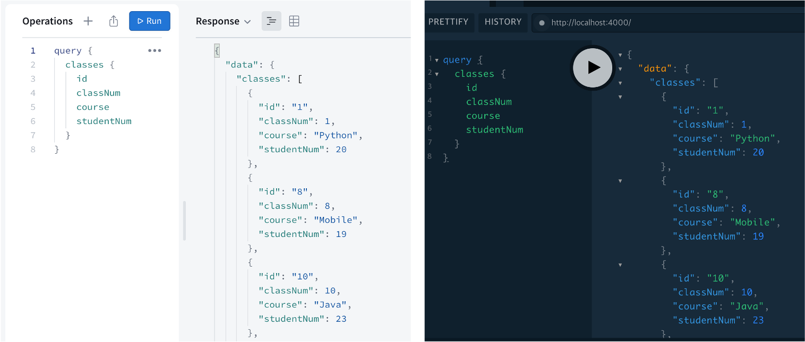
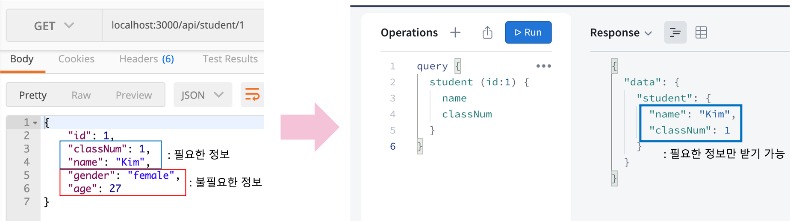
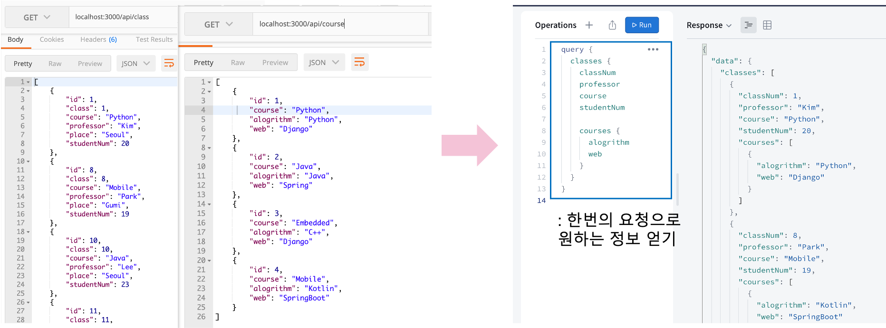
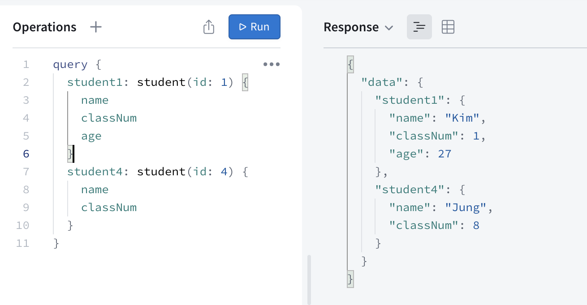
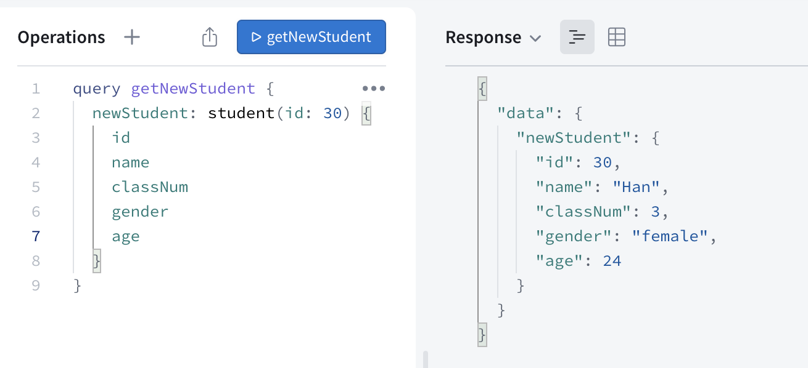
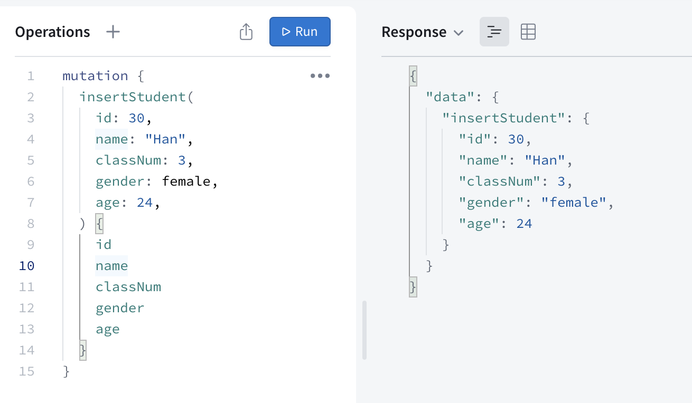
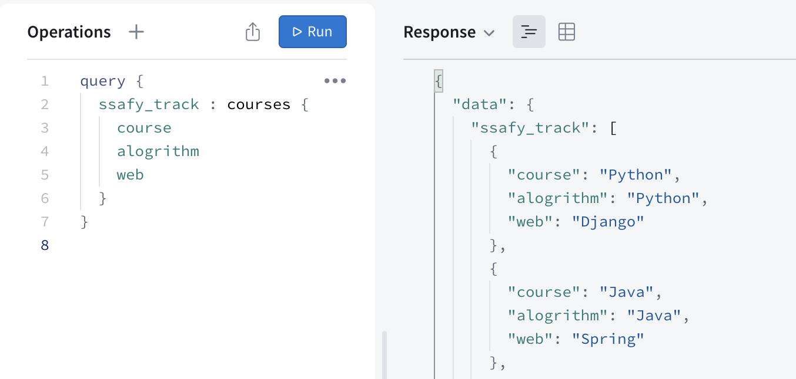
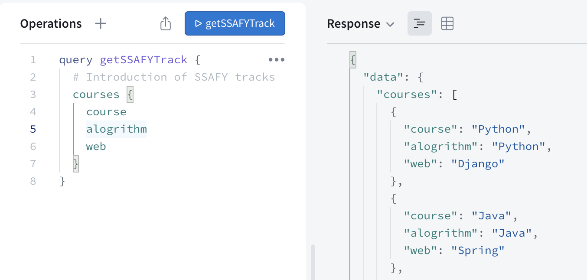

<div align="center">
  <br />
  <h1>GraphQL</h1>
  <br />
</div>

## 목차

1. [**GraphQL이란 무엇일까?**](#1)
2. [**GraphQL은 왜 등장했을까?**](#2)
3. [**GraphQL의 타입과 문법**](#3)

<br />

<div id="1"></div>

## GraphQL이란 무엇일까?

### GraphQL

- 페이스북이 만든 `Query Language`
- GraphQL을 통해 클라이언트는 필요한 것을 정확하게 요청 가능
- 한번의 요청으로 앱에 필요한 모든 데이터를 가져올 수 있다
- 프론트엔드 단에서는 요청을 전송하고, 백엔드에서는 정보 제공 및 처리
- [GQL(Graph Query Language)](https://en.wikipedia.org/wiki/Graph_Query_Language)와 다르니 주의

### GraphQL 특징

- 특정 데이터베이스나 스토리지에 종속되지 않음 (MySQL, postgreSQL, MongoDB, third party API, …)
- JSON으로 데이터를 리턴

### [Apollo](https://www.apollographql.com/) GraphQL

- 백엔드와 프론트엔드 모두 제공
- 실행 방법: [Apollo Studio](https://studio.apollographql.com/), [GraphQL Playground](https://www.graphqlbin.com/)
- 실행 예시
  > <br />
  > 왼쪽이 Apollo Studio, 오른쪽이 GraphQL Playground

<br />

<div id="2"></div>

## GraphQL은 왜 등장했을까?

### REST의 단점

> REST: 소프트웨어간 정보를 주고받는 방식. 소프트웨어나 라이브러리가 아니라 형식  
> `Endpoint`: 최종적으로 도달할 URI. 각 Endpoint마다 SQL 쿼리 변경

- `Overfetching`: 불필요한 데이터를 가져오는 것 → 데이터 전송량, 네트워크 비용, 시간 증가
- `Underfetching`: 여러 계층에서 데이터를 받을 때 한 번이 아닌 여러 번의 endpoint 요청이 필요 → 앱 속도 감소

### GraphQL의 해결

- 하나의 endpoint에서 모든 요청 처리 가능. 즉, 하나의 URI에서 POST로 모든 요청 가능
- **필요한 정보들만 선택**하여 받기 가능. 데이터 전송량 감소 → Overfetching 문제 해결
- **한 번의 네트워크 호출**을 통해 필요한 여러 계층의 데이터 받기 가능 → Underfetching 문제 해결

### GraphQL의 해결 예시

- Overfetching 해결 예시
  > <br />
  > 1번 학생의 이름과 반번호만 알고 싶은 경우,  
  > REST는 불필요한 정보까지 가져오지만, GraphQL은 요청한 정보만 가져온다
- Underfetching 해결 예시
  > <br />
  > class들의 정보와 해당 반의 course 정보까지 알고 싶은 경우,  
  > REST는 여러 번의 요청이 필요하지만, GraphQL은 한 번의 요청으로 원하는 정보를 얻을 수 있다

### GraphQL과 REST

- GraphQL이 REST를 완전히 대체하지는 않는다
- 더 작은 서비스인 경우, 또는 자주 요청되는 URL을 아는 경우 REST가 나을 것
- 서비스가 어떤 종류의 데이터를 어떻게 주고받느냐에 따라 REST와 GraphQL 중 하나를 선택

<br />

<div id="3"></div>

## GraphQL의 타입과 문법

### Types

- The Query and Mutation types

  - `query`: 데이터를 읽는데(R) 사용

    > <br />
    > 예시 1: id가 1인 학생의 이름, 반번호, 나이와 id가 4인 학생의 이름, 반번호를 요청<br /> 
    
    > <br />
    > 예시 2: id가 30인 학생(newStudent)의 모든 정보를 요청

  - `mutation`: 데이터를 바꾸는데(CUD) 사용. DB 등의 데이터를 변경
    > <br />
    > 예시: id는 30, 이름은 Han, 3반, 여성, 24살의 새로운 학생을 추가

- Scalar types
  - `String`, `Float`, `Int`, `Boolean`, `ID`(String 형태이며 unique 값)

```javascript
type SClass {
  id: ID!
  classNum: Int!
  course: CourseTrack!
  professor: String
  place: String
  studentNum: Int
  courses: [Course]
}
```

- List: []
- Non-Null: !
- Enumeration types (`Enums`)

```javascript
enum CourseTrack {
  Python
  Java
  Embedded
  Mobile
}
```

### typedef, resolver

- `typedef`: GraphQL 명세에서 사용될 데이터, 요청의 타입 지정. gql(template literal tag)로 생성

```javascript
const typeDefs = gql`
  type Query {
    students: [Student]
    student(id: Int): Student
  }
  type Mutation {
    insertStudent(
      id: Int
      classNum: Int
      name: String
      gender: Gender
      age: Int
    ): Student
  }
  type Student {
    id: Int!
    classNum: Int!
    name: String!
    gender: Gender!
    age: Int
    sclass: SClass
  }
  enum Gender {
    male
    female
  }
};
```

- `resolver`: 서비스의 액션들을 함수로 지정. 요청에 따라 데이터를 반환, 입력, 수정, 삭제. 직접 구현 필요

```javascript
const resolvers = {
  Query: {
    students: () => database.students,
    student: (parent, args, context, info) =>
      database.students.filter((student) => {
        return student.id === args.id;
      })[0],
  },
  Mutation: {
    insertStudent: (parent, args, context, info) => {
      database.students.push(args);
      return args;
    },
  },
};
```

### 그 외 문법

- Aliases 지정 가능 (별칭)      
  
- Operation name 설정 가능 (함수명)  
  
- comments (주석): #

<br />
<br />

###### 출처: [인프런 얄팍한 GraphQL과 Apollo](https://www.inflearn.com/course/얄팍한-graphql-apollo/), [GraphGL 한국어 사이트](https://graphql-kr.github.io/), [GraphQL Learn](https://graphql.org/learn/), [GraphQL 개념잡기](https://tech.kakao.com/2019/08/01/graphql-basic/), [Can GraphQL Replace REST?](https://medium.com/graphql-portal/can-graphql-replace-rest-479aab585f9d), [What is GraphQL and why Facebook felt the need to build it?](https://buddy.works/tutorials/what-is-graphql-and-why-facebook-felt-the-need-to-build-it)

<br />
<br />
