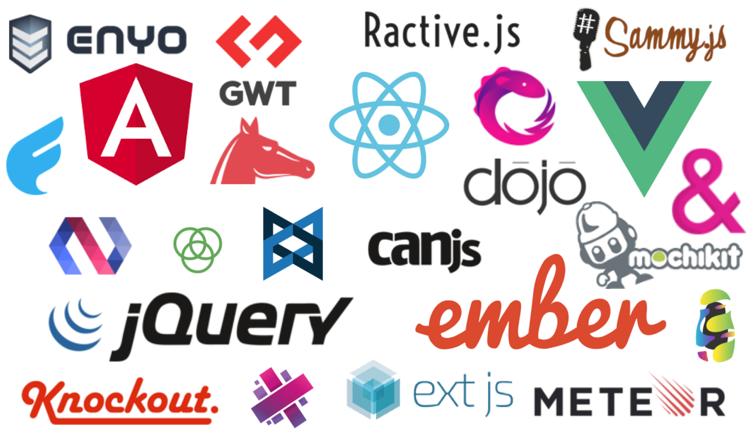

<div align="center">
  <br />
  <h1>리액트를 왜 사용하는 것인가?</h1>
  <br />
</div>

## 목차

1. [**리액트란?**](#1)
2. [**프론트엔드 라이브러리, 프레임워크의 등장**](#2)
3. [**리액트의 특징**](#3)
4. [**리액트의 장단점**](#4)

<br />

<div id="1"></div>

## 리액트란?

**리액트(React.js)** 는 페이스북(FaceBook)에서 개발한 `JavaScript 라이브러리`의 하나로서 **사용자 인터페이스**를 만들기 위해 사용된다.


<br />

<div id="2"></div>

## 프론트엔드 라이브러리, 프레임워크의 등장

요즘의 웹들은 **웹 앱** 혹은 **웹 애플리케이션**이라 불릴 정도로 동적 요소들이 많아지면서 복잡해졌다. 이러한 웹을 구현하기 위해 웹의 크기가 커지면서 JavaScript 파일의 관리가 어려워졌고 이로 인해 발생하는 문제점들을 해결하기 위해 만들어진 것들이 `프론트엔드 라이브러리 또는 프레임워크`이다.

> **라이브러리** : 개발자가 어떠한 기능을 가진 모듈이 필요할 때 해당 모듈을 호출하여 사용하는 개념, 즉 사용자가 개발 흐름에 대해 제어를 하며 필요한 상황에만 가져다 쓰는 것이다.

> **프레임워크** : 개발자가 코드를 작성할 수 있는 프로그램의 뼈대 구조 를 제공해주는 것 (ex. 필수적인 코드, 알고리즘, 데이터베이스 연동 등), 즉 사용자가 아닌 프레임워크가 전체적인 개발 흐름을 자체적으로 가지고 있는 것이다.



<br />

<div id="3"></div>

## 리액트의 특징

- **선언형**

React는 상호작용이 많은 UI를 만들 때 생기는 어려움을 줄여줍니다.  
애플리케이션의 각 상태에 대한 간단한 뷰만 설계하면 React는 데이터가 변겸됨에 따라 적절한 컴포넌트만 효율적으로 갱신하고 렌더링합니다.

- **컴포넌트 기반**

스스로 상태를 관리하는 캡슐화된 컴포넌트를 만들 수 있습니다. 이를 조합해 복잡한 UI 설계도 가능합니다.  
컴포넌트 로직은 템플릿이 아닌 JavaScript로 작성됩니다. 따라서 다양한 형식의 데이터를 앱 안에서 손쉽게 전달할 수 있고, DOM과는 별개로 상태를 관리할 수 있습니다.

- **JSX 사용**

리액트는 JSX라고 하는 JavaScript를 확장한 문법을 사용합니다.

ex) JSX 예시

```jsx
function getGreeting(user) {
  if (user) {
    return <h1>Hello, {formatName(user)}!</h1>;
  }
  return <h1>Hello, Stranger.</h1>;
}
```

```jsx
const element = (
  <div>
    <h1>Hello!</h1>
    <h2>Good to see you here.</h2>
  </div>
);
```

- **Virtual DOM 사용**

리액트는 Virtual DOM을 사용합니다. Virtual DOMD은 UI를 가상 메모리에 저장하고 ReactDOM과 같은 라이브러리에 의해 실제 DOM과 동기화하는 프로그래밍 개념입니다. 이를 재조정(Reconciliation)이라고 합니다.

- **라이프 사이클**

리액트에서 컴포넌트에는 라이프 사이클 즉, 컴포넌트의 수명 주기가 존재합니다.  
컴포넌트의 수명은 보통 페이지에서 렌더링되기 전인 준비과정에서 시작하여 페이지에서 사라질 때 끝이납니다.


<br />

<div id="4"></div>

## 리액트의 장단점

| 분류 | 내용                                                                                                                                      |
| :--: | :---------------------------------------------------------------------------------------------------------------------------------------- |
| 장점 | 1. SSR과 CSR을 모두 지원한다.<br />2. 간편한 UI 수정과 재사용이 용이하다.<br />3. 다른 프레임워크나 라이브러리와 혼용하여 사용할 수 있다. |
| 단점 | 1. view 외 기능들은 직접 구현하거나 추가 라이브러리를 사용하여 구현해야 한다.<br />2. 초기 렌더링 속도가 너무 느리다.                     |
