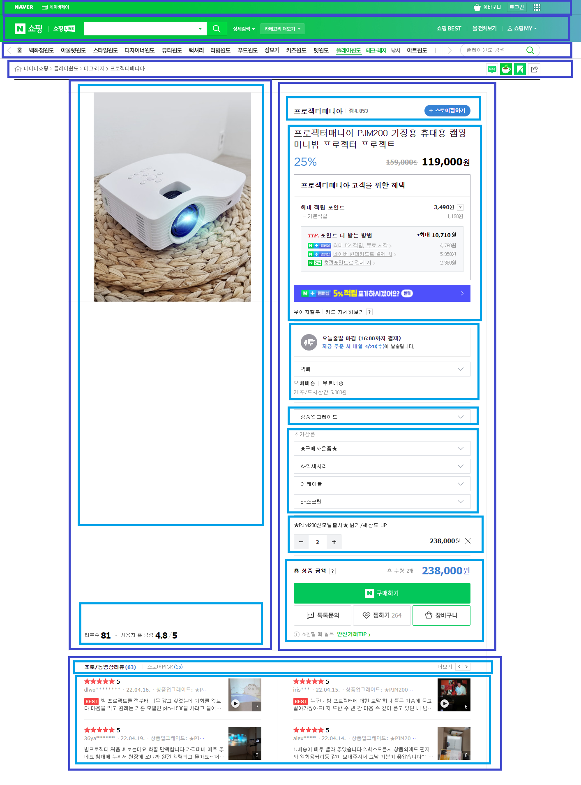

<div align="center">
  <br />
  <h1>반응형 프로그래밍</h1>
  <br />
</div>

## 목차

1. [**상태관리**](#1)
2. [**반응형 프로그래밍**](#2)
3. [**Publish/Subscibe Pattern**](#3)

<br />

<div id="1"></div>

## 상태관리

### 상태

- **변화하는 데이터 (동적으로 표현되는 데이터)**
- 사용자의 액션에 따라 변경될 수 있는 컴포넌트의 부분을 나타내는 자바스크립트 객체

### 상태 관리

- 여러 컴포넌트간의 데이터 전달과 이벤트 통신을 한 곳에서 관리하는 것

### 상태 관리의 필요성

- 상태 관리가 없다면

  - Component 단위에서는 props를 통해 하위 component로 상태를 전달
  - Component가 증가한다면 비효율적인 작업 발생 가능

- 상태 관리의 예시
  

### 상태의 두 가지 종류

- **로컬 상태**

  - 특정 컴포넌트 안에서만 관리되는 상태
  - 예 : input box, select box

- **전역 상태**

  - 프로덕트 전체 또는 여러 컴포넌트에서 관리되는 상태
  - 앱 전반에 영향을 준다
  - 예 : 언어 설정, 테마 설정

<br />

<div id="2"></div>

## 반응형 프로그래밍

> **상태관리와 반응형 프로그래밍**
>
> - 상태관리를 통해 상태가 바뀔 때 다른 컴포넌트 등 상태의 업데이트가 이루어진다 ⇒ 반응

### 반응형 프로그래밍

- **데이터가 변화하면 그 변화에 따라 알아서 반응하는 프로그래밍**
- 데이터가 어떤 값으로 변경되는지 직관적으로 보여준다
- On the development of reactive systems (1985)에 처음 나온 개념
- 시간 순으로 발생한 이벤트의 나열
- 예시 : 엑셀의 함수

- **ReactiveX** : 비동기 이벤트 기반 프로그래밍 라이브러리

  - Rx에 대한 기본 개념만 있으면 어떤 언어에서든 비슷하게 사용 가능
  - _반응형 프로그래밍은 ReactiveX의 기본 정도라고 보면 될 것_
  - **데이터 스트림(Data Stream)과 변화의 전파와 관련된 선언형 프로그래밍 패러다임**
  - 관찰자는 데이터가 변화하는 것을 바라보고 있다가 최종으로 데이터가 나오면 그 데이터로 자신의 작업을 수행

### 선언형 프로그래밍과 명령형 프로그래밍

- **선언형 프로그래밍** : 무엇을 할 지 알려준다 (`함수형`) (`Reactive`)

  - `$` : 스트림을 가리키는 변수를 한정하는 데 사용, 변경 된 값을 실시간으로 참조

  ```js
  // '$'는 참조되는 값이 변경되면 실시간으로 해당 값을 따른다
  let b = 1;
  let c = 2;
  let a$ = b + c;
  console.log(a$); // 3
  b = 10;
  c = 5;
  console.log(a$); // 15
  ```

- **명령형 프로그래밍** : 어떻게 할 지 알려준다 (`절차형`) (`객체지향형`)

  ```js
  let b = 1;
  let c = 2;
  let a = b + c;
  console.log(a); // 3
  b = 10;
  console.log(a); // 3
  ```

### 데이터 스트림

- 예 : 키 입력, 마우스, 터치, HTTP 호출 등의 이벤트, 변수의 변화

### PULL과 PUSH

- 반응형 프로그래밍의 핵심은 프로그램이 외부 환경과 커뮤니케이션하는 방법
- `데이터 생산자`(`Data Producer`)와 `데이터 소비자`(`Data Consumer`)가 통신하는 방법을 제공

### PULL

- **소비자가 언제 생산자에서 데이터를 받아올지 결정**
- **데이터가 필요하면 데이터를 만드는 친구에게 달라고 요청해서 받는 것**
- _`야, 데이터 줘`_
- 생산자는 언제 소비자에게 데이터를 전달해야 하는지 모른다
- 제어권은 소비자가 가지고 있다
- 예 : 자바스크립트, 자바의 함수

  ```js
  funtion solution(a, b) {
  // ...
    let result = add(a, b); // add 호출
  //
  }

  function add(a, b) {
    return a + b;
  }
  ```

### PUSH

- **생산자가 언제 소비자에게 데이터를 보낼지 결정**
- **물어볼 때 주는 게 아니고 생산자가 바꾸면 그때 받기**
- 소비자는 언제 데이터를 받을지 모른다 ⇒ 외부에서 응답이 오면 그때마다 반응
- 비동기 처리에 유리 ⇒ 계속 물어보지 않아도 알아서 작업 마치면 나에게 알려주니까
- 예 : 푸쉬 알림
  - 카카오톡 알림 : 카톡이 오면 카톡 알림으로 알려줌. 언제 카톡이 올지 나는 확인하지 않음
  - 배송 알림 : 언제 배송이 시작되는지, 언제 도착하는지 소비자는 알 수 없음. 제품 배송 상태가 바뀌면 생산자가 소비자에게 알려줌
- 예 : **Promise**
  - Promise : 자바스크립트 비동기 처리에 사용되는 객체로 ES6에 도입된 기능
  - `Promise`(`생산자`)는 `callback`(`소비자`)에서 나온 값을 전달하고, 함수와 다르게 언제 해당 callback 값을 `보낼지`(`push`) 결정

<br />

<div id="3"></div>

## Publish/Subscibe Pattern

> Observer Pattern에 대한 상세한 설명은 [이곳](https://github.com/ssafy-tech-concert/ssafy-tech-concert/blob/master/Etc/Design_Pattern.md#5)을 참고

### Pub/Sub Pattern (Publish/Subscibe Pattern)

- `옵저버 패턴`의 변화된 형태 ⇒ 차이점 : **중간에 이벤트 관리자를 둔다**
- 예 : 우체부(Pusblisher)가 편지(메시지)를 우체통(채널 또는 브로커)에 넣으면 우리(Subscriber)가 가져다 읽는 것
- 구독자를 객체에 바로 등록하지 않고, 객체도 구독자에게 바로 퍼블리시하지 않고 이벤트 채널을 통해 구독자에게 변화된 내용을 전달
  - _`응답이 오면 알려줘, 나는 내 할일 하고 있을게`_

### 특징

- 장점

  - 구독자와 객체가 서로 직접적으로 연락하지 않으므로 결합도 감소
  - Publisher 관점에서 Subscriber들을 일일히 관리하지 않는다
  - 코드 관리, 재사용성, 안정성이 높다

- 옵저버 패턴에 비해 아쉬운 단점

  - 옵저버 패턴을 이용한 시스템은 직접 통신하기 때문에 목적지까지 메시지를 확실하게 전송할 수 있었다. 하지만, Pub/Sub시스템은 미들웨어를 통하기 때문에 의도한대로 전달하지 못할 수도 있다.

- 특징

  - 1:N 관계
  - 반응형 프로그래밍에 딱 맞는 패턴
  - 예 : 리액트의 state와 props 변화, 리덕스, RxJS, Fetch API, 웹소켓의 on()

### 메시지 브로커

- `Message Broker`(`메시지 브로커`)는 `Publisher`(`송신자`)로부터 전달받은 메시지를 `Subscriber`(`수신자`)로 전달해주는 중간 역할이며 응용 소프트웨어 간에 메시지를 교환할 수 있게 한다
- 메시지가 적재되는 공간은 `Message Queue`(`메세지 큐`), 메시지의 그룹은 `Topic`(`토픽`)

### 메시지 큐

- **프로세스 또는 프로그램 간에 데이터를 교환할 때 사용하는 통신 방법** 중 하나

- 메시지 지향 미들웨어(Message Oriented Middleware:MOM)를 구현한 시스템
  - 메시지 지향 미들웨어란 비동기 메시지를 사용하는 응용 프로그램들 사이에서 데이터를 송수신하는 것
- 각 메시지는 하나의 소비자에 의해 한 번만 처리 ⇒ 일대일 통신
- 사용 예시 : 회원가입 또는 비밀번호 분실 시 이메일 전송
- 예 : RabbitMQ, Kafka, ActiveMQ 등

<br />
<br />

###### 출처: [[10분 테코톡] 🍎 그루밍의 상태관리와 반응형 프로그래밍](https://www.youtube.com/watch?v=alsCMx6vpG4), [프론트엔드 개발에서의 상태 관리](https://velog.io/@ehdgusdl9177/%ED%94%84%EB%A1%A0%ED%8A%B8%EC%97%94%EB%93%9C-%EA%B0%9C%EB%B0%9C%EC%97%90%EC%84%9C%EC%9D%98-%EC%83%81%ED%83%9C-%EA%B4%80%EB%A6%AC), [Pub/Sub model](https://sugerent.tistory.com/585), [[Tech.] Message Broker란?](https://heodolf.tistory.com/49), [메시지 큐에 대해 알아보자!](https://tecoble.techcourse.co.kr/post/2021-09-19-message-queue/)

<br />
<br />
