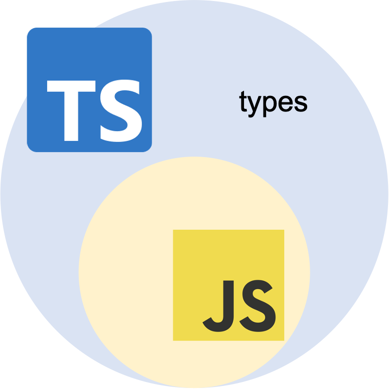
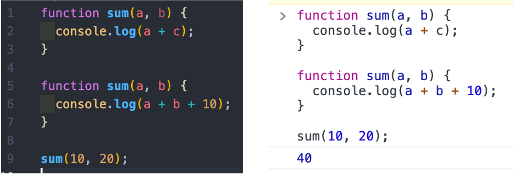
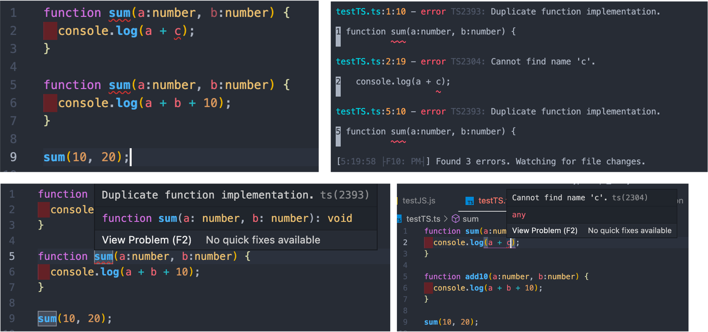
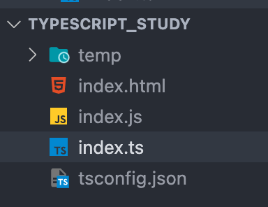

<div align="center">
  <br />
  <h1>타입스크립트(TypeScript)</h1>
  <br />
</div>

## 목차

1. [**타입스크립트란?**](#1)
2. [**타입스크립트를 사용하면 어떤 장점이 있을까?**](#2)
3. [**타입스크립트는 어떻게 실행될까?**](#3)
4. [**타입스크립트의 기본 문법**](#4)

<br />

<div id="1"></div>

## 타입스크립트란?

- 자바스크립트에 정적 타입을 제공해주는 언어
- 자바스크립트의 상위 집합으로 자바스크립트의 모든 기능을 포함
- 마이크로소프트가 만들었으며 [VS Code](https://github.com/microsoft/vscode) 등에서 사용



<br />

<div id="2"></div>

## 타입스크립트를 사용하면 어떤 장점이 있을까?

> **정적 타입과 동적 타입** <br />
> `정적 타입(Statically Typed Language)`: 프로그램이 실행되기 전, 런타임 이전에 컴파일 시 타입 분석 진행 (예: JAVA, C++, TypeScript) <br />
> `동적 타입(Dynamically Typed Language)`: 프로그램이 실행되는 런타임 시 타입 분석 진행 (예: Python, PHP, JavaScript)
- 프로그램을 실행하기 전 미리 에러 파악 가능
- 친절한 에러 메세지를 제공
- 객체지향적(인터페이스, 제네릭 등)
- 넓은 생태계

<br />

> <em>아래 코드는 자바스크립트로 작성되었다. 해당 코드는 두 가지 문제점을 가지고 있음에도 브라우저에서 실행이 가능하다. 어떤 에러일까?</em>
> 
> 
> <em>같은 코드에 타입을 적용해서 타입스크립트로 적어보았다. 빨간 밑줄을 통해 에러가 어디서 나는지 확인이 가능한 것을 확인할 수 있다.</em>
> 


<br />

<div id="3"></div>

## 타입스크립트는 어떻게 실행될까?

- 웹 브라우저는 자바스크립트 런타임 환경으로 자바스크립트만 이해한다. 
- 따라서 타입스크립트 파일(`.ts` 또는 `.tsx`)로 작성한 뒤에 자바스크립트 파일(`.js`)로 변환하는 컴파일 과정을 필요로 한다.
- 일반적인 컴파일과 다른 점도 있기 때문에 컴파일 대신 `transpile`이라고 부르기도 한다.
- `tsconfig.json`는 프로젝트를 컴파일할 때 필요한 루트 파일과 컴파일 옵션을 지정한다.
 　　 


<br />

<div id="4"></div>

## 타입스크립트의 기본 타입 및 문법

- 사용자는 타입스크립트를 통해 타입을 명시적으로 지정할 수 있다.
- 만약 명시적으로 지정하지 않는다면 타입스크립트의 컴파일러가 자동으로 타입을 추론한다.
- 타입스크립트 파일 안의 모든 변수, 함수 등에 타입을 지정해야하는 건 아니다.
- **타입스크립트 타입**: `number`, `string`, `boolean`, `null`, `undefined`, `symbol`, `object`, `array`, `tuple`, `enum`, `any`, `void`, `never`
```typescript
let tel: number | string = 10; // number, string

const flag: boolean = true; // boolean

let n: null = null; // null

let num: number | undefined = undefined; // undefined

let sym2 = Symbol("key"); // symbol

const obj: object = {}; // object

let nums1: number[] = [1, 2]; // array 
let nums2: Array<number> = [1, 2];

let values: any[] = [1, 'one', true]; // any: 모든 타입을 허용. 자바스크립트에서 타입스크립트를 적용하기 시작할 때 사용하면 좋다

let tuple: [string, number]; // tuple

enum Colors { // enum: 값들의 집합
  Yellow, 
  Blue,
};
let c: Colors = Colors.Yellow;

function sayHello(): void{ // void
  console.log("hello");
}

function neverEnd(): never { // never: 함수가 종료되지 않거나 비정상적으로 종료될 경우
  while(true){}
}

```

<br />
<br />

###### 출처: [TypeScript](https://www.typescriptlang.org/), [타입스크립트 기초 강의](http://slides.com/woongjae/deck-8), [타입스크립트 쓰는 이유 & 필수 문법 10분 정리](https://www.youtube.com/watch?v=xkpcNolC270), [정적 타이핑](https://poiemaweb.com/typescript-typing), [타입스크립트 핸드북](https://joshua1988.github.io/ts/intro.html), [자바스크립트 개발자를 위한 타입스크립트](https://ahnheejong.gitbook.io/ts-for-jsdev/)

<br />
<br /> 
