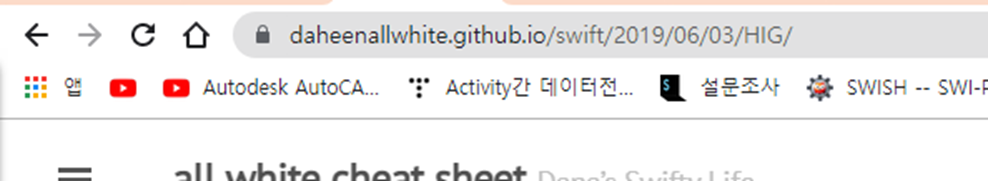
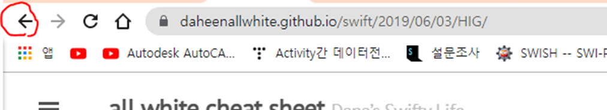
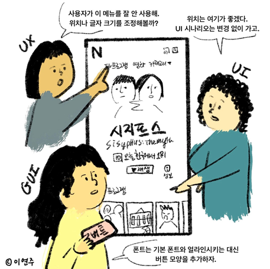

   
  <h1>발표 제목</h1>
   

## 목차

1. [**UI와 UX**](#1)
2. [**UI디자이너와 UX 기획자**](#2)
3. [**HIG**](#3)
4. [**HIG 사용 이유**](#4)

 

## UI와 UX

UI
 - User Interface
 - 사용자가 제품 혹은 서비스를 이용할 때 보게되는 화면을 말한다.
 - 사용자가 서비스를 이용하기 위해서 만들어졌다.
 - 폰트, 레이아웃 등 사용자가 마주하게 될 시간적인 디자인이다.
 - ex)Web - html, Android - xml

UX
 - User Experience
 - 사용자 경험이라는 뜻으로 서비스를 직, 간접적으로 이용하면서 느끼는 종합적인 만족
 - UX 디자인이랑 사용자가 만족할 수 있도록 사용자 중심적으로 설계된 디자인이다.

우리는 경험을 통해 이 버튼이 뒤로가기 라는 것을 알고 있다!
 

## UI디자이너와 UX 기획자

UX 기획자

 - 사용자의 행동을 분석하여 서비스에서 개선할 방법을 도출. 
 - 페이지의 방문자 수 및 어떤 기능의 사용 빈도 등의 분석과 인터뷰를 혹은 인터넷이나 전화를 통한 컴플레인 등을 통해 수정할 기능을 선발. 
 - 그 후 개발자, 디자이너, 팀장 등에게 전달.
 - Ux 개발자는 해당 자료를 받아서 결과만 취하기 때문에 백엔드 기술이 필수는 아닌 것 같다…

UI 디자이너
 - UX 기획자가 찾은 문제점을 개선. 
 - 해당 부분의 위치를 수정하거나 최악의 경우 개발자와의 협의를 통해 UI 시나리오의 수정을 거친다.
 - UI 시나리오란? 서비스의 UI의 구성 요소가 동작하는 방법, UI가 나타나는 순서 등을 정리한 정책서 이다. 이를 수정 한다는 것은 서비스의 전체적인 수정을 한다는 것과 같다.

각각의 차이를 한 번에 볼 수 있는 이 그림을 만들어주신 이연주님께 다시 한번 감사를 보낸다.

 

## HIG

HIG

 - Human Interface Guidelines

 - 보다 직관적이고 학습 가능하며 일관성 있게 만들어 사용자 경험을 개선하는 것에 목표를 한다.

 - 비주얼 적인 디자인 규칙을 설명하고, 작업 동작에 대한 설명과 기능적인 설명을 통해 애플리케이션 개발을 어떻게 하면 좋을지에 대한 방식을 추천하는 개발 문서.
 - 애플리케이션 개발자에게 일련의 권장 사항을 제공하는 소프트웨어 개발 문서

 - HCI(Human Computer Interface)에 대한 연구를 기반으로 하는게 맞지만 대부분은 플랫폼 개발자가 선호하는 규칙을 기반으로 만들어진다.
   - HCI는 사람과 컴퓨터 간의 인터페이스에 중점을 둔 컴퓨터 기술의 설계 및 사용에 대한 연구.

 - 플랫폼 간의 지침이 대부분 존재한다. 대표적으로 apple 사의 것이 있다.

## HIG 사용 이유

사용자 입장
 - 일관적인 사용자 경험을 제공. 어떤 기기에서든 같은 플랫폼 안에서는 같은 동작에 같은 결과를 기대할 수 있기 때문에 배우기 쉽고, 사용자가 통일성과 일관성을 느낄 수 있다.

개발자 입장
 - 표준과 일관된 기준을 제공. 개발 과정 중 중요한 부분에 집중할 수 있게 하며, 의사 소통 과정에서 필요한 정보와 공통된 용어를 제공하여 효율적인 개발에 도움을 준다.

결론
 - HIG는 사용자 경험에 관해 이미 검증된 방식을 추천하여, UX나 디자인, 어플리케이션 구성을 처음 만드는 사람도 가이드라인에 따른다면 어느정도 직관적인 사용자 경험, 효율적이고 명시적인 어플리케이션을 만들 수 있다.
