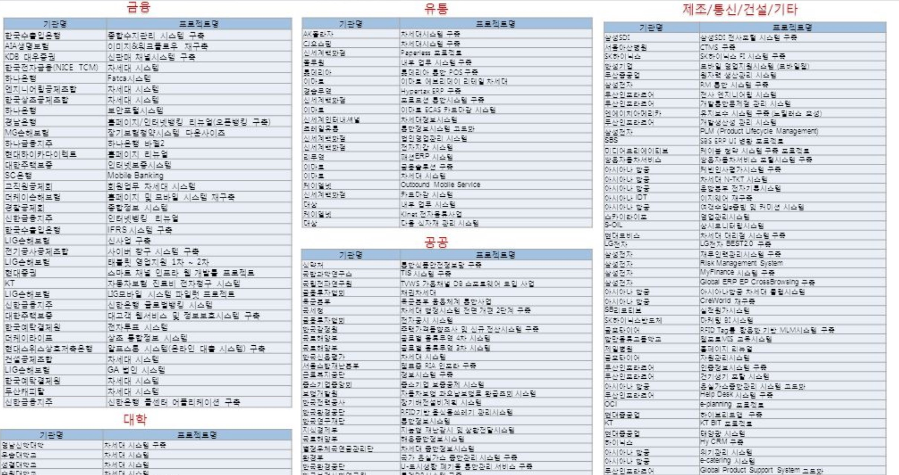

<div align="center">
	<br />
    <h1>
        WebSquare
    </h1>
    <br />
</div>

## 목차

1. [**WebSquare의 정의, 장점, 사례**](#1)
2. [**WebSquare 단점**](#2)

<br />

<br />

<div id="1"></div>

## WebSquare의 정의, 장점, 사례

<br />

### WebSqure의 정의

> 국내 최초의 WYSIWYG 개발 도구가 포함된, HTML5를 완벽히 지원할 수 있는 HTML5 웹 표준 UI 플랫폼

*WYSIWYG(위지위그) : "What You See Is What You Get"의 약자로, 문서 및 문서 작성 방법을 GUI로 구현한 것을 이름

<br />

- 프론트 화면 개발 툴 (최신 버전 : WebSquare5)
- 이클립스를 지원 - 웹스퀘어 엔진을 등록하고 서버 설정 디렉토리를 web.xml에 지정하면 사용 가능

```java
<servlet>
    <servlet-name>websquareDispatcher</servlet-name>
    <servlet-class>websquare.http.DefaultRequestDispatcher</servlet-class>
    <init-param>
        <param-name>WEBSQUARE_HOME</param-name> 
        <param-value>~/~/~/websquare_home</param-value>
    </init-param>
</servlet>	

<servlet-mapping>
    <servlet-name>websquareDispatcher</servlet-name>
    <url-pattern>*.wq</url-pattern>
</servlet-mapping>
```

- XML/JSON으로의 데이터 처리를 통해 서버와 데이터 통신, 대용량 데이터 처리도 가능

- 디자인 탭에서 화면을 보며 마우스를 통해 만들고자 하는 요소, 속성 추가 및 지정 가능

​	👉 Source탭에선 이러한 작업들이 html / js 소스로 자동으로 완성되어 있음

- 화면은 websqure.html을 통해 실행되고, 변경사항을 실시간으로 브라우저를 통해 확인 가능

ex)

```
http://domain.com/websquare/websquare.html?w2xPath=/MA/MA01M01.xml
```

* w2xPath=/MA/MA01M01.xml : 웹스퀘어 화면 파일 경로

<br />


서버 통신 플로우

<br />

<br />

### WebSquare 장점

<br />

- 강력한 개발 편의 기능을 통해 UI/UX의 획기적인 개발 생산성을 보장

  👉 코드 창에 코드를 입력하지 않고도 레이아웃, 스타일 등을 입힐 수 있기 때문에, 백엔드 개발자도 쉽게 UI 구성 가능

- 이클립스와 독립된 프로세스로 가볍고 빠른 성능

- CSS3, CSS2017, HTML5.2와 같은 최신 기술 스펙 지원

- 모바일 개발을 더욱 쉽게 하는 디바이스 모드 제공

- 다양한 오픈/상용 라이브러리의 손쉬운 연계 지원

- One Source, Multi Use : 하나의 소스로 다양한 브라우저에서 동일한 UI 구현 가능


<br />

<br />

### WebSquare 사용 사례



- 연매출 250억 가량의 기업 제품인 만큼, 많은 기업들이 사용 중

<br />

<br />

## WebSquare 단점

- 개인이 아닌 기업 시스템에서 많이 사용되는 만큼, 인터넷 상에 정보 ↓
- 윈도우에서만 호환 가능, Mac OS에서는 작동 불가
- 사용자 인터페이스가 좋지 않다는 평이 많음 - 적응하는 데 시간 걸림


<br />

<br />

---

### 참고 자료

https://slidesplayer.org/amp/11043191/

https://sungjaecloud.tistory.com/m/303

https://cheershennah.tistory.com/m/204

https://eomstory.tistory.com/m/196
