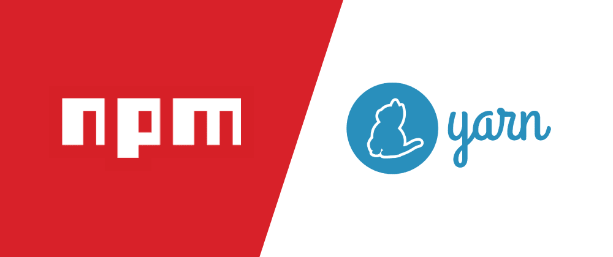

   
  <h1>npm VS yarn</h1>
   

## 목차

1. [**npm은 무엇인가?**](#1)
2. [**yarn은 무엇인가?**](#2)
3. [**패키지 매니저란?**](#3)
4. [**npm VS yarn**](#4)
5. [**package.json**](#5)
6. [**package-lock.json과 yarn.lock**](#5)

 

## npm은 무엇인가?

**npm(Node Package Manager)** 는 명령어로 자바스크립트 라이브러리를 설치하고 관리할 수 있는 패키지 매니저입니다.

전 세계 자바스크립트 개발자들이 모두 자바스크립트 라이브러리를 공개된 저장소에 올려놓고 npm 명령어로 편하게 다운로드 받을 수 있습니다.

좀 더 쉽게 이야기 하면 npm은 iOS의 App Store, Android의 Google Play 처럼 Node.js 생태계의 스토어 역할을 하는 것입니다.

 

## yarn은 무엇인가?

**yarn**은 Meta에서 개발한 패키지 매니저입니다.

 

## 패키지 매니저란?

패키지를 설치하기 위해서는 설치, 빌드, 테스트, 업그레이드, 의존성 관리 등 복잡한 상황이 발생합니다.  
이런 복잡성을 낮추고 쉽게 패키지를 이용할 수 있도록 돕는 소프트웨어가 **패키지 매니저(Package Manager)** 입니다.

 

## npm VS yarn

yarn은 npm과 비교했을 때 두 가지 장점을 갖고 있습니다.

첫 번째, 속도입니다.

yarn은 다운로드한 패키지 데이터를 캐시에 저장하여 중복된 데이터를 다운로드하지 않고 캐시에 저장된 데이터를 활용함으로써 npm에 비해 패키지 속도가 매우 빠릅니다. 또한 여러 개의 패키지를 설치할 때도 병렬로 처리하기 때문에 순차적으로 진행하는 npm보다 더 빠릅니다.

두 번째, 보안성입니다.

npm은 패키지가 설치될 때 자동으로 코드와 의존성을 실행할 수 있도록 허용했습니다. 이 특징은 편리한 기능이지만 보안성을 위협할 수 있습니다. 특히나 보장된 정책 없이 등록한 패키지가 존재할 수 있다는 점에서 더욱 위험도가 높습니다.  
반면 yarn은 yarn.lock이나 package.json 파일에 있는 파일만 설치합니다. 그렇기에 yarn이 npm보다 보안성이 높습니다.

 

## package.json

`package.json`은 프로젝트 정보와 의존성을 관리하는 문서입니다.  
이미 작성된 `package.json` 문서는 어느 곳에서도 동일한 개발 환경을 구축할 수 있도록 도와줍니다.

 

## package-lock.json과 yarn.lock

`package-lock.json`, `yarn.lock`과 같은 패키지 잠금 파일은 시간과 장소에 따라서 서로 다른 버전의 패키지가 설치되는 문제를 방지합니다.

패키지 잠금 파일에는 프로젝트에 패키지가 최초로 추가될 당시에 정확히 어떤 버전이 설치가 되었는지를 기록합니다.

만약 `package-lock.json`, `yarn.lock` 파일을 프로젝트의 Git 저장소에 올려두면, 앞으로 해당 프로젝트의 모든 개발자의 PC, 배포되는 서버까지도 npm 또는 yarn registry에 배포된 최신 버전을 무시하고 `package-lock.json`, `yarn.lock`에 기록된 버전 기준으로 패키지가 설치될 것입니다.

 

## 참고 자료

> https://en.wikipedia.org/wiki/Yarn_(package_manager)

> https://heropy.blog/2018/02/18/node-js-npm/

> https://velog.io/@kysung95/%EA%B0%9C%EB%B0%9C%EC%83%81%EC%8B%9D-npm%EA%B3%BC-yarn

> https://joshua1988.github.io/webpack-guide/build/node-npm.html#node-js

> https://www.daleseo.com/js-package-locks/
