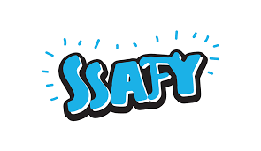

<div align="center">
  <br />
  
  <br />
  <h1>SSAFY 테크 콘서트 (SSAFY Tech Concert)</h1>
  <br />
</div>

## 목차

1. [**스터디 소개**](#1)
2. [**진행 방법**](#2)
3. [**다룰 주제**](#3)
4. [**대상자**](#4)
5. [**스터디 일정 및 시간**](#5)
6. [**모집 인원**](#6)
7. [**신청 방법**](#7)

<br />

<div id="1"></div>

## 💁🏻‍♂ 스터디 소개

&nbsp;&nbsp;SSAFY 테크 콘서트 스터디는 `웹 개발 분야의 기술, CS 지식, 최신 개발 트랜드 뉴스 등`의 주제로 10분간 발표를 통해 서로 지식을 공유하는 스터디입니다.

> **스터디 진행 예시**  
> [🔗 우아한 테크의 10분 테코톡 영상 바로가기 Click!](https://youtu.be/F_vBAbjj4Pk) 👈

<br />

<div id="2"></div>

## 💡 진행 방법

발표자는 발표일 전에 총 세 가지를 준비합니다.

&nbsp;&nbsp;**첫 번째**, 발표 준비

&nbsp;&nbsp;**두 번째**, 발표 시 활용할 PPT

&nbsp;&nbsp;**세 번째**, 발표 내용을 정리해서 문서화 한 마크다운 문서(.md file)

발표자는 약 10분 간 준비해온 주제로 발표를 시작하고 5분간 QnA를 받습니다. 스터디 종료 후 GitHub 그룹 저장소에 md 파일을 커밋 해주시면 됩니다.

```
발표(약 10분) -> QnA(약 5분) -> md 파일 커밋
```

> 발표 시간은 정확히 10분으로 맞추지 않아도 되며 최소 5분에서 최대 15분으로 준비해 주시면 됩니다.

> PPT에 만드는 것에 너무 많은 시간을 쓰시지 않았으면 좋겠습니다. PPT는 단순히 내용 전달을 위한 보조 도구로만 간단하게 만들어주시면 됩니다. (발표 내용과 마크다운 파일에 더 집중해 주세요.)

<br />

<div id="3"></div>

## 🛠 다룰 주제

- **웹 개발 기술**
- **CS 지식**
- **최신 개발 트랜드**

> **_예시_**
>
> - HTML, CSS, JavaScript의 역할은?
> - DOM이 무엇인가?
> - TCP / UDP는 무엇인가?
> - 최신 웹 개발 트랜드 분석
> - REST API 정복하기
> - 프레임워크란 무엇이고 어떤 것들이 있는가?
> - 데브옵스는 무엇인가?
> - 애자일 방법론이란?

<br />

<div id="4"></div>

## 🎯 대상자

- CS 지식이 부족하다고 느끼시는 분
- 웹 개발 관련 지식들을 쌓고 싶으신 분
- 기술 발표 경험을 통해 기술 면접을 대비하고 싶으신 분
- 마크다운 문서 작성에 능숙해지고 싶으신 분

> 마크다운 작성법 또는 깃허브 사용법을 모르셔도 충분히 참여하실 수 있습니다. 1시간만 투자하시면 충분히 배우실 수 있습니다.

> [🔗 무료 강의 링크 Click!](https://youtu.be/kMEb_BzyUqk) 👈

<br />

<div id="5"></div>

## 📅 스터디 일정 및 시간

| 요일 |       월, 수, 금        |
| :--: | :---------------------: |
| 시간 | 18:10 ~ 18:30 (약 20분) |

> 6인으로 진행 시 2주 마다 발표 순서가 돌아오는 식으로 진행됩니다.

> 스터디 시작은 다음 주 금요일부터로 생각하고 있습니다. (인원 확정 후 추후 다시 조정 예정)

<br />

<div id="6"></div>

## 👪 모집 인원

&nbsp;&nbsp;6명 ~ 8명

<br />

<div id="7"></div>

## ✉️ 신청 방법

**Mattermost**로 저에게 **DM 메시지** 주시면 됩니다.  
만약 발표를 진행한다면 다루고 싶은 주제 한 가지도 같이 적어서 전달해 주시면 더 감사하겠습니다 :)

_\* 신청은 토요일 오후 10시까지 받도록 하겠습니다._

> 혹시나 진짜 만약에 진원하시는 분들이 많으시면 사다리타기로 진행하겠습니다.

> 스터디가 짧은 시간 진행되고 2주마다 발표 하나씩 준비라 다른 스터디랑 병행하셔도 큰 부담은 없을 거 같습니다.

> 스터디 진행 관련해서 문의사항이 있으시면 언제든지 DM으로 문의 주세요.
