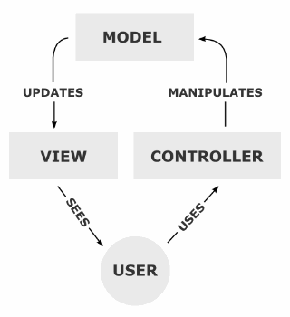
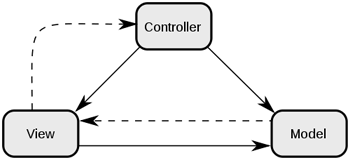
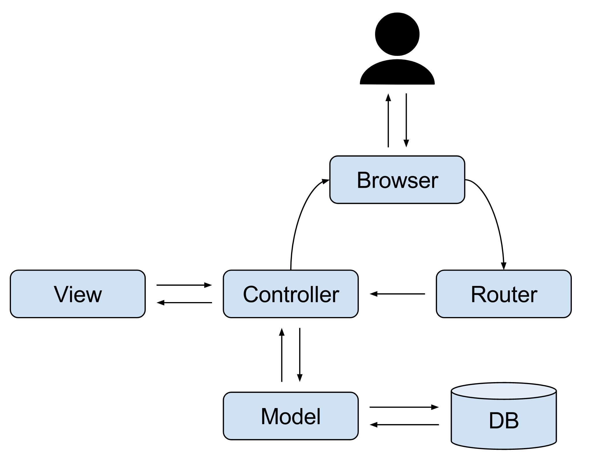
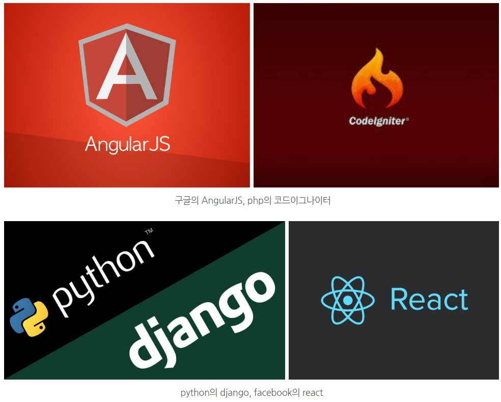
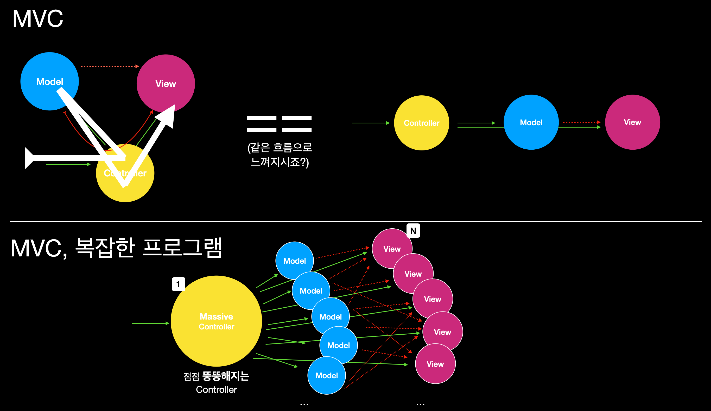

   
  <h1>MVC 패턴</h1>
   

##  목차

1. [**MVC 패턴이란?**](#1)
2. [**MVC패턴 구조**](#2)
3. [**MVC패턴 사용 이유 및 예시**](#3)
4. [**MVC 패턴의 한계**](#4)

 

 

## MVC 패턴이란?

> MVC는 Model, View, Controller의 합성어로, 소프트웨어 공학에서 사용되는 소프트웨어 *_디자인 패턴_  중 하나이다.

*디자인 패턴 : 소프트웨어의 개발 방법을 공식화 한 것. 소수의 뛰어난 엔지니어가 해결한 문제를 다수의 엔지니어들이 처리할 수 있도록 한 규칙이면서, **구현자들 간의 커뮤니케이션의 효율성을 높이는 기법**

- 하나의 어플리케이션, 프로젝트를 구성할 때 그 구성 요소를 세 가지의 역할로 구분한 패턴

사용자가 controller 조작 →  controller는 model을 통해 데이터를 가져 옴 → 데이터 바탕으로 View를 제어 → 사용자는 변경 사항을 View를 통해 시각적으로 확인

 

 

 

## MVC 패턴 구조

 

 

### 1. Model

> 애플리케이션의 정보/데이터를 나타내며, 이러한 정보/데이터의 가공을 책임지는 컴포넌트

👉 백그라운드에서 동작하는 로직을 처리

ex) 데이터베이스, 처음 정의하는 상수, 초기화값, 변수..

**Model의 규칙**

> 1. 사용자가 편집하기를 원하는 모든 데이터를 가지고 있어야 한다.

예를 들어 화면 안에 네모 박스가 있고, 그 안에 글자가 있다면 Model은 네모박스의 화면 위치 정보 및 크기 정보, 글자의 내용, 위치, 포맷 정보 등을 모두 가지고 있어야 함

> 2. View나 Controller에 대해서 어떤 정보도 알지 말아야 한다.

데이터 변경이 일어났을 때 Model에서 화면 UI(View의 영역)를 직접 조정해서 수정할 수 있도록 View를 참조하는 내부 속성값을 가지면 안된다는 뜻

> 3. 변경이 일어나면, 변경 통지에 대한 처리 방법을 구현해야만 한다.

Model에서 수정이 일어나면 이벤트를 발생시켜 View에 전달해야 할 수 있어야 하며, 마찬가지로  View가 Model을 변경하도록 요청하는 이벤트를 보냈을 때 이를 수신할 수 있는 처리 방법을 구현해야 함.

 

### 2. View

> 사용자에게 보여지는 부분, 즉 유저 인터페이스(UI)를 의미

👉 데이터 및 객체의 입력, 그리고 받은 데이터를 화면에 출력하는 역할을 담당

**View의 규칙**

> 1. Model이 가지고 있는 정보를 따로 저장해서는 안된다.

예를 들어, 화면에 글자를 표시하기 위해 Model이 가지고 있는 정보를 전달받게 될 것인데, 그 정보를 유지하기 위해서 View 내부에 데이터를 저장하면 안됨.

> 2. Model과 Controller에 대해서 몰라야 함

자기 자신을 제외한 다른 요소들을 참조하거나 어떻게 동작하는지 알아서는 안됨.

👉 즉, View는 데이터를 받으면 **단순히 화면에 표시해주는 역할**만 가짐(정보 저장 X)

> 3. 변경이 일어나면 변경 통지에 대한 처리방법을 구현해야만 한다.

Model과 마찬가지로, 사용자가 화면에 표시된 내용을 변경하게 되면 View는 이를 Model에게 전달해서 변경을 요청해야 할 것인데, 그 작업을 하기 위한 변경 통지를 구현해야 함.

 

### 3. Controller

> Model(Data)과 View(UI) 사이를 이어주는 다리 역할

👉사용자가 어플리케이션을 조작하여 발생하는 변경 "이벤트"들을 처리하는 역할

**Controller의 규칙**

> 1.  Model과 View에 대해서 알고 있어야 한다.

Model, View는 서로의 존재를 모른 채 변경 사항을 외부로 알리고, 수신하는 방법만 가지고 있음.

이를 Controller가 중재하기 위해서 그 둘에 대해 알고 있어야 함.

> 2. Model이나 View의 변경을 모니터링 해야 함

Model이나 View의 변경 통지를 받으면 이를 해석해서 각각의 구성 요소에게 통지해야 함

  

## MVC 패턴 사용 이유 및 예시

>  🌟**유지보수의 편리성, 애플리케이션의 확장성, *_유연성_**🌟

- 각 컴포넌트는 자신이 맡은 역할만 수행한 후, 다른 컴포넌트로 결과만 넘겨주면 되기 때문에 *_시스템 결합도_를 낮출 수 있음.

- 각자 맡은 컴포넌트에만 집중하여 개발 가능 👉 중복코딩 X

- 유지 보수 시에도 특정 컴포넌트만 수정하면 되기 때문에 시스템 변경 용이 

  (화면의 변경은 View만 변경, 데이터나 *_비즈니스 로직_ 변경은 Model만 변경, View와 Model 변경에 따라 Controller 일부 변경)

*유연성 : 클라이언트의 새로운 요구사항에 대해 최소한의 비용으로 보다 유연하게 대처할 수 있는 것

*시스템 결합도 : 어떤 모듈이 다른 모듈에 의존하는 정도

*비즈니스 로직 : 프로그램의 논리 구조

 

### MVC패턴 적용 사례

- Spring 프레임워크와 JSP를 이용한 웹 어플리케이션 개발에서 가장 즐겨 사용됨

- 그 외..

 

 

## MVC 패턴의 한계

대규모 프로그램 or 복잡한 화면과 데이터를 구성해야 하는 어플리케이션의 경우, 하나의 Controller에 다수의 Model과 View가 복잡하게 연결되어 있는 상황이 생길 수 있음. 

   👉 Massive ViewController(대규모 MVC 어플리케이션)

MVC, 특히 Controller가 비대해짐😥

- View와 Model이 서로 복잡하게 얽혀서 의존성을 띠게 됨
- 새 기능 추가 / 코드 수정, 분석 / 테스트 등이 어려워짐.

 

이러한 문제점을 보완하기 위해 다양한 패턴이 파생됨

- MVP 패턴
- MVVM 패턴
- Flux
- Redux
- RxMVVM

 

 

### 참고 자료

https://m.blog.naver.com/jhc9639/220967034588

https://medium.com/@jang.wangsu/%EB%94%94%EC%9E%90%EC%9D%B8%ED%8C%A8%ED%84%B4-mvc-%ED%8C%A8%ED%84%B4%EC%9D%B4%EB%9E%80-1d74fac6e256