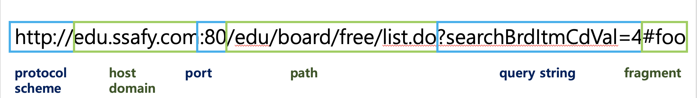
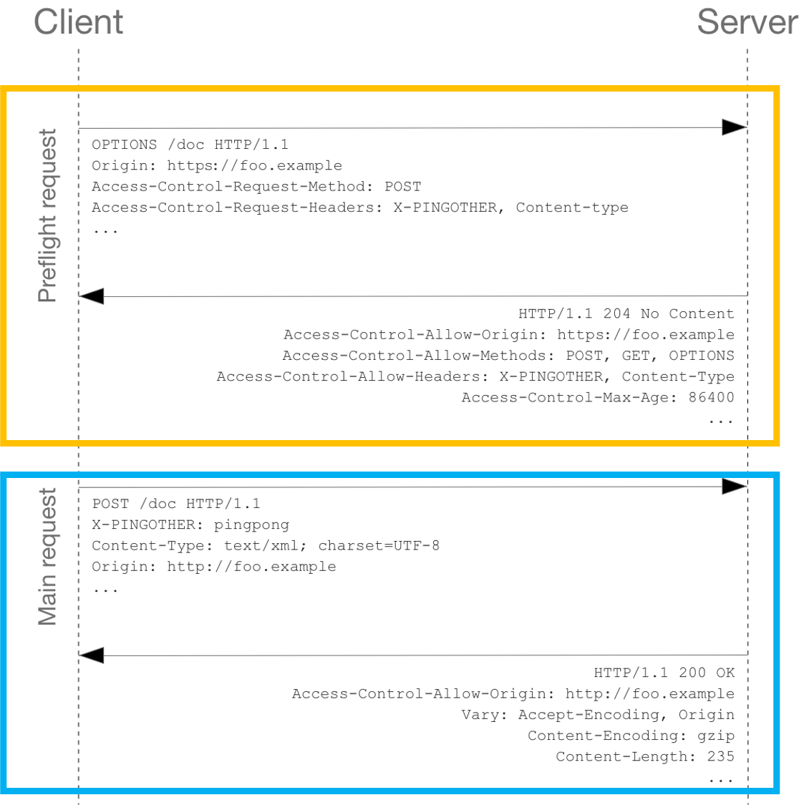

   

<h1>CORS</h1>

   

## 목차

1. [**CORS란?**](#1)

2. [**SOP란?**](#2)

3. [**CORS의 접근제어 시나리오**](#3)

 

## CORS란?

### CORS (Cross-Origin Resource Sharing) (교차 출처 리소스 공유)

- 추가 HTTP 헤더를 사용하여, 한 출처에서 실행 중인 웹 애플리케이션이 다른 출처의 선택한 자원에 접근할 수 있는 권한을 부여하도록 브라우저에게 알려주는 체제
- 웹 애플리케이션은 리소스가 자신의 출처와 다를 때 교차 출처 HTTP 요청을 실행
- CORS 체제를 통해 안전한 교차 출처 요청 및 데이터 전송 지원 - 보안 문제 해결
- CORS 외에 우회하는 방식: JSONP, Allow CORS 플러그인

 

## SOP란?

### SOP (Same-Origin Policy) (동일 출처 정책)

- 한 출처에서 불러온 문서나 스크립트가 다른 출처에서 가져온 리소스와 상호작용하는 것을 제한하는 보안 방식
- 잠재적으로 해로울 수 있는 문서를 분리하여 공격받을 수 있는 경로 감소
- 출처 3가지가 모두 같은 경우만 동일한 출처라고 인정

  - 그러나 port는 명시된 경우에만 번호까지 같아야 하며, 경우에 따라 같거나 다른 출처로 판단 가능

- Internet Explorer는 비표준으로 여기는 다른 브라우저와 다르게 다음 두 경우는 예외적으로 인정
  - 양쪽 도메인 모두가 높음 단계의 보안 수준을 가진 경우
  - port가 다른 경우

### Origin (출처)

- `scheme`(`protocol`: HTTP 또는 HTTPS), `host`(`domain`), `port`(설정된 경우)로 정의

### 출처 비교 예시

- URL : `http://edu.ssafy.com`

|                   URL                    | 결과 |                        이유                        |
| :--------------------------------------: | :--: | :------------------------------------------------: |
| `http://edu.ssafy.com/edu/main/index.do` | 성공 |                   경로만 다르다                    |
|         `https://edu.ssafy.com`          | 실패 |                 프로토콜이 다르다                  |
|        `http://edu.ssafy.com:81`         | 실패 | 포트가 다르다 (`http://`는 80이 기본값)(IE는 성공) |
|          `http://www.ssafy.com`          | 실패 |                  호스트가 다르다                   |
|            `http://ssafy.com`            | 실패 |                  호스트가 다르다                   |

 

## CORS의 접근제어 시나리오

### Simple Request (단순 요청)

- Preflight Request 없이 Main Request만 존재
- 다음 조건을 **모두 충족해야** 요청 가능
  - 메서드 : GET, HEAD, POST 중 하나
  - 유저 에이전트가 자동으로 설정 한 헤더 외에 설정할 수 있는 헤더 : Accept, Accept-Language, Content-Language, Content-Type
  - Content-Type의 헤더에 허용된 값 : application/x-www-form-urlencoded, multipart/form-data, text/plain

### Preflight Request (프리플라이트 요청)

- **교차 출처 요청하기 전에 options 메서드**로 다른 도메인의 리소스로 HTTP 요청을 보내 실제로도 그 요청이 안전한지 확인
- 유저 데이터에 영향을 줄 수 있는 경우(예: delete, put)를 대비하여 미리 전송하는 것
- `Access-Control-Request-Method`와 `Access-Control-Request-Headers`를 보고 서버는 요청을 수락할지 결정
  - Preflight 요청을 보낼 때 origin 외에도 자신이 예비 요청 이후 본 요청에 해당하는 내용도 함께 전송
  - 서버의 응답을 통해 요청이 허용되는지 확인 가능
  - `Access-Control-Max-Age` 헤더값에 명시한 시간 동안 Preflight 요청 대신 본 요청
- Preflight Request가 성공해야 Main Request 가능
  - 실제 응답에서도 `Access-Control-Allow-Origin` 헤더 필수

### Credentialed Request (인증정보 포함 요청)

- 브라우저의 토큰, 쿠키 정보 등 **사용자 식별 정보**를 담아 다른 출처로 보내는 요청인 경우
- 클라이언트 측은 `credentials: include` 필수 (무조건 인증 정보 포함)
- 서버 측은 `Access-Control-Allow-Credentials: true` 필수
- Access-Control-Allow-Origin는 정확한 정보만 있어야 하므로 \* 사용 불가

###### 출처: [CORS는 왜 이렇게 우리를 힘들게 하는걸까?]("https://evan-moon.github.io/2020/05/21/about-cors/"), [교차 출처 리소스 공유 (CORS)]("https://developer.mozilla.org/ko/docs/Web/HTTP/CORS"), [동일 출처 정책]("https://developer.mozilla.org/ko/docs/Web/Security/Same-origin_policy"), [fetch와 Cross-Origin 요청]("https://ko.javascript.info/fetch-crossorigin"), [[10분 테코톡] 🌳 나봄의 CORS]("https://www.youtube.com/watch?v=-2TgkKYmJt4"), [웹개발 짜증유발자! CORS가 뭔가요?]("https://www.youtube.com/watch?v=bW31xiNB8Nc")
