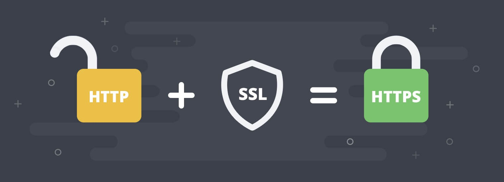
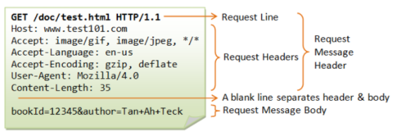
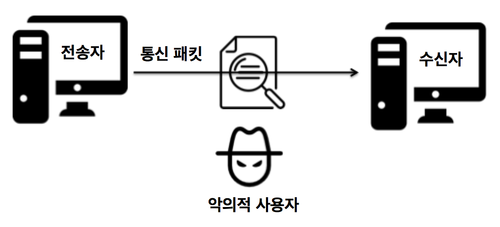
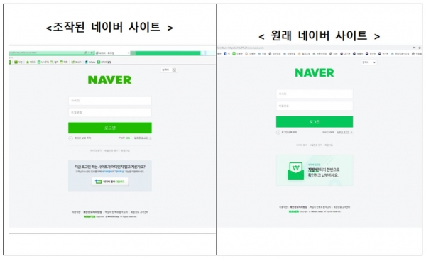

   
  <h1>HTTP가 무엇이고 왜 HTTPS를 사용하는 것인가?</h1>
   

## 목차

1. [**HTTP와 HTTPS는 무엇인가?**](#1)
2. [**HTTP 메시지 포멧**](#2)
3. [**HTTPS와 HTTP의 차이점은?**](#2)

 

## HTTP와 HTTPS는 무엇인가?

&nbsp;&nbsp;**HTTP**는 `Hyper Text Transfer Protocol`의 약자로 인터넷상의 커뮤니케이션에 사용되는 형식들 중 하나입니다. 여기에 보안 기능을 추가한 것이 **HTTPS**(HTTP + Secure) 입니다.

 

## HTTP 메시지 포멧

> 즉, HTTP는 텍스트 기반의 통신 규약으로 인터넷에서 데이터를 주고받을 수 있는 프로토콜입니다.

 

## HTTPS와 HTTP의 차이점은?

**첫 번째**, 사용자가 웹 사이트에 보내는 정보들을 제 3자가 못 보게 합니다.

> HTTP의 경우 사용자가 로그인 폼에 아이디와 비밀번호를 입력하고 로그인 버튼을 누르면 이 두 정보가 인터넷을 타고 서버로 전송될 때 이 암호가 입력한 텍스트 그대로, 누구든 알아볼 수 있는 형식으로 보내집니다. 이는 제 3자에게 사용자의 정보가 유출될 수 있습니다. 그러나 HTTPS의 경우는 이 비밀번호 정보를 허가된 서버에서만 알아볼 수 있는 암호화된 텍스트로 변경해서 전송됩니다.

**두 번째**, 사용자가 접속한 사이트가 신뢰할 수 있는 사이트인지 판별해줍니다.

> 기관으로부터 검증된 사이트만 주소에 HTTPS 사용이 허가되기 때문에 피싱 사이트를 걸러낼 수 있게 해줍니다.

