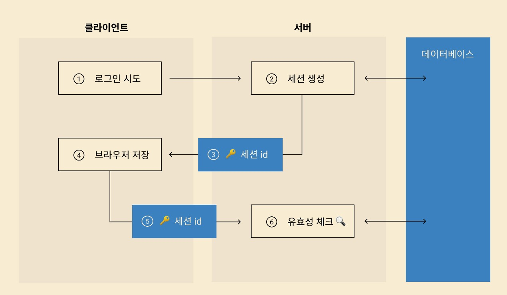
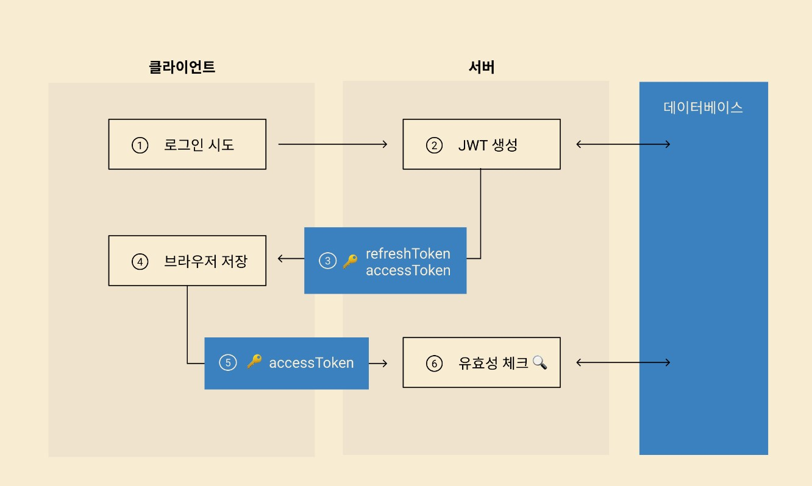
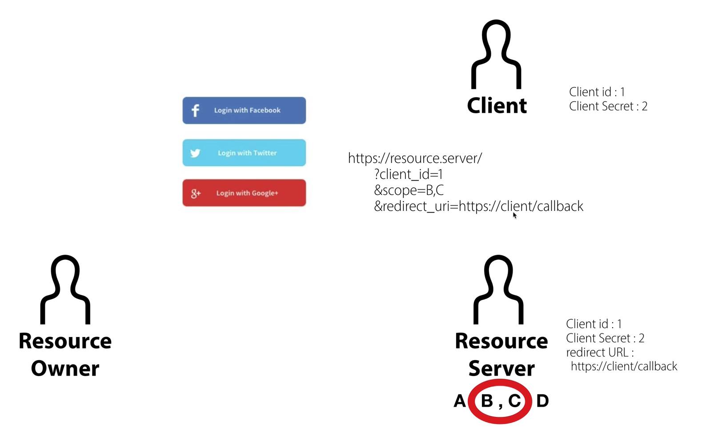
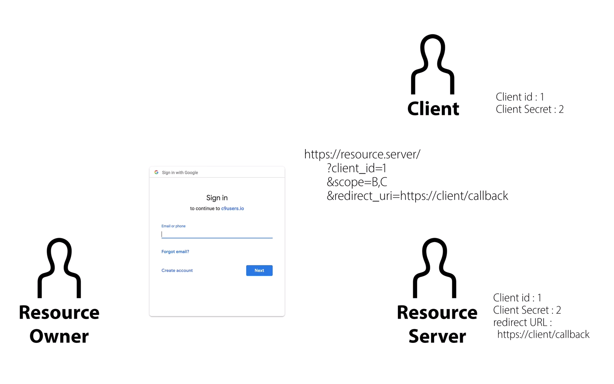
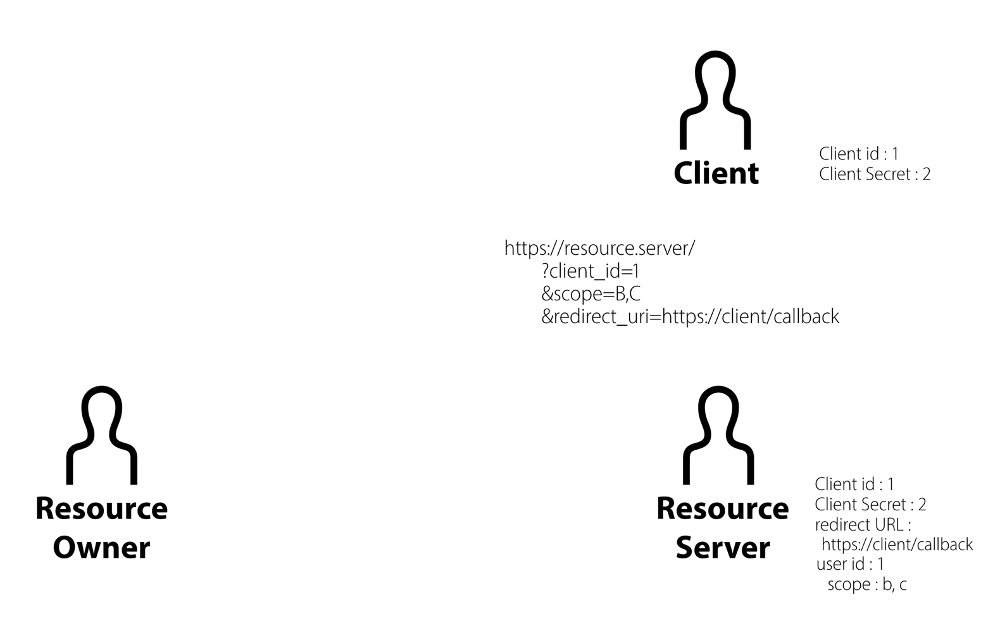
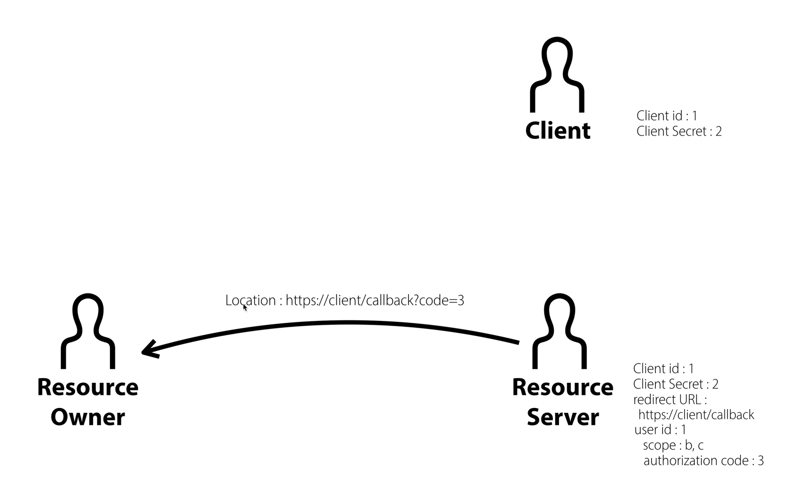
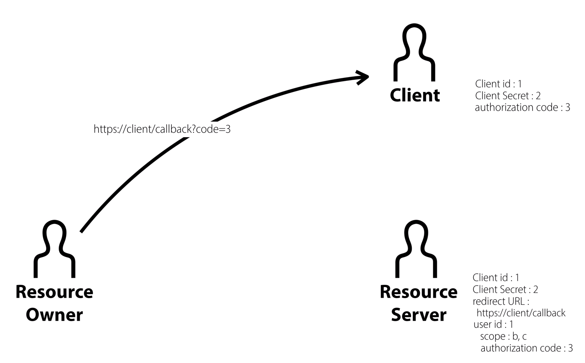
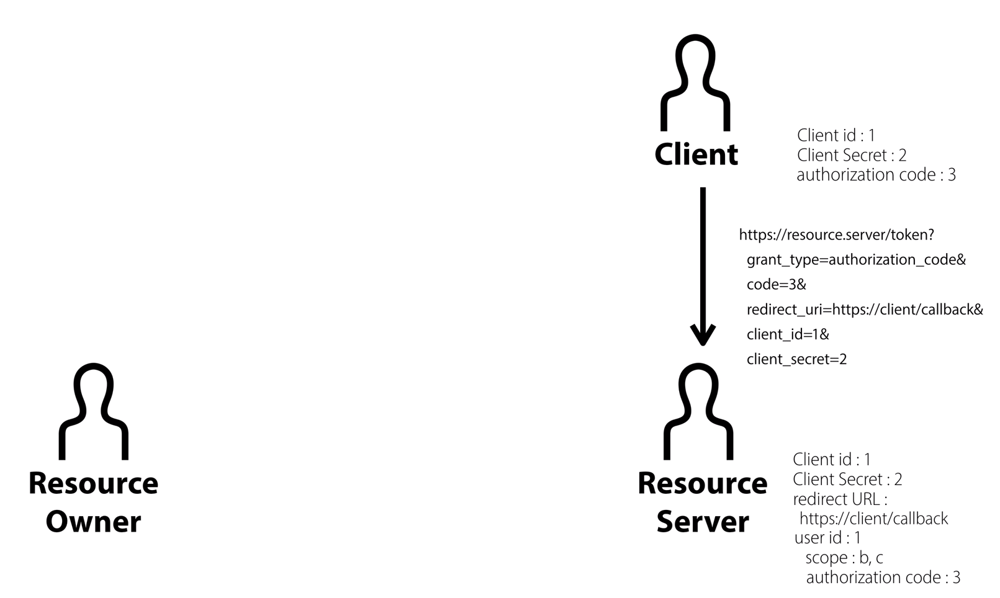
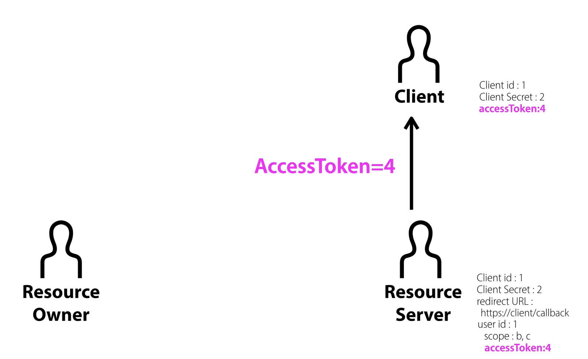

     
    <h1>
        로그인 원리와 OAuth
    </h1>
     

 

## 목차

1. [**로그인 원리**](#1)
2. [**OAuth란?**](#2)

 

<dive id="1">

## 로그인 원리

 

### 1. 세션 id 이용

1) 유저가 로그인 시도
2) 서버는 유저의 정보를 담은 세션을 생성
3) 세션의 id를 클라이언트에 전송
4) 클라이언트는 세션 id를 브라우저에 저장
5) 클라이언트가 나중에 인증이 필요한 데이터를 가져올 때 서버에 세션 id값을 전송
6) 서버는 세션 id를 통해 세션을 불러와 유효성을 체크

👉 세션 id를 브라우저에 그대로 저장하는 방식은 보안적으로 굉장히 취약함

👉👉 JWT 인증 방식 사용

 

 

### 2. JWT 이용(accessToken, refreshToken)

- JWT(Json Web Token) : 서버가 인증 정보를 보낼 때 암호화나 시그니처 추가가 가능한 데이터 패키지

​	(*시그니처 : 일련의 문자열로, 토큰의 변조 여부를 확인할 수 있음)

1) 유저가 로그인
2) 서버는 인증 정보인 accessToken과 refreshToken을 JWT에 담아 클라이언트에 전송
   	- accessToken : 실질적인 인증 정보. 일정 시간이 지나면 만료됨
   	- refreshToken : accessToken이 만료되어 이 토큰을 서버에 보내면, 서버는 새로운 accessToken을 발급해 돌려줌 (로그인 지속적으로 유지 가능)

3. 클라이언트는 이 정보를 브라우저에 저장
4. 차후에 accessToken을 유저에게만 보여줄 수 있는 정보에 접근할 때 서버에 보냄
5. 서버는 그 토큰이 유효한지 확인

 

👉 accessToken은 웹 어플리케이션 내 로컬 변수에 저장해 사용하고, API 요청 시 `Authorization` 헤더에 넣어 보내줌

 

 

<dive id="2">

## 2. OAuth란?

> OAuth의 핵심 역할  :  `AccessToken` 얻어내기

- 실제 비밀번호 대신에 `AccessToken`을 비밀키로 사용
- AccessToken을 이용해 해당 서비스의 일부 기능을 이용할 수 있는 것이 OAuth 서비스의 핵심

### OAuth 인증에 필요한 객체

1. User(Resource Owner) : 일반 사용자
2. App(Client) : User가 사용하는 서비스, 앱.
3. Authorization server / Resource Server
   - ex. Google, Github, Facebook...

 

### OAuth 로그인에 필요한 것

1. Client ID : 공개해도 되는 public key
2. Client secret : 공개하면 안되는 secret key. 보통 환경변수에 담아둠
3. Redirect URL : Client ID와 Client secret을 확인한 후 redirect할 url 주소

✔ Resource Server에 등록된 위 세가지 요소와, 우리가 만든 APP에 등록된 위 세가지 요소가 **모두 일치**해야 OAuth인증 성공 

 

### OAuth 로그인 원리

 

1.

**App(Client)가 User(Resource Owner)에게 OAuth 로그인 버튼을 보여줌**

- 로그인 버튼에는 clientId, scope(가져올 회원 정보의 범위), redirect url 정보가 들어있음

(scope : ex) 프로필 정보, 이메일 주소, 생년월일... )

 

2.

**로그인 버튼을 누르면 Resource Server는 Resource Owner에게 로그인 화면을 보여줌**

 

3

**로그인 버튼을 누르면 scope에 정의된 정보 공개 범위에 대한 동의를 구함**

- 로그인 과정에서, clientId와 redirect url이 일치하는지 확인하고 하나라도 일치하지 않으면 더이상 진행 X

 

4

**사용자로부터 동의를 얻게 되면 Resource Server는 사용자 아이디와 제공할 scope를 알게 된다**

 

5.

**로그인 인증이 끝나면 Resource Server는 Resource Owner에게 Authorization Code를 전달하는데, 이때 redirect url로 전환되면서 전달된다.**

 

6.

**Resource Owner가 App(Client)에게 Authorization Code를 전달함**

 

7.

**Client는 Resource Server에게 Client ID, Client Secret, Redirect URL, Authorization Code를 모두 보낸다**

 

8.

**위 네가지 정보가 모두 일치하면 Resource Server는 Client에게 AccessToken을 발급한다.**

(Authorization code값은 더 이상 필요없기 때문에 삭제함)

 

👉 이렇게 발급받은 AccessToken을 통해서 Client는 Resource Server로부터 사용자 정보를 가져올 수 있음!

 

 

---

### 참고 자료

https://velog.io/@yaytomato/%ED%94%84%EB%A1%A0%ED%8A%B8%EC%97%90%EC%84%9C-%EC%95%88%EC%A0%84%ED%95%98%EA%B2%8C-%EB%A1%9C%EA%B7%B8%EC%9D%B8-%EC%B2%98%EB%A6%AC%ED%95%98%EA%B8%B0

https://velog.io/@sonypark/OAuth2-%EC%9D%B8%EC%A6%9D