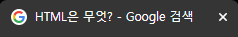
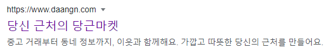
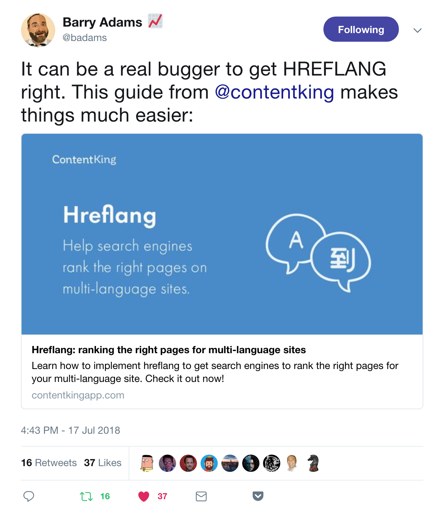
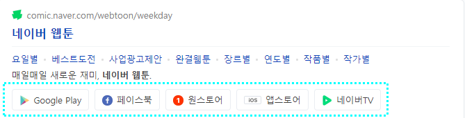

<div align="center">
  <br />
  <h1>HTML과 SEO</h1>
  <br />
</div>

## 목차

1. [**SEO는 무엇인가?**](#1)
2. [**SEO에 영향을 주는 요인들**](#2)
3. [**페이지 타이틀 (Page Title)**](#3)
4. [**메타데이터 (Metadata)**](#4)

<br />

<div id="1"></div>

## SEO는 무엇인가?

**검색 엔진 최적화(Search engine optimization, SEO)**, 즉 검색엔진에서 찾기 쉽도록 사이트를 개선하는 프로세스입니다.

웹 페이지 검색엔진이 자료를 수집하고 순위를 매기는 방식에 맞게 웹 페이지를 구성해서 검색 결과의 상위에 나올 수 있게 합니다.


<br />

<div id="2"></div>

## SEO에 영향을 주는 요인들

- 검색 결과 페이지(SERP) 노출 대비 클릭률
- 백링크(backlink): 다른 웹 페이지로부터 인용(링크)되는 횟수
- 도메인 권력(Domain authority): 검색 결과 페이지 순위 예측 점수
- 페이지 타이틀
- 메타 디스크립션
- 로딩 속도
- SSL(https) 사용 여부
- 콘텐츠의 양, 질, 개연성
- 사용자 경험: LCP(최대 콘텐츠 블럭 그리기), CLS(누적 배치 변경)

> 이런 다양한 요인들이 있지만 실제 어느 정도의 비율로 검색 결과에 반영이 되는지는 검색 엔진에서 비밀로 유지하고 있기 때문에 정확히는 알 수 없습니다.

<br />

<div id="3"></div>

## 페이지 타이틀 (Page Title)

### 페이지 타이틀 - Accessibility

**화면 낭독기 사용자**는 웹 페이지 접속 시 페이지 타이틀을 음성으로 전달 받습니다. 사용자는 그 음성으로 전달받은 내용을 듣고 '내가 원하는 페이지에 정확하게 들어왔구나' 그렇지 않으면 '내가 잘못된 페이지에 들어왔구나'라는 것을 빠르게 인지할 수 있습니다. 그런데 만약 페이지 타이틀에 다 똑같은 내용의 텍스트를 집어넣는다면 화면 낭독기 사용자는 그 페이지가 내가 찾는 페이지인지 확신을 할 수 없을 겁니다. 그렇기에 페이지 타이틀은 매우 중요한 요소 중 하나입니다.

화면 낭독기 사용자는 불필요한 정보들을 빠르게 건너뛰기 위해 보통 속청으로 듣기 때문에 페이지 타이틀 내용은 **간결**하게, 중요한 **키워드**만 집어넣는 것이 좋습니다.

<br />

### 페이지 타이틀 - 구분자

`-`, `|`, `:` 을 구분자로 많이 사용합니다.

```
Page title - Site name
Page title | Site name
Page title : Stie name
```




> 대시(`-`)를 사용하면 키워드 사이의 공간이 더 크기 때문에 가독성이 좋습니다.

> 파이프(`|`), 콜론(`:`)은 장평이 적기 때문에 공간을 더 효율적으로 사용할 수 있습니다.

> 언더바(`_`)는 인접 키워드를 하나로 연결하기 때문에 추천하지 않습니다.

<br />

### 페이지 타이틀 - JavaScript

최근 검색 엔진들은 JavaScript에 의해 동적으로 생성한 페이지 타이틀도 모두 잘 크롤링하고 있습니다.

<br />

### 페이지 타이틀 - 요약 정리

- 본문을 가장 잘 설명하는 **키워드** 중심으로.

- 페이지마다 **구체적**이고 **고유한**(흔하지 않은) 키워드 사용.

- 페이지마다 **반복**하는 키워드 **최소화**.

- 구체적인 키워드를 앞으로 **배치**.

- 가능한 **짧게**.

<br />

<div id="4"></div>

## 메타데이터 (Metadata)

### 메타데이터는 무엇인가?

**메타데이터(Metadata)** 는 데이터(data)에 대한 데이터입니다. 즉 '어떤 목적을 가지고 만들어진 데이터'로 정의할 수 있다.

```html
<!-- lang 속성은 검색 엔진이 특정 언어의 웹 페이지를 검색할 때 도움을 주기도 하고 또는 화면 낭독기 사용자들이 이 웹 페이지를 읽을 때 어떤 음성 엔진을 선택해야 하는지 힌트를 주기도 합니다. 하지만 구글에서는 현재 lang 속성을 신뢰하지 않습니다.-->
<html lang="ko">
  <head>
    <!-- charset="UTF-8" 설정을 통해 전 세계의 모든 국가의 언어를 이 웹 페이지에 문제없이 표시할 수 있습니다. 'UTF-8'이 표준입니다.-->
    <meta charset="UTF-8" />

    <!-- 검색 엔진의 검색 결과 화면에 노출되는 텍스트 (사이트에 대한 설명을 표기) -->
    <meta
      name="descripton"
      content="중고 거래부터 동네 정보까지, 이웃과 함께해요. 가깝고 따뜻한 당신의 근처를 만들어요."
    />

    <!-- 모바일 디바이스에서 이 웹 페이지가 모바일에서도 볼 수 있는지 , 즉 최적화 되어 있는지에 대한 정보를 검색 엔진에 제공-->
    <meta name="viewport" content="width=device-width, initial-scale=1.0" />

    <!-- 페이지 타이틀 -->
    <title>당신 근처의 당근마켓</title>
  </head>
</html>
```

- 구글에 실제 검색되는 화면

  

<br />

### Metadata - Facebook

```html
<meta property="og:url" content="https://*.html" />
<meta property="og:title" content="..." />
<meta property="og:description" content="..." />
<meta property="og:image" content="https://*.jpg" />
```


[**🔗 페이스북 공유 카드 가이드 바로가기 Click !**](https://developers.facebook.com/docs/sharing/webmasters#markup) 👈

[**🔗 페이스북 공유 카드 디버거 바로가기 Click !**](https://developers.facebook.com/tools/debug) 👈

> 새 창 열기 방법 : CTRL+click (on Windows and Linux) | CMD+click (on MacOS)

<br />

### Metadata - Twitter

```html
<meta name="twitter:card" content="summary" />
<meta name="twitter:title" content="..." />
<meta name="twitter:description" content="..." />
<meta name="twitter:image" content="https://*.jpg" />
```



[**🔗 트위터 공유 카드 가이트 바로가기 Click !**](https://developer.twitter.com/en/docs/twitter-for-websites/cards/overview/markup) 👈

[**🔗 트위터 공유 카드 유효성 검사 바로가기 Click !**](https://cards-dev.twitter.com/validator) 👈

<br />

### Metadata - Naver

```html
<html lang="ko">
  <head>
    ...
  </head>
  <body>
    <!-- 네이버 연관 채널에 등록하기 위한 'JSON-LD 형식'의 <script> 포맷의 JavaScript -->
    <script type="application/Id+json">
      {...}
    </script>
  </body>
</html>
```

> `<body>` 종료 직전에 넣는 것을 추천합니다.



<br />

### Metadata - 요약 정리

```html
<html lang="ko">
  <head>
    <!-- Google -->
    <meta charset="utf-8" />
    <meta name="description" content="A description of the page" />
    <meta name="viewport" content="width=device-width, initial-scale=1" />
    <title>Page title - Site name</title>
    <!-- //Google -->

    <!-- Facebook -->
    <meta property="og:url" content="https://*.html" />
    <meta property="og:title" content="..." />
    <meta property="og:description" content="..." />
    <meta property="og:image" content="https://*.jpg" />
    <!-- //Facebook -->

    <!-- Twitter -->
    <meta name="twitter:card" content="summary" />
    <meta name="twitter:title" content="..." />
    <meta name="twitter:description" content="..." />
    <meta name="twitter:image" content="https://*.jpg" />
    <!-- //Twitter -->
  </head>
  <body>
    <!-- Naver -->
    <script type="application/Id+json">
      {...}
    </script>
    <!-- //Naver -->
  </body>
</html>
```

<br />

## 참고 자료

> https://developers.google.com/search/docs/beginner/seo-starter-guide?hl=ko#glossary

> https://ko.wikipedia.org/wiki/%EA%B2%80%EC%83%89_%EC%97%94%EC%A7%84_%EC%B5%9C%EC%A0%81%ED%99%94

> https://ko.wikipedia.org/wiki/%EB%A9%94%ED%83%80%EB%8D%B0%EC%9D%B4%ED%84%B0

> https://fastcampus.co.kr/dev_red_jcm

> 새 창 열기 방법 : CTRL+click (on Windows and Linux) | CMD+click (on MacOS)
