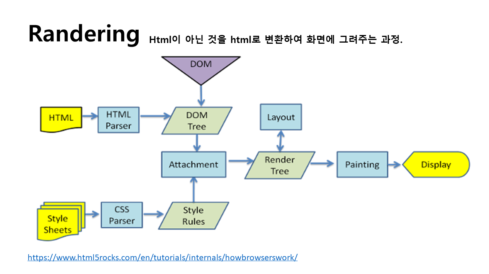
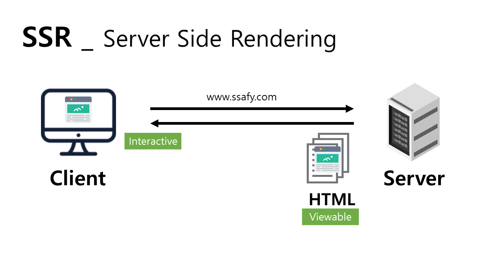
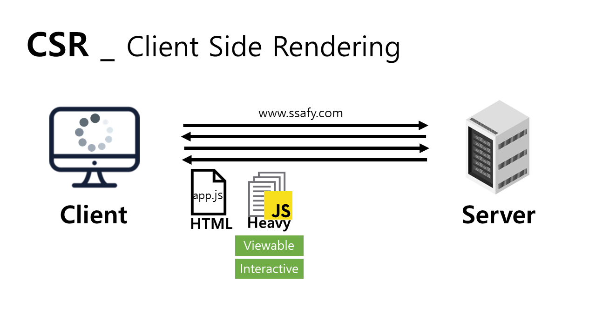

   
  <h1>SSR and CSR</h1>
   

## 목차

1. [**RENDERING**](#1)
2. [**CSR/SSR**](#2)
3. [**MPA/SPA**](#3)

 

## RENDERING

 HTML로 DOMTree가 만들어지고, CSS가 CSSOM을 결합시켜 최종적으로 Rendering Tree가 만들어 진다.  그리고, 이렌더링 트리에서 각노드의 크기와 위치를 계산하고, 개별 노드를 화면에 그려주는 과정이 렌더링의 과정이라고 할 수 있다. 

 

## CSR/SSR/SSG

### SSR(Server Side Rendering) 
* 서버에서 렌더링을 해줌

서버에서 완성된 형태의 html파일을 받아와서 그대로 화면에 띄워줌.

 

### CSR(Client Side Rendering)
* 클라이언트에서 렌더링을 해줌

 서버에서 빈 HTML파일을 서버로부터 받는다. 이떄, 화면은 빈화면이 뜬다. 서버로부터 다시 링크된 자바 스크립트 파일을 받게되고, 이때, 소스코드 뿐만 아니라 각종 프레임워크까지 포함된 파일을 받는다. 이때 받은 파일을 기반으로 클라이언트에서 렌더링을 하여 화면에 띄워준다.

 

| | SSR | CSR |
|:---:|:---|:---|
|장점 |- SEO  - 첫 페이지 로딩이 빠름  - User의 네트워크 환경에 환경에 상관없이 페이지 로딩이 가능함.| - 구동 속도가 빠름|
|단점 |- Blinking 이슈가 있음  - 서버 렌더링에 따른 부하   - TTV와 TTI사이의 지연 존재*|- 초기 구동속도가 느림  - LOW SEO|
* SEO (Search Engine Optimization) 웹사이트의 HTML 문서를 분석하는 검색엔진.
* TTI (Time To Interaction)
* TTV (Time To View)
 

## MPA/SPA

MPA(Multi Page Application) : 
 
SPA(Single Page Application):
| | SPA | MPA |
|:---:|:---|:---|
| 장점 |- Good User Experience 제공   - 효과적인 캐싱이 가능| -SEO에 유리|
|단점 | - 초기 구동 속도가 느리다.  - Low SEO| - Blinkng현상 있음   - 프론트와 백의 연관이 높아, 개발 시 복잡할 수 있다.|

| 참고한 사이트 | 링크 |
| :--- |:--- |
| **(Youtube)'서버사이드 렌더링(개발자라면 상식으로 알고 있어야 하는 개념 정리_드림코딩by엘리)**|[바로가기]('https://www.youtube.com/watch?v=iZ9csAfU5Os')|
| **(velog)ru_bryunak.log**|[바로가기]('https://velog.io/@ru_bryunak/SPA-%EC%82%AC%EC%9A%A9%EC%97%90%EC%84%9C%EC%9D%98-SSR%EA%B3%BC-CSR')|
| **tech.junhabaek 사이트**|[바로가기]('https://tech.junhabaek.net/%EC%9B%B9-%EB%A0%8C%EB%8D%94%EB%A7%81%EC%9D%98-%EC%9C%A0%ED%98%95-1-only-ssr-static-ssr-b10c3916fb09')|

|**구글 developers 사이트**|[바로가기]('https://developers.google.com/web/updates/2019/02/rendering-on-the-web?hl=ko')|