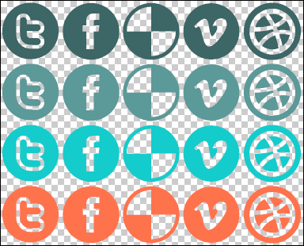

<div align="center">
  <br />
  <h1>웹 성능 최적화</h1>
  <br />
</div>

## 목차

1. [**프론트엔드 성능은?**](#1)
2. [**웹 성능 최적화**](#2)
3. [**브라우저의 로딩 과정**](#3)
4. [**브라우저의 로딩 과정**](#4)
5. [**사용자 기준의 성능 측정**](#5)
6. [**가장 효과적인 웹 성능 최적화 방법은?**](#6)

<br />

<div id="1"></div>

## 프론트엔드 성능은?

프론트엔드 성능 = 로딩 + 렌더링

<br />

<div id="2"></div>

## 웹 성능 최적화

최근 웹 애플리케이션은 서버와의 많은 통신과 복잡한 UI 등 많은 기능을 담으면서 크고 무거워졌습니다. 무거워진 웹은 긴 로딩 시간과 함께 사용자 경험에 안 좋은 영향을 끼칩니다.

Pinterest는 긴 로딩 시간으로 인해 사용자가 페이지를 이탈하는 비율이 높았는데, 최적화를 통해 사용자 이탈률을 줄이고 매출을 40%로 증가시켰습니다. 이처럼 매출 실적과 연결될 정도로 웹 애플리케이션의 성능 최적화는 매우 중요합니다.

<br />

<div id="3"></div>

## 브라우저의 로딩 과정

브라우저는 웹 페이지의 필요한 리소스를 내려받고 해석한 다음 여러 계산 과정을 거쳐 콘텐츠를 화면에 보여줍니다.

- Rendering Pipline

  

1. JavaScript : JS로 DOM을 변경
2. Style recalculate : DOM의 최종 스타일을 계산
3. Layout: DOM의 배치와 크기 계산
4. Paint : 화면에 그리기
5. Composite: 레이어 조합하기

<br />

<div id="4"></div>

## 사용자 기준의 성능 측정

사용자 기준의 성능 측정은 사용자에게 콘텐츠를 보여주는 여러 시점을 기반으로 합니다. 의미 있는 콘텐츠가 처음 보이는 시점이 빠를 수록 성능이 좋다고 판단하며, 이 시점을 앞당길 수 있도록 최적화해야 합니다.

<br />

<div id="5"></div>

## 가장 효과적인 웹 성능 최적화 방법은?

### 초기 로딩 시 불필요한 자원은 삭제하거나 뒤로(Lazy) 미루는 것

- 실수로 요청한 자원들 줄이기
- 초기 로딩 시 필요 없는 JS 파일 제거
- 뷰 포트 바깥에 있는 이미지는 지연 로딩(Lazy Loading) 적용
  > 페이지를 로드할 때, 모든 이미지를 로드하는 것이 아니라 중요하지 않은 자원 또는 당장 필요 없는 자원의 경우 서버에 요청을 미루고 필요할 때 해당 자원을 요청 받는 방법입니다.

### 이미지 파일들을 최적화 하는 것

- 뷰포트에 따라 여러 버전의 이미지 제공

  > 현재 뷰포트 크기에 따라 가장 적합한 크기의 버전 이미지 파일을 제공합니다. 이에 따라 불필요하게 높은 해상도의 이미지 파일을 다운로드 하는 것을 방지할 수 있습니다.

- Image CDN 사용

  > Image content delivery networks는 이미지 최적화에 탁월합니다. Image CDN을 통해 이미지 URL 만으로 이미지의 크기, 포맷, 품질 등을 쉽게 변형하여 원하는 이미지 파일을 얻어올 수 있게 합니다.

- 이미지 고정값 지정

  > 치수가 없는 이미지들은 Reflow를 발생시켜 퍼포먼스를 저하키기 때문에 이를 해결하기 위해 이미지 및 비디오 요소에 width와 height 속성을 항상 포함하여야 합니다.

- CSS Sprite

  > 웹 페이지에 필수적으로 자주 사용되는 아이콘, 버튼 같은 이미지들을 쓸 때마다 여러 이미지들을 불러오는 것이 아니라, 한 이미지 파일로 통합한 후 배경 이미지로 만들어 놓고 'position' 값으로 각각의 이미지를 불러오는 방법입니다.

  

  ```CSS
  .sprite {
  background: url(/images/sprite.png); no-repeat;
  }
  .sprite > .first {
  background-position: 0 0;
  }
  .sprite > .second {
  background-position: 0 -15px;
  }
  .sprite > .third {
  background-position: 0 -30px;
  }
  ```

<br />

## 참고 자료

> https://ui.toast.com/fe-guide/ko_PERFORMANCE

> https://www.youtube.com/watch?v=cpE1dwJgS4c

> https://www.youtube.com/watch?v=G1IWq2blu8c

> https://velog.io/@hustle-dev/%EC%9B%B9-%EC%84%B1%EB%8A%A5%EC%9D%84-%EC%9C%84%ED%95%9C-%EC%9D%B4%EB%AF%B8%EC%A7%80-%EC%B5%9C%EC%A0%81%ED%99%94

> 새 창 열기 방법 : CTRL+click (on Windows and Linux) | CMD+click (on MacOS)
