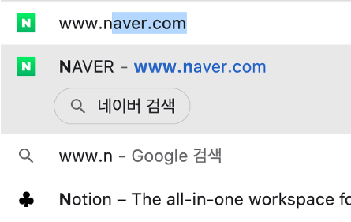
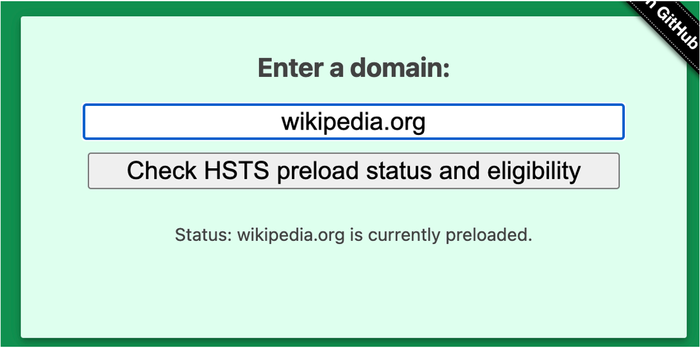
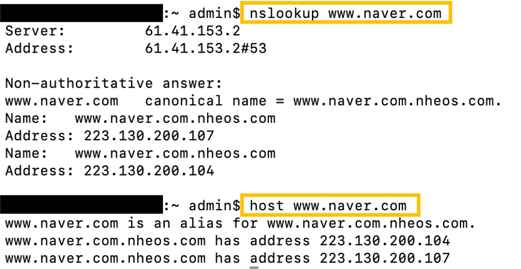
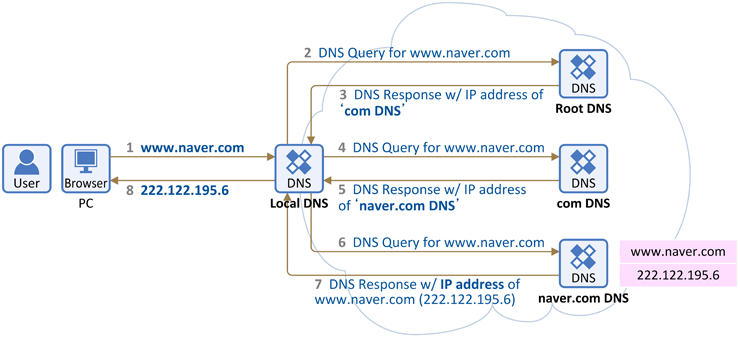

<div align="center">
  <br />
  <h1>웹 브라우저 주소창에 ww<span>w.naver.com을 입력하고 엔터를 누르면 어떤 일이 일어날까?</h1>
  <br />
</div>

## 목차

1. [**웹 브라우저 주소창에 `www.naver.com`을 입력한 뒤에 엔터를 누른다**](#1)
2. [**웹 브라우저가 입력된 URL(`www.naver.com`)이 문법에 맞는지 해석한다**](#2)
3. [**URL(`www.naver.com`)이 웹 브라우저에 캐싱되어 DNS 기록으로 존재하는지 확인한다**](#3)
4. [**만약 입력한 도메인이 캐싱되지 않은 상태라면 ISP의 DNS 서버가 해당 도메인의 IP 주소를 찾기 위해 DNS Query(DNS 질의)를 보낸다**](#4)
5. [**라우터를 통해 서버의 게이트웨이까지 이동하고, ARP를 통해 IP 주소를 MAC 주소로 변환한다**](#5)
6. [**브라우저가 도메인의 IP에서 해당 포트 번호를 가져와 TCP 소켓을 열고 3-way handshake로 연결을 설정한다**](#6)
7. [**웹 브라우저는 웹 서버에게 IP 주소에 해당하는 페이지의 데이터를 달라고 GET 요청을 보낸다**](#7)
8. [**서버는 request을 처리하고 response를 생성한다**](#8)
9. [**서버가 HTTP response를 보낸다**](#9)
10. [**웹 브라우저는 서버로부터 응답받은 HTML, CSS, JS, 이미지 등 자원을 통하여 웹을 파싱 및 랜더링하고, 최종적으로 사용자는 입력했던 `www.naver.com`을 볼 수 있다**](#10)

<br />

<div id="1"></div>

## 1. 웹 브라우저 주소창에 `www.naver.com`을 입력한 뒤에 엔터를 누른다

- 사용자가 웹 브라우저 주소창에 키 하나를 누른 순간 **자동완성** 기능이 활성화
- 브라우저는 사용자의 **검색 및 방문 기록이나 즐겨찾기**에 기반하여 매 키를 누를 때마다 매번 선별된 제안 제공
- URL을 모두 다 입력하기도 전에 `www.naver.com`을 먼저 제안 가능  
  

<br />

<div id="2"></div>

## 2. 웹 브라우저가 입력된 URL(`www.naver.com`)이 문법에 맞는지 해석한다

- **URL의 기본 구조**
  
  - 정규표현식으로 URL인지 확인 → _[정규표현식이란](https://github.com/ssafy-tech-concert/ssafy-tech-concert/blob/master/Etc/REGEX.md)_
    ```
    [(http(s)?):\/\/(www\.)?a-zA-Z0-9@:%._\+~#=]{2,256}\.[a-z]{2,6}\b([-a-zA-Z0-9@:%_\+.~#?&//=]*)
    ```

#### 1. URL이 문법에 맞다면 URL의 호스트 부분을 **인코딩**

- `www.naver.com`만 입력한 경우 HTTP 프로토콜을 사용하여 접속 시도
  - 만약 해당 사이트가 HTTPS 프로토콜이 적용된 경우라면 301, 302 상태 코드를 통해 리다이렉트하여 다시 HTTPS 프로토콜로 접속
- 미리 불러들인 `HSTS`(`HTTP Strict Transport Security`) 목록을 확인
  - 목록에 존재한다면 HTTPS로, 없다면 HTTP로 요청 → _[HTTP와 HTTPS란](https://github.com/ssafy-tech-concert/ssafy-tech-concert/blob/master/web/HTTP_HTTPS.md#1)_
  - `HSTS` : 요청한 웹 서버가 HTTPS로 설계되어 있을 때, 웹 브라우저에게 **HTTPS로 요청하라고 알려주는 보안** 기능
    - HTTPS 프로토콜을 사용하는 사이트에 처음 방문하면 웹 브라우저의 HSTS 목록에 저장
    - 어떤 사이트들은 HSTS 목록에 이미 저장되어(preloaded) 있으며 https://hstspreload.org<span>에서 목록 확인 가능
      
- **퓨니코드**(**Punycode**) 인코딩 : 유니코드 문자열을 호스트 이름에서 허용된 문자만으로 인코딩하는 방법

#### 2. URL이 문법에 맞지 않다면 **브라우저의 기본 검색 엔진**(google, bing 등)으로 검색

<br />

<div id="3"></div>

## 3. URL(`www.naver.com`)이 웹 브라우저에 캐싱되어 DNS 기록으로 존재하는지 확인한다

> _[캐싱이란](https://github.com/ssafy-tech-concert/ssafy-tech-concert/blob/master/web/Cache.md#5)_

- `DNS`(`Domain Name System`) : 인터넷상의 도메인 이름을 실제로 접속 가능한 주소로 식별해서 찾을 수 있도록 하는 서비스
  - `Domain Name` ←→ `IP Address`
  - Domain Name → IP Address : 컴퓨터의 주소를 찾기 위함
  - IP Address → Domain Name : 사람이 사용하기 쉽게 하기 위함
  - `IP Address` 확인하는 방법 : `nslookup`, `host`  
    

1. 우선 웹 브라우저는 일정 기간 동안 DNS 기록을 저장하고 있기 때문에 **브라우저 캐시**에서 웹 사이트 이름의 IP 주소 찾기
2. 다음으로 **OS 캐시** 확인. `systemcall`을 통해 OS가 저장하고 있는 DNS 기록들의 캐시에 접근하여 찾기
   - systemcall : 운영체제의 수준에서 커널 영역을 사용자 모드의 프로그램이 사용할 수 있게 해주는 기능
3. 그 다음으로 DNS 기록을 캐싱하고 있으며 OSI 7계층 중 데이터 통신 계층에 있는 **router와 통신**하여 캐시 확인 → _[데이터 통신 계층이란](https://github.com/ssafy-tech-concert/ssafy-tech-concert/blob/master/Computer-Science/OSI%207%20layer.md#2)_
4. 마지막으로 DNS 서버를 구축하고 있는 **ISP 캐시** 확인
   - `ISP`(`Internet Service Provider`) (인터넷 서비스 제공자) : SKT, KT, LG 유플러스
     - 와이파이가 연결된 순간 ISP로부터 사용자 컴퓨터로 도메인 네임 서버의 IP를 세팅

- 캐싱되어 있는 도메인이었다면 **캐싱되어 있는 데이터를 참조**

<br />

<div id="4"></div>

## 4. 만약 입력한 도메인이 캐싱되지 않은 상태라면 ISP의 DNS 서버가 해당 도메인의 IP 주소를 찾기 위해 DNS Query(DNS 질의)를 보낸다



  
- **`Root Domain`**
  - 모든 도메인의 뿌리
  - 사이트 주소 뒤에 생략된 `.` → `www.naver.com.`으로 주소창에 입력해도 `www.naver.com`과 동일한 결과
  - 도메인 네임을 IP 주소로 바꿀 때 **가장 먼저 확인**하는 단계
  - Root 도메인을 다루는 DNS Server는 Top-level Domain을 담당하는 DNS Server를 알고 있다
  
- **`Top-level Domain` (`TLD`) (최고레벨 도메인, 최상위 도메인)**
  - 가장 일반적인 정보 제공
  - 인터넷에서 도메인 네임의 가장 마지막 부분
  - **도메인을 구분하는 가장 큰 카테고리**이며 도메인을 **성격에 따라서 분류**
      - 일반 최상위 도메인: 국가별로 고유하지 않은 도메인 (.com, .org, .net, .edu, .gov)
      - 국가 코드 최상위 도메인: 여기에는 국가 또는 주와 관련된 모든 도메인 (.uk, .us, .ru, .jp)
  
- **`Second-level Domain`**(SLD)
- **`subdomain`**
- 각각의 도메인은 DNS Server를 각각 가지고 있고 각각 전담하는 파트는 다르다
- **상위 DNS Server는 직접 연결된 하위 DNS Server를 알고** 있지만 연결되지 않은 하위 DNS Server는 모른다
- `Recursive Search`
  - ISP가 제공하는 DNS 서버인 `DNS Recursor`에서 DNS 정보를 찾으려 다른 DNS 서버들로 DNS Query를 보낸다
  - DNS 서버에서 다른 DNS 서버로 **반복적**으로 이동하면서 **IP 주소를 찾을 때까지 또는 못 찾아서 에러가 발생할 때까지** 검색 진행
  - DNS Query와 DNS Recursor의 IP 주소가 포함된 패킷을 통해 전달 → 패킷이 유실되면 request fail error 발생
  - IP 주소를 찾아내면 해당 IP 주소로 HTTP 요청 전송
  
<br />

<div id="5"></div>

## 5. 라우터를 통해 서버의 게이트웨이까지 이동하고, ARP를 통해 IP 주소를 MAC 주소로 변환한다

- 실질적인 통신을 위해서 **논리 주소인 IP 주소를 물리 주소인 MAC 주소로** 변환하는 과정 필요
  - `IP 주소` : 접속하려는 서버의 네트워크를 찾기 위해 사용
  - `MAC 주소` : 그 네트워크 내부에 있는 컴퓨터와 통신하기 위해 필요
- router 내에 존재할 경우 routing table을 추적하여 MAC 주소를 찾고, Local Network가 아니라면 게이트웨이를 타고 밖으로 나가 MAC 주소를 찾기
- **`ARP`**(`Address Resolution Protocol`) : IP 주소 → MAC 주소 변환하는 프로토콜
  - 송신측은 MAC 주소가 필요하므로 ARP 요청 패킷을 브로드캐스트 방식으로 전달
  - 최종 목적지의 물리 주소를 모르기 때문에 모두에게 요청하고 모든 Host와 Router는 송신자가 보낸 ARP 요청 수락
  - 해당되는 수신자만 자신의 IP 주소와 MAC 주소를 넣어 응답
- `RARP`(`Reverse Address Resolution Protocol`) : MAC 주소 → IP 주소

<br />
  
<div id="6"></div>

## 6. 브라우저가 도메인의 IP에서 해당 포트 번호를 가져와 TCP 소켓을 열고 3-way handshake로 연결을 설정한다

> _[TCP란](https://github.com/ssafy-tech-concert/ssafy-tech-concert/blob/master/Computer-Science/TCP_UDP.md#1)_

- 3-way handshake가 끝나면 TCP connection 완성
- HTTPS 요청인 경우 추가적인 `TLS(Transport Layer Security) handshake`를 통하여 세션 키를 생성
- 세션이 유지되는 동안 요청과 응답을 반복하는데, 필요하다면 응답을 캐싱

<br />
  
<div id="7"></div>

## 7. 웹 브라우저는 웹 서버에게 IP 주소에 해당하는 페이지의 데이터를 달라고 GET 요청을 보낸다

> _[웹 서버란](https://github.com/ssafy-tech-concert/ssafy-tech-concert/blob/master/Back-end/Servlet%20%26%20JSP.md#2)_

- TCP로 연결이 되었다면, HTTP Request가 TCP Socket을 통해 전송
- 전송되는 HTTP Headers
  - Accept 헤더 : 받아들일 요청의 종류
  - User-Agent 헤더 : browser identification
  - connection 헤더 : 추가적인 요청을 위해 TCP connection 유지를 요청
  - 브라우저에서 얻은 쿠키 정보, Accept-Encoding, Host 등

<br />
  
<div id="8"></div>

## 8. 서버는 request을 처리하고 response를 생성한다

- 서버는 브라우저로부터 요청을 받고 request handler로 요청을 전달
- request handler는 요청과 요청의 헤더, 쿠키를 읽어서 요청이 무엇인지 파악하고 필요하다면 서버에 정보를 업데이트
- response는 특정한 포맷(JSON, XML, HTML)으로 작성

<br />
  
<div id="9"></div>

## 9. 서버가 HTTP response를 보낸다

- 서버의 response
  - 요청한 웹페이지
  - 첫번째 줄에는 Status Code(응답 종류) → _[Status Code(응답 종류)](https://github.com/ssafy-tech-concert/ssafy-tech-concert/blob/master/web/REST.md#2)_
  - compression type(Content-Encoding) : 인코딩이 어떻게 되어 있는지에 대한 정보
  - Cache-Control : 페이지를 어떻게 캐싱할지에 대한 정보
  - 설정할 쿠키가 있다면 쿠키, 개인정보 등 포함

<br />
  
<div id="10"></div>

## 10. 웹 브라우저는 서버로부터 응답받은 HTML, CSS, JS, 이미지 등 자원을 통하여 웹을 파싱 및 랜더링하고, 최종적으로 사용자는 입력했던 `www.naver.com`을 볼 수 있다

> _[랜더링이란](https://github.com/ssafy-tech-concert/ssafy-tech-concert/blob/master/web/SSRCSR.md#1)_

<br />

<br />
<br />

### 추천 자료

[웹의 동작 원리](http://tcpschool.com/webbasic/works), [How the DNS works](https://www.youtube.com/watch?v=2ZUxoi7YNgs)

<br />
  
###### 출처: [...하면 생기는 일](https://github.com/SantonyChoi/what-happens-when-KR), [What is a URL?](https://developer.mozilla.org/ko/docs/Learn/Common_questions/What_is_a_URL), [HSTS (HTTP Strict Transport Security) 개념과 설정](https://rsec.kr/?p=315), [[네트워크] 브라우저 주소창에 URL 입력시 일어나는 일들](https://1day1commit.tistory.com/149), [주소 창에 google.com을 검색하면? (브라우저가 웹 페이지를 표시하는 일련의 과정)](https://oizys.tistory.com/36), [인터넷 주소창에 URL을 입력 후 화면에 출력되는 과정](https://1-7171771.tistory.com/134), [[번역] Browser에 www.google.com을 검색하면 어떤 일이 일어날까?](https://devjin-blog.com/what-happen-browser-search/), [웹 브라우저에 URL을 입력했을 때 발생하는 일](https://sorjfkrh5078.tistory.com/65), [DNS server types](https://www.cloudflare.com/ko-kr/learning/dns/dns-server-types/), [DNS 기본 동작 설명](https://www.netmanias.com/ko/post/blog/5353/dns/dns-basic-operation)

<br />
<br />
