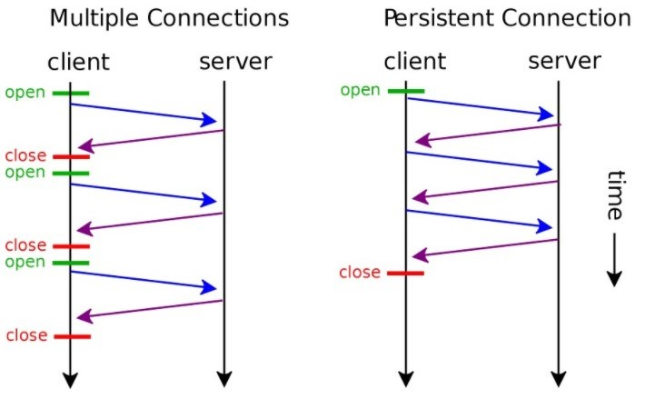
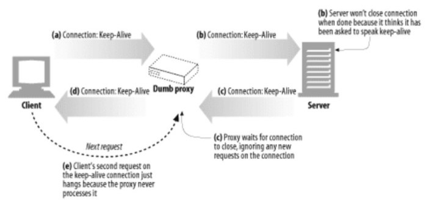

## 목차

1. [**HTTP**](#HTTP)
2. [**HTTP의 Keep Alive란**](#HTTP의-Keep-Alive란)
3. [**Keep Alive와 멍청한 프록시**](#Keep-Alive와-멍청한-프록시)
4. [**HTTP/1.1의 '지속 커넥션'**](#HTTP/1.1의-'지속-커넥션')

 

### HTTP

- HTTP는 Connectionless 방식으로 연결을 매번 끊고 새로 생성하는 구조입니다.
- 이는 Network 비용 측면에서 최초 연결을 하기 위해 많은 비용을 소비하는 구조입니다.

### HTTP의 Keep Alive란

> HTTP/1.0+의 'Keep-Alive'.

- 연결을 유지하라
- 이미 연결되어 있는 TCP 연결을 재사용하는 기능입니다. Handshake 과정이 생략되므로 성능 향상을 기대할 수 있습니다.
- 즉, keep Alive time out내에 client에서 request를 재 요청하면 socket(port)를 새로 여는 것이 아니라 이미 열려 있는 socket(port)에 전송하는 구조가 됩니다.

👉 Conenction에 소요되는 시간을 절약하게 된다.

#### Keep Alive 설정

요청 헤더에 “Connection:keep-alive”기재,

응답 헤더에  “Connection:keep-alive”  - 연결을 keep-alive 상태로 유지한다.

Keep-Alive : timeout=5, max=100 - 하나의 연결을 5초 동안 유지한다. 최대 100개 까지 허용한다.
 
*timeout이 필요한 이유*

서버 자원은 무한정이 아니다. 그렇기 때문에 이러한 접속을 계속 유지하는 것은 Server에 손실을 발생시킨다.

서버와 연결을 맺을 수 있는 Socket은 한정되어 있고 연결이 오래 지속되면 다른 사람들이 연결을 못하게되는 상황이 닥친다.

#### 단점

사용자가 많다면 모든 요청 마다 연결을 유지해야 하기 때문에 새로운 사용자를 받아들이지 못하는 경우가 생길수있다.
그래서 사용자가 많고 유동이 많은 서비스에서는 사용이 권장되지 않는다.

### Keep Alive와 멍청한 프록시

1. 클라이언트는 프록시에 Connection : Keep-Alive 헤더와 함께 메시지를 전송한다.
2. 멍청한 프록시는 요청받은 HTTP의 Connection 헤더를 이해하지 못하기 때문에 다음 서버에 메시지를 그대로 전달한다. 

    *문제 발생*

    *Connection 헤더는 홉별(hop-hop) 헤더이다.*

    *Connection에 담겨있는 헤더 값들은 다음 커넥션에 영향을 끼쳐선 안되기 때문에 현재 커넥션에 있는 헤더 값들을 모두 삭제 한 후 다음 커넥션 요청을 진행해야 한다.*

3. 서버는 프록시로부터 Connection : Keep-Alive 헤더를 받았기 때문에 프록시가 커넥션을 유지하기를 원하는 걸로 잘못 판단하게 된다.

    서버는 프록시와 커넥션을 유지하는 것에 동의를 하고 Connection : Keep-Alive 헤더를 포함하여 응답한다.

4. 멍청한 프록시는 서버로부터 받은 Connection : Keep-Alive 헤더를 또 이해하지 못하고 다시 그대로 포함하고 있는 Connection : Keep-Alive 헤더 응답 메시지를 클라이언트에게 전달한다.

**클라이언트** 

- 클라이언트는 프록시로부터 Connection : Keep-Alive 헤더 응답 메시지를 받았기 때문에 프록시가 커넥션을 유지하는 것에 동의했다고 생각한다.
- 다음 요청을 커넥션이 유지되고 있는 프록시에 보낸다.

**멍청한 프록시**

- 하지만 프록시는 서버와 커넥션이 끊어지기를 기다리는중이다.
- 같은 커넥션상에서 다른 요청이 오는 경우는 예상하지 못하기 때문에 클라이언트의 요청은 프록시로부터 무시되고 브라우저는 응답 없이 대기를 하게 된다.

**서버**

- 하지만 서버 역시 프록시가 보낸 Connection : Keep-Alive에 동의 했기 때문에 프록시의 추가 요청이 오기를 기다린다.

**결국 브라우저는 무한정 대기를 하다 타임아웃이 나서 커넥션이 끊기게 된다...**

### HTTP/1.1의 '지속 커넥션'

- 위와 같은 문제로 HTTP/1.1 부터는 Connection: Keep-Alive를 지원하지 않는다.
- HTTP/1.1에서는 모든 커넥션을 지속 커넥션으로 관리하되 Connection: Close 헤더를 명시했을 때 커넥션을 끊는다.
- 클라이언트는 이 Connection: Close 헤더가 없으면 커넥션을 유지하는 것으로 추정할 것이다.
- 하지만 안보낸다고해서 연결이 영원히 지속되는것은 아니다.

#### 커넥션 끊기

커넥션을 언제 끊는가에 대한 명확한 기준은 없다.

보통 에러가 나면 끊지만 언제든 끊을 수 있다.

+우아하게 커넥션 끊기
